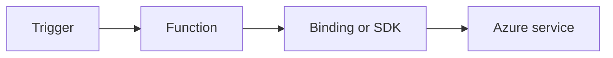

# Queue

Design queue-driven background processing with retries, dead-letter strategy, and idempotency guards.



## Topic/Command Groups

### Queue trigger + output
```csharp
[Function("QueueWorker")]
[QueueOutput("completed-items", Connection = "AzureWebJobsStorage")]
public string QueueWorker(
    [QueueTrigger("work-items", Connection = "AzureWebJobsStorage")] string message)
{
    return $"done:{message}";
}
```

### Queue host settings
```json
{
  "version": "2.0",
  "extensions": {
    "queues": {
      "batchSize": 16,
      "maxDequeueCount": 5
    }
  }
}
```

## See Also
- [Recipes Index](index.md)
- [.NET Language Guide](../index.md)
- [Troubleshooting](../troubleshooting.md)

## Sources
- [Azure Functions .NET isolated worker guide](https://learn.microsoft.com/azure/azure-functions/dotnet-isolated-process-guide)
- [Azure Functions triggers and bindings](https://learn.microsoft.com/azure/azure-functions/functions-triggers-bindings)
