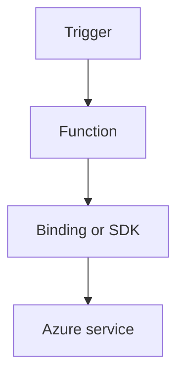

---
content_sources:

- type: mslearn-adapted
  url: https://learn.microsoft.com/azure/azure-functions/dotnet-isolated-process-guide
- type: mslearn-adapted
  url: https://learn.microsoft.com/azure/azure-functions/functions-triggers-bindings
content_validation:
  status: verified
  last_reviewed: '2026-05-23'
  reviewer: agent
  core_claims:
  - claim: This page uses Microsoft Learn as the primary source basis for its Azure-specific
      guidance.
    source: https://learn.microsoft.com/azure/azure-functions/dotnet-isolated-process-guide
    verified: true
---
# Queue

Design queue-driven background processing with retries, dead-letter strategy, and idempotency guards.

<!-- diagram-id: queue -->


## Topic/Command Groups

### Queue trigger + output
```csharp
[Function("QueueWorker")]
[QueueOutput("completed-items", Connection = "AzureWebJobsStorage")]
public string QueueWorker(
    [QueueTrigger("work-items", Connection = "AzureWebJobsStorage")] string message)
{
    return $"done:{message}";
}
```

### Queue host settings
```json
{
  "version": "2.0",
  "extensions": {
    "queues": {
      "batchSize": 16,
      "maxDequeueCount": 5
    }
  }
}
```

## Review Matrix

| Review area | Page-specific check |
|---|---|
| Scope | Confirm the guidance applies to Queue. |
| Source basis | Validate the recommendation against the Microsoft Learn sources in this page. |
| Evidence | Capture command output, portal state, metrics, logs, or screenshots before treating the result as proven. |

## See Also
- [Recipes Index](index.md)
- [.NET Language Guide](../index.md)
- [Troubleshooting](../troubleshooting.md)

## Sources
- [Azure Functions .NET isolated worker guide](https://learn.microsoft.com/azure/azure-functions/dotnet-isolated-process-guide)
- [Azure Functions triggers and bindings](https://learn.microsoft.com/azure/azure-functions/functions-triggers-bindings)
