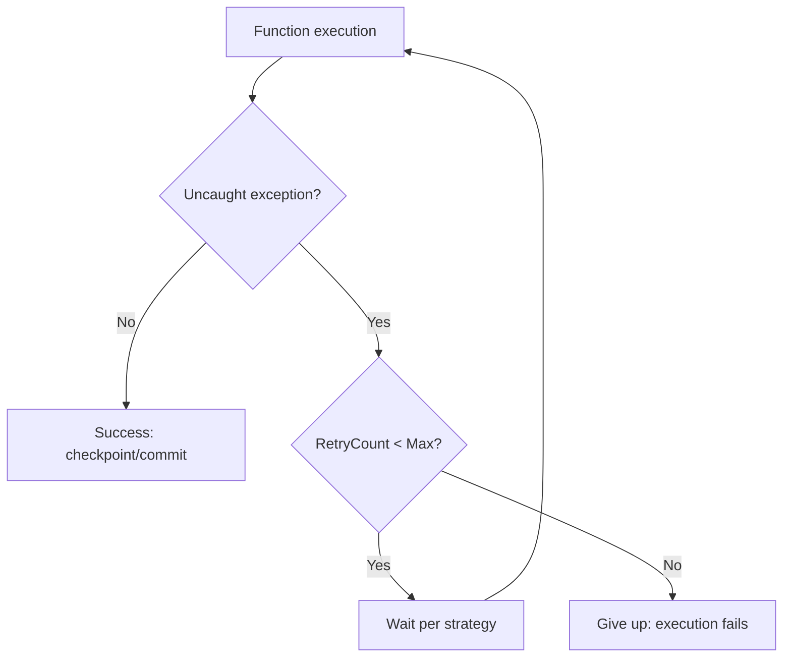

---
content_sources:
  references:
    - type: mslearn-adapted
      url: https://learn.microsoft.com/en-us/azure/azure-functions/functions-bindings-error-pages
  diagrams:
    - id: architecture
      type: flowchart
      source: self-generated
      justification: Flow view of architecture, synthesized from Microsoft Learn documentation cited on this page.
      based_on:
        - https://learn.microsoft.com/en-us/azure/azure-functions/functions-bindings-error-pages
---
# Retry Policies

Azure Functions runtime-enforced retry policies rerun a failed execution until it succeeds or the maximum retry count is reached. In the .NET isolated worker model you attach a policy with the `[FixedDelayRetry]` or `[ExponentialBackoffRetry]` attribute on the function method. Retry policies are only supported for a specific set of trigger types; other triggers rely on their own built-in retry behavior.

## Supported Triggers

Runtime retry policies apply only to these triggers:

| Trigger | Retry source |
|---|---|
| Timer | Retry policies |
| Event Hubs | Retry policies |
| Azure Cosmos DB | Retry policies |
| Kafka | Retry policies |

Queue Storage, Blob Storage, and Service Bus triggers do **not** use retry policies — they retry through their own binding extensions (poison-queue handling, `maxDeliveryCount`, dead-lettering). HTTP triggers have no automatic retry; the caller must retry.

## Required Packages

Function-level retries in the isolated worker require these NuGet packages:

- `Microsoft.Azure.Functions.Worker.Sdk` version 1.9.0 or later
- `Microsoft.Azure.Functions.Worker.Extensions.EventHubs` version 5.2.0 or later (for Event Hubs)
- `Microsoft.Azure.Functions.Worker.Extensions.Timer` version 4.2.0 or later (for Timer)

## Architecture

<!-- diagram-id: architecture -->


## Fixed Delay

A fixed amount of time elapses between each retry.

```csharp
[Function(nameof(ScheduledJob))]
[FixedDelayRetry(5, "00:00:10")]
public void ScheduledJob(
    [TimerTrigger("0 */5 * * * *")] TimerInfo timerInfo,
    FunctionContext context)
{
    var logger = context.GetLogger(nameof(ScheduledJob));
    logger.LogInformation("Next schedule = {Next}", timerInfo.ScheduleStatus?.Next);
    throw new InvalidOperationException("This is a retryable exception");
}
```

## Exponential Backoff

The first retry waits the minimum interval; each subsequent retry adds time exponentially (with small randomization) up to the maximum interval.

```csharp
[Function(nameof(ScheduledJob))]
[ExponentialBackoffRetry(5, "00:00:04", "00:15:00")]
public void ScheduledJob(
    [TimerTrigger("0 */5 * * * *")] TimerInfo timerInfo,
    FunctionContext context)
{
    var logger = context.GetLogger(nameof(ScheduledJob));
    throw new InvalidOperationException("This is a retryable exception");
}
```

## Attribute Properties

| Property | Description |
|---|---|
| `MaxRetryCount` | Required. Max retries per execution. `-1` retries indefinitely. |
| `DelayInterval` | Fixed-delay interval, format `HH:mm:ss`. |
| `MinimumInterval` | Exponential-backoff minimum delay, format `HH:mm:ss`. |
| `MaximumInterval` | Exponential-backoff maximum delay, format `HH:mm:ss`. |

!!! warning "Max retry count is best-effort"
    The retry count is stored in instance memory. If the instance fails between retries, the count is lost — Event Hubs resumes on a new instance with the count reset, while Timer does not resume. Design your functions to be idempotent.

!!! note "Event Hubs checkpoint behavior"
    Event Hubs checkpoints are not written until the retry policy finishes, so progress on that partition is paused until the current batch completes.

## See Also

- [Event Hubs](event-hub.md)
- [Timer](timer.md)

## Sources

- [Azure Functions error handling and retry guidance (Microsoft Learn)](https://learn.microsoft.com/en-us/azure/azure-functions/functions-bindings-error-pages)
