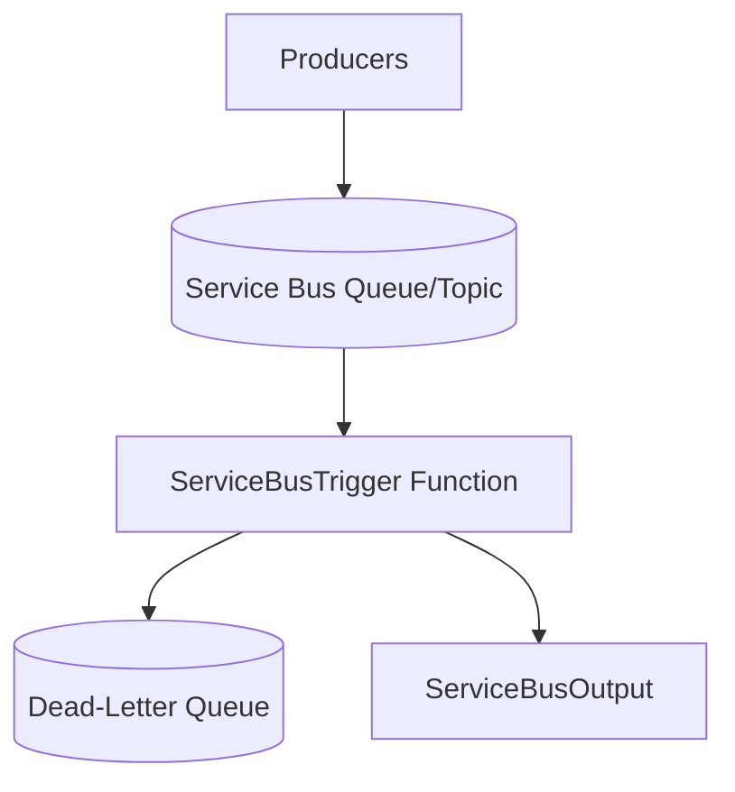

---
content_sources:
  references:
    - type: mslearn-adapted
      url: https://learn.microsoft.com/en-us/azure/azure-functions/functions-bindings-service-bus
  diagrams:
    - id: service-bus
      type: flowchart
      source: self-generated
      justification: Flow view of service-bus, synthesized from Microsoft Learn documentation cited on this page.
      based_on:
        - https://learn.microsoft.com/en-us/azure/azure-functions/functions-bindings-service-bus
        - https://learn.microsoft.com/en-us/azure/azure-functions/functions-bindings-service-bus-trigger
---
# Service Bus

Consume Service Bus queue and topic messages with the trigger and publish messages with the output binding in the .NET isolated worker model.

<!-- diagram-id: service-bus -->


## Topic/Command Groups

### Queue trigger

Message settlement is automatic: returning settles the message, and throwing abandons it. After `maxDeliveryCount` the message is dead-lettered.

```csharp
[Function("ProcessOrder")]
public void ProcessOrder(
    [ServiceBusTrigger("orders", Connection = "ServiceBusConnection")] string message,
    FunctionContext context)
{
    var logger = context.GetLogger("ProcessOrder");
    logger.LogInformation("Processing message: {Message}", message);
}
```

### Topic/subscription trigger

```csharp
[Function("ProcessEvent")]
public void ProcessEvent(
    [ServiceBusTrigger("events", "billing", Connection = "ServiceBusConnection")] string message,
    FunctionContext context)
{
    context.GetLogger("ProcessEvent").LogInformation("Subscription message: {Message}", message);
}
```

### Output binding

```csharp
[Function("Enqueue")]
[ServiceBusOutput("orders", Connection = "ServiceBusConnection")]
public string Enqueue(
    [HttpTrigger(AuthorizationLevel.Function, "post", Route = "servicebus/enqueue")]
    HttpRequestData request)
{
    return new StreamReader(request.Body).ReadToEnd();
}
```

### Identity-based connection

```bash
az functionapp config appsettings set \
  --name $APP_NAME \
  --resource-group $RG \
  --settings "ServiceBusConnection__fullyQualifiedNamespace=$NAMESPACE.servicebus.windows.net"
```
| Command/Parameter | Purpose |
| --- | --- |
| `az functionapp config appsettings set` | Add or update application settings on the function app. |
| `--name` | Name of the target resource. |
| `--resource-group` | Resource group that contains the resource. |
| `--settings` | Key=value application settings to apply. |

Grant the managed identity the **Azure Service Bus Data Receiver** (and **Data Sender** for output) role.

### Host settings

```json
{
  "version": "2.0",
  "extensions": {
    "serviceBus": {
      "maxConcurrentCalls": 16,
      "prefetchCount": 0,
      "maxAutoLockRenewalDuration": "00:05:00"
    }
  }
}
```

## Review Matrix

| Review area | Page-specific check |
|---|---|
| Scope | Confirm the guidance applies to Service Bus trigger and output bindings. |
| Source basis | Validate the recommendation against the Microsoft Learn sources in this page. |
| Evidence | Capture command output, portal state, metrics, logs, or screenshots before treating the result as proven. |

## See Also
- [Recipes Index](index.md)
- [.NET Language Guide](../index.md)
- [Troubleshooting](../troubleshooting.md)

## Sources
- [Azure Service Bus bindings for Azure Functions (Microsoft Learn)](https://learn.microsoft.com/en-us/azure/azure-functions/functions-bindings-service-bus)
- [Azure Service Bus trigger for Azure Functions (Microsoft Learn)](https://learn.microsoft.com/en-us/azure/azure-functions/functions-bindings-service-bus-trigger)
- [Azure Service Bus output binding for Azure Functions (Microsoft Learn)](https://learn.microsoft.com/en-us/azure/azure-functions/functions-bindings-service-bus-output)
