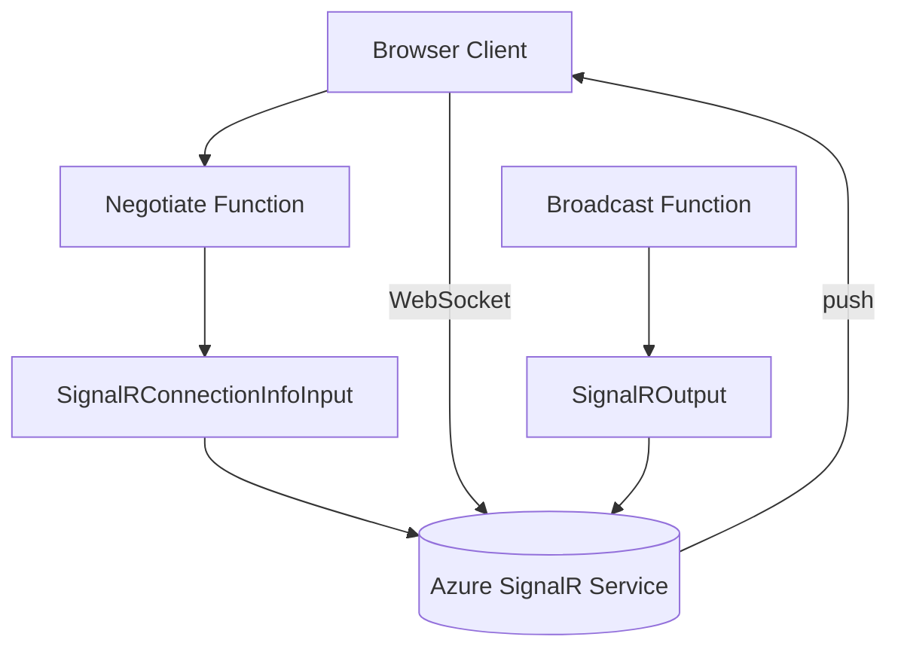

---
content_sources:
  references:
    - type: mslearn-adapted
      url: https://learn.microsoft.com/en-us/azure/azure-functions/functions-bindings-signalr-service
  diagrams:
    - id: signalr
      type: flowchart
      source: self-generated
      justification: Flow view of architecture, synthesized from Microsoft Learn documentation cited on this page.
      based_on:
        - https://learn.microsoft.com/en-us/azure/azure-functions/functions-bindings-signalr-service
        - https://learn.microsoft.com/en-us/azure/azure-functions/functions-bindings-signalr-service-input
---
# SignalR Service

This recipe covers adding real-time messaging to Azure Functions .NET isolated worker with Azure SignalR Service in serverless mode. It uses the `SignalRConnectionInfoInput` attribute to implement the required `negotiate` endpoint and the `SignalROutput` attribute to broadcast messages to connected clients.

## Architecture

<!-- diagram-id: signalr -->


## Prerequisites

Install the isolated worker SignalR extension package:

```bash
dotnet add package Microsoft.Azure.Functions.Worker.Extensions.SignalRService
```

| CLI element | Explanation |
|---|---|
| Command(s) | `dotnet add package` |
| Key flags | (package name argument) |
| Variables | None |
| Expected result | The package reference is added to the `.csproj`; confirm the restore succeeds before continuing. |

Configure the connection in app settings. A connection string (stored as `AzureSignalRConnectionString`) or an identity-based connection is supported:

```bash
az functionapp config appsettings set \
  --name $APP_NAME \
  --resource-group $RG \
  --settings "AzureSignalRConnectionString__serviceUri=https://$SIGNALR_NAME.service.signalr.net"
```

| CLI element | Explanation |
|---|---|
| Command(s) | `az functionapp config appsettings set` |
| Key flags | `--name`, `--resource-group`, `--settings` |
| Variables | `$APP_NAME`, `$RG`, `$SIGNALR_NAME` |
| Expected result | Azure CLI returns the updated app settings as JSON; confirm the setting is present before continuing. |

The SignalR Service instance must be in **Serverless** mode. When using an identity-based connection, grant the function app's managed identity the **SignalR Service Owner** role on the resource.

## Command Groups

### The negotiate Endpoint

Before a client connects, it calls a `negotiate` endpoint to obtain the service URL and a short-lived access token. The `SignalRConnectionInfoInput` binding produces this payload. The framework serializes the connection info as camel case, which the SignalR client SDK requires.

```csharp
[Function(nameof(Negotiate))]
public static string Negotiate(
    [HttpTrigger(AuthorizationLevel.Anonymous, "post")] HttpRequestData req,
    [SignalRConnectionInfoInput(HubName = "serverless")] string connectionInfo)
{
    return connectionInfo;
}
```

### Broadcast a Message

Return a `SignalRMessageAction` decorated with the `SignalROutput` attribute to send a message to all connected clients. The action specifies a `Target` (the client-side handler name) and `Arguments`.

```csharp
[Function(nameof(Broadcast))]
[SignalROutput(HubName = "serverless")]
public static async Task<SignalRMessageAction> Broadcast(
    [HttpTrigger(AuthorizationLevel.Function, "post")] HttpRequestData req)
{
    string message = await req.ReadAsStringAsync() ?? string.Empty;

    return new SignalRMessageAction("newMessage")
    {
        Arguments = new[] { (object)message },
    };
}
```

### Target a User or Group

Set `UserId` or `GroupName` on the `SignalRMessageAction` to target a subset of clients instead of broadcasting.

```csharp
return new SignalRMessageAction("newMessage")
{
    UserId = "user1",
    Arguments = new[] { (object)message },
};
```

## Review Matrix

| Property | Purpose |
|----------|---------|
| `Target` | Name of the client-side method invoked by SignalR |
| `Arguments` | Arguments passed to the client method |
| `UserId` | Restrict delivery to a single user identifier |
| `GroupName` | Restrict delivery to members of a named group |

!!! warning "Secure the negotiate endpoint"
    The example uses `AuthorizationLevel.Anonymous` for clarity. In production, protect the endpoint with App Service Authentication and bind the authenticated user via `UserId = "{headers.x-ms-client-principal-id}"`.

## See Also

- [HTTP Authentication](http-auth.md)
- [Managed Identity](managed-identity.md)

## Sources

- [Azure Functions SignalR Service bindings (Microsoft Learn)](https://learn.microsoft.com/en-us/azure/azure-functions/functions-bindings-signalr-service)
- [SignalR Service input binding (Microsoft Learn)](https://learn.microsoft.com/en-us/azure/azure-functions/functions-bindings-signalr-service-input)
- [SignalR Service output binding (Microsoft Learn)](https://learn.microsoft.com/en-us/azure/azure-functions/functions-bindings-signalr-service-output)
