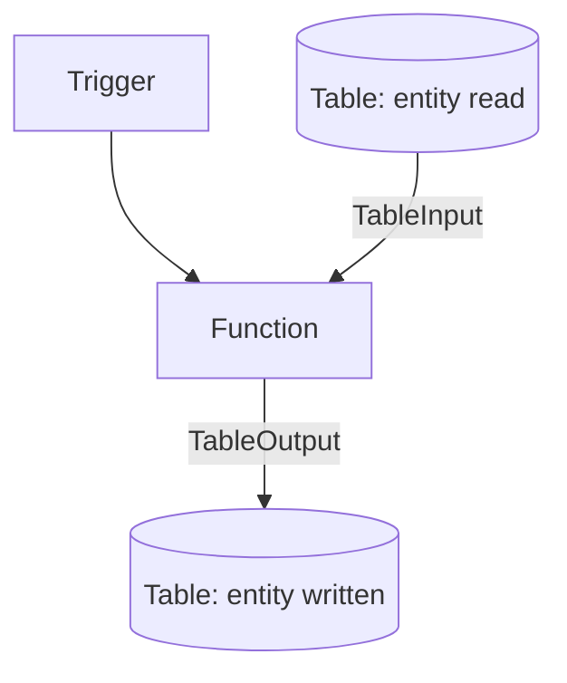

---
content_sources:
  references:
    - type: mslearn-adapted
      url: https://learn.microsoft.com/en-us/azure/azure-functions/functions-bindings-storage-table
  diagrams:
    - id: table-storage
      type: flowchart
      source: self-generated
      justification: Flow view of table-storage, synthesized from Microsoft Learn documentation cited on this page.
      based_on:
        - https://learn.microsoft.com/en-us/azure/azure-functions/functions-bindings-storage-table
        - https://learn.microsoft.com/en-us/azure/azure-functions/functions-bindings-storage-table-output
---
# Table Storage

Read and write Azure Table Storage entities with the `TableInput` and `TableOutput` bindings in the .NET isolated worker model.

<!-- diagram-id: table-storage -->


## Topic/Command Groups

### Entity type

The output entity must implement `ITableEntity` or expose string `PartitionKey` and `RowKey` properties.

```csharp
public class MyTableData : Azure.Data.Tables.ITableEntity
{
    public string Text { get; set; }
    public string PartitionKey { get; set; }
    public string RowKey { get; set; }
    public DateTimeOffset? Timestamp { get; set; }
    public ETag ETag { get; set; }
}
```

### Output binding: write an entity

```csharp
[Function("TableFunction")]
[TableOutput("OutputTable", Connection = "TableConnection")]
public static MyTableData Run(
    [QueueTrigger("table-items", Connection = "AzureWebJobsStorage")] string input,
    FunctionContext context)
{
    return new MyTableData
    {
        PartitionKey = "queue",
        RowKey = Guid.NewGuid().ToString(),
        Text = $"Record created from message: {input}"
    };
}
```

### Input binding: read an entity

```csharp
[Function("GetEntity")]
public static MyTableData GetEntity(
    [HttpTrigger(AuthorizationLevel.Function, "get", Route = "entities/{partitionKey}/{rowKey}")]
    HttpRequestData req,
    [TableInput("OutputTable", "{partitionKey}", "{rowKey}", Connection = "TableConnection")]
    MyTableData entity)
{
    return entity;
}
```

### Identity-based connection

```bash
az functionapp config appsettings set \
  --name $APP_NAME \
  --resource-group $RG \
  --settings "TableConnection__tableServiceUri=https://$STORAGE_NAME.table.core.windows.net"
```
| Command/Parameter | Purpose |
| --- | --- |
| `az functionapp config appsettings set` | Add or update application settings on the function app. |
| `--name` | Name of the target resource. |
| `--resource-group` | Resource group that contains the resource. |
| `--settings` | Key=value application settings to apply. |

Grant the managed identity **Storage Table Data Reader** (input) and **Storage Table Data Contributor** (output).

!!! note "Output binding creates new entities only"
    The table output binding only creates new entities. To update or delete an entity, inject a `TableClient` from `Azure.Data.Tables` and call it directly.

## Review Matrix

| Review area | Page-specific check |
|---|---|
| Scope | Confirm the guidance applies to Table Storage input and output bindings. |
| Source basis | Validate the recommendation against the Microsoft Learn sources in this page. |
| Evidence | Capture command output, portal state, metrics, logs, or screenshots before treating the result as proven. |

## See Also
- [Recipes Index](index.md)
- [.NET Language Guide](../index.md)
- [Troubleshooting](../troubleshooting.md)

## Sources
- [Azure Table storage bindings for Azure Functions (Microsoft Learn)](https://learn.microsoft.com/en-us/azure/azure-functions/functions-bindings-storage-table)
- [Azure Tables output binding for Azure Functions (Microsoft Learn)](https://learn.microsoft.com/en-us/azure/azure-functions/functions-bindings-storage-table-output)
- [Azure Tables input binding for Azure Functions (Microsoft Learn)](https://learn.microsoft.com/en-us/azure/azure-functions/functions-bindings-storage-table-input)
