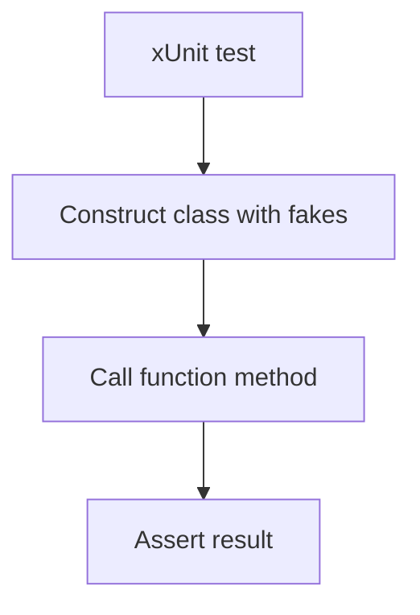

---
content_sources:
  references:
    - type: mslearn-adapted
      url: https://learn.microsoft.com/en-us/azure/azure-functions/dotnet-isolated-process-guide
  diagrams:
    - id: architecture
      type: flowchart
      source: self-generated
      justification: Flow view of architecture, synthesized from Microsoft Learn documentation cited on this page.
      based_on:
        - https://learn.microsoft.com/en-us/azure/azure-functions/dotnet-isolated-process-guide
---
# Unit Testing

In the .NET isolated worker model a function is a plain class method, so you test it with xUnit by constructing the inputs and asserting on the return value. Because the function class supports constructor injection, you pass fakes or mocks directly. No Functions host is required.

## Prerequisites

- A .NET isolated worker Function App.
- A test project referencing `xunit` and (optionally) `Moq`.

## Architecture

<!-- diagram-id: architecture -->


## Testable Function

Depend on an abstraction so tests can substitute the implementation. See [Dependency Injection](dependency-injection.md).

```csharp
using Microsoft.Azure.Functions.Worker;
using Microsoft.Extensions.Logging;

public class GreetFunction
{
    private readonly IGreeter _greeter;

    public GreetFunction(IGreeter greeter) => _greeter = greeter;

    [Function("Greet")]
    public string Greet([TimerTrigger("0 */5 * * * *")] TimerInfo timer)
    {
        return _greeter.Greet("world");
    }
}

public interface IGreeter
{
    string Greet(string name);
}
```

## Test the Function

Inject a fake implementation and assert on the returned value.

```csharp
using Xunit;

public class GreetFunctionTests
{
    private sealed class FakeGreeter : IGreeter
    {
        public string Greet(string name) => $"hello {name}";
    }

    [Fact]
    public void Greet_ReturnsGreeting()
    {
        var function = new GreetFunction(new FakeGreeter());

        var result = function.Greet(new TimerInfo());

        Assert.Equal("hello world", result);
    }
}
```

## Mocking With Moq

For richer behavior verification, use Moq instead of a hand-written fake.

```csharp
var greeter = new Mock<IGreeter>();
greeter.Setup(g => g.Greet(It.IsAny<string>())).Returns("hello world");

var function = new GreetFunction(greeter.Object);
var result = function.Greet(new TimerInfo());

Assert.Equal("hello world", result);
greeter.Verify(g => g.Greet("world"), Times.Once);
```

| Element | Explanation |
|---|---|
| Constructor injection | Lets tests pass fakes/mocks without a running host. |
| Hand-written fake | Simplest test double for deterministic behavior. |
| `Mock<T>` (Moq) | Enables setup and `Verify` for interaction testing. |

!!! tip "HTTP trigger testing"
    For HTTP functions, build a `FunctionContext` and `HttpRequestData` test double (or use a helper library). To exercise the full pipeline including bindings, run `func start` locally.

## See Also

- [Dependency Injection](dependency-injection.md)
- [Middleware](middleware.md)

## Sources

- [Guide for running C# Azure Functions in the isolated worker model (Microsoft Learn)](https://learn.microsoft.com/en-us/azure/azure-functions/dotnet-isolated-process-guide)
