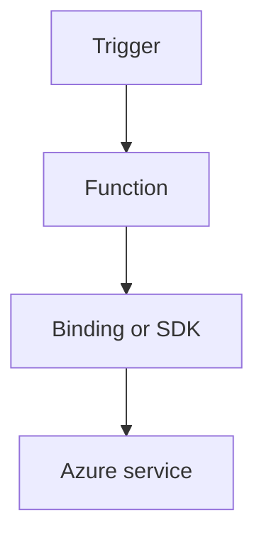

---
content_sources:

  references:
    - type: mslearn-adapted
      url: https://learn.microsoft.com/en-us/azure/azure-functions/dotnet-isolated-process-guide
    - type: mslearn-adapted
      url: https://learn.microsoft.com/en-us/azure/azure-functions/functions-triggers-bindings
  diagrams:
    - id: timer-trigger
      type: flowchart
      source: self-generated
      justification: Flow view of timer trigger, synthesized from Microsoft Learn documentation cited on this page.
      based_on:
        - https://learn.microsoft.com/en-us/azure/azure-functions/dotnet-isolated-process-guide
        - https://learn.microsoft.com/en-us/azure/azure-functions/functions-triggers-bindings
---
# Timer Trigger

Schedule periodic jobs with cron expressions and safe idempotent processing.

<!-- diagram-id: timer-trigger -->


## Topic/Command Groups

### Timer trigger
```csharp
[Function("NightlyJob")]
public void NightlyJob([TimerTrigger("0 0 2 * * *")] TimerInfo timer)
{
}
```

### Every 5 minutes heartbeat
```csharp
[Function("Heartbeat")]
public void Heartbeat([TimerTrigger("0 */5 * * * *")] TimerInfo timer)
{
}
```

### Time zone caveat (`WEBSITE_TIME_ZONE`)
- `WEBSITE_TIME_ZONE` is supported on Windows plans and on Linux Premium/Dedicated plans.
- `WEBSITE_TIME_ZONE` is not supported on Linux Consumption or Flex Consumption plans.

## Review Matrix

| Review area | Page-specific check |
|---|---|
| Scope | Confirm the guidance applies to Timer Trigger. |
| Source basis | Validate the recommendation against the Microsoft Learn sources in this page. |
| Evidence | Capture command output, portal state, metrics, logs, or screenshots before treating the result as proven. |

## See Also
- [Recipes Index](index.md)
- [.NET Language Guide](../index.md)
- [Troubleshooting](../troubleshooting.md)

## Sources
- [Azure Functions .NET isolated worker guide](https://learn.microsoft.com/en-us/azure/azure-functions/dotnet-isolated-process-guide)
- [Azure Functions triggers and bindings](https://learn.microsoft.com/en-us/azure/azure-functions/functions-triggers-bindings)
