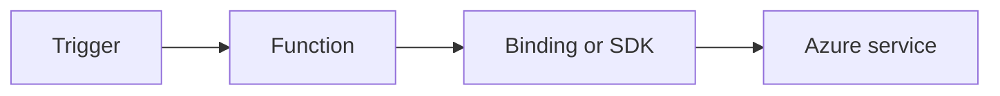

# Timer Trigger

Schedule periodic jobs with cron expressions and safe idempotent processing.



## Topic/Command Groups

### Timer trigger
```csharp
[Function("NightlyJob")]
public void NightlyJob([TimerTrigger("0 0 2 * * *")] TimerInfo timer)
{
}
```

### Every 5 minutes heartbeat
```csharp
[Function("Heartbeat")]
public void Heartbeat([TimerTrigger("0 */5 * * * *")] TimerInfo timer)
{
}
```

## See Also
- [Recipes Index](index.md)
- [.NET Language Guide](../index.md)
- [Troubleshooting](../troubleshooting.md)

## Sources
- [Azure Functions .NET isolated worker guide](https://learn.microsoft.com/azure/azure-functions/dotnet-isolated-process-guide)
- [Azure Functions triggers and bindings](https://learn.microsoft.com/azure/azure-functions/functions-triggers-bindings)
