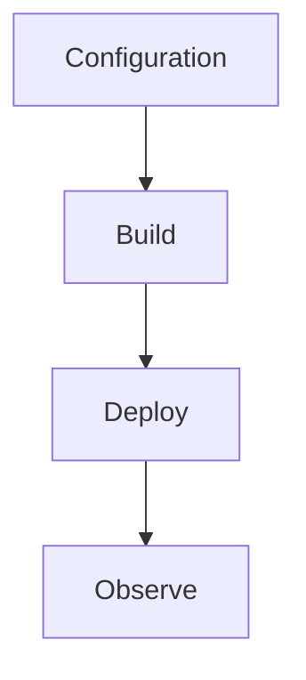

---
content_sources:

  - type: mslearn-adapted
    url: https://learn.microsoft.com/en-us/azure/azure-functions/dotnet-isolated-process-guide
  - type: mslearn-adapted
    url: https://learn.microsoft.com/en-us/azure/azure-functions/functions-host-json
content_validation:
  status: verified
  last_reviewed: '2026-05-23'
  reviewer: agent
  core_claims:
    - claim: This page uses Microsoft Learn as the primary source basis for its Azure-specific guidance.
      source: https://learn.microsoft.com/en-us/azure/azure-functions/dotnet-isolated-process-guide
      verified: true
---
# Troubleshooting

Common .NET isolated worker problems with direct diagnosis and remediation steps.

<!-- diagram-id: troubleshooting -->


## Topic/Command Groups

### Function not discovered after deploy
- Confirm `FUNCTIONS_WORKER_RUNTIME=dotnet-isolated`.
- Check startup exceptions in log stream.
- On Linux Consumption, `az functionapp log tail` can fail because scm/Kudu endpoints are not available; use Application Insights queries instead.

```bash
az functionapp log tail --name "$APP_NAME" --resource-group "$RG"
```

| CLI element | Explanation |
|---|---|
| Command(s) | `az functionapp log tail` |
| Key flags | `--name`, `--resource-group` |
| Variables | `$APP_NAME`, `$RG` |
| Expected result | Azure CLI completes successfully and returns JSON, table, or no output depending on the command; verify the next documented check before continuing. |


### Startup failure due to package mismatch
- Align worker SDK and extension package versions.
- Rebuild and republish with clean output.

```bash
dotnet clean
dotnet build --configuration Release
dotnet publish --configuration Release --output ./publish
func azure functionapp publish "$APP_NAME"
```

### HTTP 500 from serialization
- Validate request body parsing and response encoding.
- Ensure `HttpResponseData` is returned on all code paths.

## See Also
- [.NET Language Guide](index.md)
- [.NET Runtime](dotnet-runtime.md)
- [.NET Isolated Worker Model](isolated-worker-model.md)
- [Recipes Index](recipes/index.md)

## Sources
- [Azure Functions .NET isolated worker guide](https://learn.microsoft.com/en-us/azure/azure-functions/dotnet-isolated-process-guide)
- [Azure Functions host.json reference](https://learn.microsoft.com/en-us/azure/azure-functions/functions-host-json)
