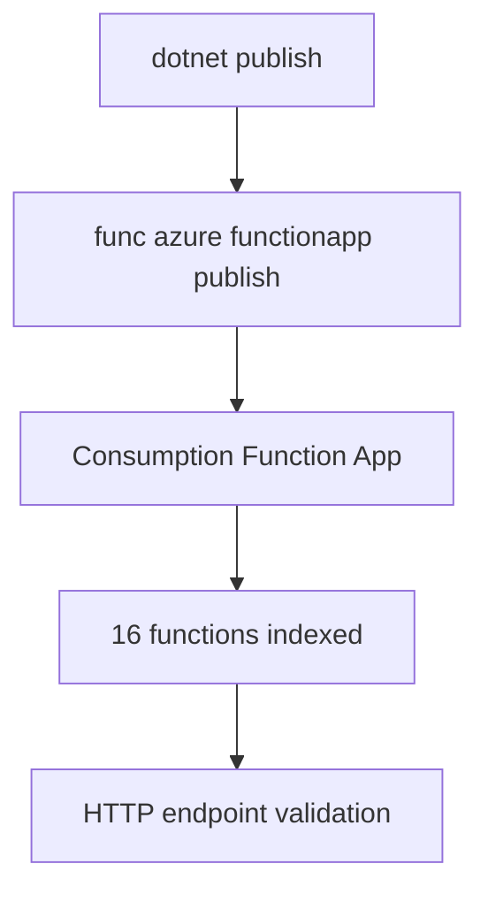

---
hide:
  - toc
validation:
  az_cli:
    last_tested: 2026-04-12
    cli_version: "2.70.0"
    core_tools_version: "4.6.0"
    result: pass
  bicep:
    last_tested: null
    result: not_tested
content_sources:
  - type: mslearn-adapted
    url: https://learn.microsoft.com/azure/azure-functions/dotnet-isolated-process-guide
  - type: mslearn-adapted
    url: https://learn.microsoft.com/azure/azure-functions/functions-develop-local
  - type: mslearn-adapted
    url: https://learn.microsoft.com/azure/azure-functions/functions-scale
---

# 02 - First Deploy (Consumption)

Deploy your .NET 8 isolated worker app to the Consumption plan with long-form Azure CLI commands and validate your first production endpoint.

## Prerequisites

| Tool | Version | Purpose |
|------|---------|---------|
| .NET SDK | 8.0 (LTS) | Build and run isolated worker functions |
| Azure Functions Core Tools | v4 | Start local host and publish artifacts |
| Azure CLI | 2.61+ | Provision Azure resources and inspect app state |

!!! info "Consumption plan basics"
    Consumption (Y1) scales to zero and charges per execution. Default timeout is 5 minutes (max 10 minutes). No VNet integration on this plan.

## What You'll Build

A Linux Consumption Function App running the .NET 8 isolated worker, deployed from your local project with Core Tools, then validated through all HTTP endpoints.

<!-- diagram-id: what-you-ll-build -->


## Steps

### Step 1 - Set deployment variables

```bash
export RG="rg-func-dotnet-con-demo"
export LOCATION="koreacentral"
export STORAGE_NAME="stdotnetcon0410"
export APP_NAME="func-dotnetcon-04100220"
```

| Command/Parameter | Purpose |
|-------------------|---------|
| `RG` | Resource group name |
| `LOCATION` | Azure region |
| `STORAGE_NAME` | Storage account name |
| `APP_NAME` | Function app name |

### Step 2 - Create resource group and storage account

```bash
az group create \
  --name "$RG" \
  --location "$LOCATION"

az storage account create \
  --name "$STORAGE_NAME" \
  --resource-group "$RG" \
  --location "$LOCATION" \
  --sku Standard_LRS
```

| Command/Parameter | Purpose |
|-------------------|---------|
| `az group create` | Creates the resource group container |
| `--sku Standard_LRS` | Uses standard locally-redundant storage |

### Step 3 - Create the Consumption function app

```bash
az functionapp create \
  --name "$APP_NAME" \
  --resource-group "$RG" \
  --storage-account "$STORAGE_NAME" \
  --consumption-plan-location "$LOCATION" \
  --runtime dotnet-isolated \
  --runtime-version 8 \
  --functions-version 4 \
  --os-type Linux
```

| Command/Parameter | Purpose |
|-------------------|---------|
| `--runtime dotnet-isolated` | Specifies .NET isolated worker process |
| `--runtime-version 8` | Targets .NET 8 LTS |
| `--os-type Linux` | Runs on Linux workers |

### Step 4 - Create trigger resources

```bash
az storage queue create \
  --name "incoming-orders" \
  --account-name "$STORAGE_NAME"

az storage container create \
  --name "uploads" \
  --account-name "$STORAGE_NAME"
```

| Command/Parameter | Purpose |
|-------------------|---------|
| `az storage queue create` | Creates the queue for order processing |
| `az storage container create` | Creates the blob container for uploads |

### Step 5 - Configure app settings

```bash
STORAGE_CONN=$(az storage account show-connection-string \
  --name "$STORAGE_NAME" \
  --resource-group "$RG" \
  --query connectionString \
  --output tsv)

az functionapp config appsettings set \
  --name "$APP_NAME" \
  --resource-group "$RG" \
  --settings \
    "QueueStorage=$STORAGE_CONN" \
    "EventHubConnection=Endpoint=sb://placeholder.servicebus.windows.net/;SharedAccessKeyName=placeholder;SharedAccessKey=cGxhY2Vob2xkZXI=;EntityPath=events"
```

| Command/Parameter | Purpose |
|-------------------|---------|
| `az storage account show-connection-string` | Retrieves the storage access key |
| `az functionapp config appsettings set` | Configures environment variables for the app |

### Step 6 - Build and publish

```bash
cd apps/dotnet
dotnet publish --configuration Release --output ./publish

cd publish
func azure functionapp publish "$APP_NAME" --dotnet-isolated
```

| Command/Parameter | Purpose |
|-------------------|---------|
| `dotnet publish` | Compiles the project and dependencies |
| `func azure functionapp publish` | Deploys the artifacts to Azure |

!!! note "Must pass --dotnet-isolated flag"
    When publishing from the compiled output directory, Core Tools cannot detect the project language. Always pass `--dotnet-isolated` to specify the worker runtime explicitly.

### Step 7 - Verify function list

```bash
az functionapp function list \
  --name "$APP_NAME" \
  --resource-group "$RG" \
  --query "[].{name:name, language:language}" \
  --output table
```

| Command/Parameter | Purpose |
|-------------------|---------|
| `az functionapp function list` | Lists all deployed functions in the app |

Expected output (16 functions):

```text
Name                                          Language
--------------------------------------------  ---------------
func-dotnetcon-04100220/blobProcessor         dotnet-isolated
func-dotnetcon-04100220/dnsResolve            dotnet-isolated
func-dotnetcon-04100220/eventhubLagProcessor  dotnet-isolated
func-dotnetcon-04100220/externalDependency    dotnet-isolated
func-dotnetcon-04100220/health                dotnet-isolated
func-dotnetcon-04100220/helloHttp             dotnet-isolated
func-dotnetcon-04100220/identityProbe         dotnet-isolated
func-dotnetcon-04100220/info                  dotnet-isolated
func-dotnetcon-04100220/logLevels             dotnet-isolated
func-dotnetcon-04100220/queueProcessor        dotnet-isolated
func-dotnetcon-04100220/scheduledCleanup      dotnet-isolated
func-dotnetcon-04100220/slowResponse          dotnet-isolated
func-dotnetcon-04100220/storageProbe          dotnet-isolated
func-dotnetcon-04100220/testError             dotnet-isolated
func-dotnetcon-04100220/timerLab              dotnet-isolated
func-dotnetcon-04100220/unhandledError        dotnet-isolated
```

### Step 8 - Test HTTP endpoints

```bash
curl --request GET "https://$APP_NAME.azurewebsites.net/api/health"
curl --request GET "https://$APP_NAME.azurewebsites.net/api/hello/Consumption"
curl --request GET "https://$APP_NAME.azurewebsites.net/api/info"
```

| Command/Parameter | Purpose |
|-------------------|---------|
| `curl --request GET` | Sends HTTP GET requests to validation endpoints |
| `/api/health` | Probes service health state |
| `/api/hello/` | Validates route parameter handling |
| `/api/info` | Inspects app configuration values |

## Verification

```text
Uploading 6.82 MB [-----------------------------------------------------------]
Upload completed successfully.
Deployment completed successfully.
Syncing triggers...
```

App state:

```text
State    DefaultHostName                            Kind
-------  -----------------------------------------  -----------------
Running  func-dotnetcon-04100220.azurewebsites.net  functionapp,linux
```

Health endpoint response:

```json
{"status":"healthy","timestamp":"2026-04-09T17:46:52.625Z","version":"1.0.0"}
```

!!! note ".NET upload size"
    The .NET isolated worker publish output is approximately 6.82 MB, larger than Java (~326 KB) because it includes the ASP.NET Core runtime dependencies.

## Next Steps

> **Next:** [03 - Configuration](03-configuration.md)

## See Also

- [Tutorial Overview & Plan Chooser](../index.md)
- [.NET Language Guide](../../index.md)
- [Platform: Hosting Plans](../../../../platform/hosting.md)
- [Operations: Deployment](../../../../operations/deployment.md)
- [Recipes Index](../../recipes/index.md)

## Sources

- [Azure Functions .NET isolated worker guide (Microsoft Learn)](https://learn.microsoft.com/azure/azure-functions/dotnet-isolated-process-guide)
- [Develop Azure Functions locally with Core Tools (Microsoft Learn)](https://learn.microsoft.com/azure/azure-functions/functions-develop-local)
- [Azure Functions hosting options (Microsoft Learn)](https://learn.microsoft.com/azure/azure-functions/functions-scale)
