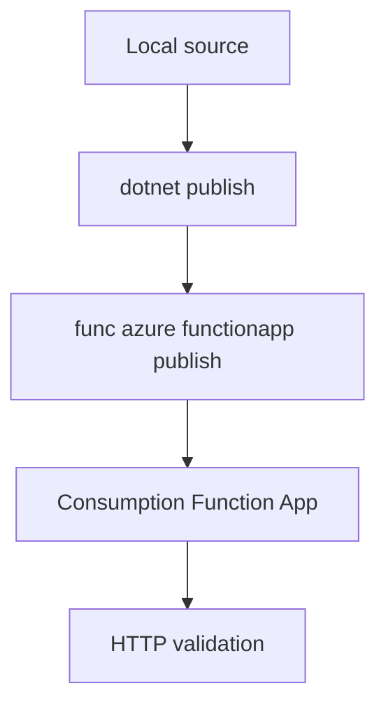

# 02 - First Deploy (Consumption)

Deploy your .NET isolated worker app to the Consumption plan with long-form Azure CLI commands and validate your first production endpoint.

## Prerequisites

| Tool | Version | Purpose |
|------|---------|---------|
| .NET SDK | 8.0 (LTS) | Build and run isolated worker functions |
| Azure Functions Core Tools | v4 | Local host and deployment commands |
| Azure CLI | 2.61+ | Provision and configure Azure resources |

!!! info "Plan basics"
    Consumption (Y1) scales to zero and charges per execution. It has a default 5-minute timeout and up to 10 minutes maximum per execution.
    No VNet integration on this plan.

## What You'll Build

A Linux Consumption Function App running the .NET isolated worker, deployed from your local project with Core Tools, then validated through the `Health` HTTP endpoint using a function key.

## Steps
### Step 1 - Set deployment variables
```bash
export RG="rg-dotnet-consumption-demo"
export APP_NAME="func-dotnet-consumption-demo"
export STORAGE_NAME="stdotnetconsumptiondemo"
export PLAN_NAME="plan-dotnet-consumption-demo"
export LOCATION="koreacentral"
```

### Step 2 - Create required Azure resources
```bash
az group create --name "$RG" --location "$LOCATION"
az storage account create \
  --name "$STORAGE_NAME" \
  --resource-group "$RG" \
  --location "$LOCATION" \
  --sku Standard_LRS \
  --kind StorageV2
az functionapp create \
  --name "$APP_NAME" \
  --resource-group "$RG" \
  --storage-account "$STORAGE_NAME" \
  --consumption-plan-location "$LOCATION" \
  --functions-version 4 \
  --runtime dotnet-isolated \
  --runtime-version 8 \
  --os-type Linux
```

### Step 3 - Build and publish the app
```bash
dotnet build
dotnet publish --configuration Release --output ./publish
func azure functionapp publish "$APP_NAME"
```

### Step 4 - Verify the endpoint
```bash
curl "https://$APP_NAME.azurewebsites.net/api/health?code=$(az functionapp keys list --resource-group $RG --name $APP_NAME --query 'functionKeys.default' --output tsv)"
```


### Step X - Validate isolated worker conventions
```bash
grep "FUNCTIONS_WORKER_RUNTIME" "local.settings.json"
grep "ConfigureFunctionsWebApplication" "Program.cs"
```

Confirm that HTTP functions use `HttpRequestData` and `HttpResponseData`, and that logging is constructor-injected with `ILogger<T>`.

## Verification
```json
{"status":"healthy"}
```
## See Also
- [Tutorial Overview & Plan Chooser](../index.md)
- [.NET Language Guide](../../index.md)
- [Platform: Hosting Plans](../../../../platform/hosting.md)
- [Operations: Deployment](../../../../operations/deployment.md)
- [Recipes Index](../../recipes/index.md)

## Sources
- [Azure Functions .NET isolated worker guide](https://learn.microsoft.com/azure/azure-functions/dotnet-isolated-process-guide)
- [Develop Azure Functions locally with Core Tools](https://learn.microsoft.com/azure/azure-functions/functions-develop-local)
- [Azure Functions hosting options](https://learn.microsoft.com/azure/azure-functions/functions-scale)
