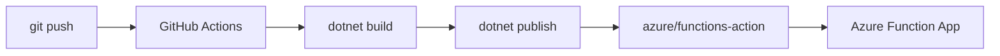

# 06 - CI/CD (Consumption)

Automate build and deployment for Consumption with GitHub Actions, deterministic .NET builds, and publish-profile based release flow.

## Prerequisites

| Tool | Version | Purpose |
|------|---------|---------|
| .NET SDK | 8.0 (LTS) | Build and run isolated worker functions |
| Azure Functions Core Tools | v4 | Local host and deployment commands |
| Azure CLI | 2.61+ | Provision and configure Azure resources |

!!! info "Plan basics"
    Consumption (Y1) scales to zero and charges per execution. It has a default 5-minute timeout and up to 10 minutes maximum per execution.
    No VNet integration on this plan.

## Steps
### Step 1 - Export publish profile
```bash
az functionapp deployment list-publishing-profiles \
  --name "$APP_NAME" \
  --resource-group "$RG" \
  --xml \
  --output tsv
```

Add the XML value to GitHub secret: `AZURE_FUNCTIONAPP_PUBLISH_PROFILE`.

### Step 2 - Create GitHub Actions workflow
```yaml
name: Deploy .NET Function App (Consumption)

on:
  push:
    branches:
      - main

jobs:
  build-and-deploy:
    runs-on: ubuntu-latest
    steps:
      - name: Checkout
        uses: actions/checkout@v4

      - name: Set up .NET
        uses: actions/setup-dotnet@v4
        with:
          dotnet-version: '8.0.x'

      - name: Build
        run: dotnet build --configuration Release

      - name: Publish
        run: dotnet publish --configuration Release --output ./publish

      - name: Deploy
        uses: azure/functions-action@v1
        with:
          app-name: ${{ secrets.AZURE_FUNCTIONAPP_NAME }}
          package: ./publish
          publish-profile: ${{ secrets.AZURE_FUNCTIONAPP_PUBLISH_PROFILE }}
```

### Step 3 - Validate release
```bash
curl --request GET "https://$APP_NAME.azurewebsites.net/api/health"
```


### Step X - Validate isolated worker conventions
```bash
grep "FUNCTIONS_WORKER_RUNTIME" "local.settings.json"
grep "ConfigureFunctionsWebApplication" "Program.cs"
```

Confirm that HTTP functions use `HttpRequestData` and `HttpResponseData`, and that logging is constructor-injected with `ILogger<T>`.

## Expected Output
```text
Run azure/functions-action@v1
Deployment successful.
Function app updated with package from ./publish
```
## Next Steps

> **Next:** [07 - Extending Triggers](07-extending-triggers.md)

## See Also
- [Tutorial Overview & Plan Chooser](../index.md)
- [.NET Language Guide](../../index.md)
- [Platform: Hosting Plans](../../../../platform/hosting.md)
- [Operations: Deployment](../../../../operations/deployment.md)
- [Recipes Index](../../recipes/index.md)

## Sources
- [Azure Functions .NET isolated worker guide](https://learn.microsoft.com/azure/azure-functions/dotnet-isolated-process-guide)
- [Develop Azure Functions locally with Core Tools](https://learn.microsoft.com/azure/azure-functions/functions-develop-local)
- [Azure Functions hosting options](https://learn.microsoft.com/azure/azure-functions/functions-scale)
