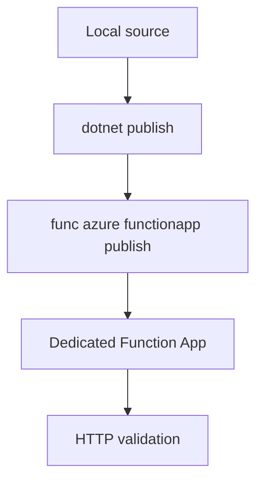

# 02 - First Deploy (Dedicated)

Deploy your .NET isolated worker app to the Dedicated plan with long-form Azure CLI commands and validate your first production endpoint.

## Prerequisites

| Tool | Version | Purpose |
|------|---------|---------|
| .NET SDK | 8.0 (LTS) | Build and run isolated worker functions |
| Azure Functions Core Tools | v4 | Local host and deployment commands |
| Azure CLI | 2.61+ | Provision and configure Azure resources |

!!! info "Plan basics"
    Dedicated (App Service Plan) runs on pre-provisioned compute with predictable cost. Enable Always On for non-HTTP triggers.
    Supports VNet integration and slots on eligible SKUs.

## Steps
### Step 1 - Set deployment variables
```bash
export RG="rg-dotnet-dedicated-demo"
export APP_NAME="func-dotnet-dedicated-demo"
export STORAGE_NAME="stdotnetdedicateddemo"
export PLAN_NAME="plan-dotnet-dedicated-demo"
export LOCATION="koreacentral"
```

### Step 2 - Create required Azure resources
```bash
az group create --name "$RG" --location "$LOCATION"
az storage account create \
  --name "$STORAGE_NAME" \
  --resource-group "$RG" \
  --location "$LOCATION" \
  --sku Standard_LRS \
  --kind StorageV2
az appservice plan create \
  --name "$PLAN_NAME" \
  --resource-group "$RG" \
  --location "$LOCATION" \
  --sku B1 \
  --is-linux true
az functionapp create \
  --name "$APP_NAME" \
  --resource-group "$RG" \
  --storage-account "$STORAGE_NAME" \
  --plan "$PLAN_NAME" \
  --functions-version 4 \
  --runtime dotnet-isolated \
  --runtime-version 8 \
  --os-type Linux
```

### Step 3 - Build and publish the app
```bash
dotnet build
dotnet publish --configuration Release --output ./publish
func azure functionapp publish "$APP_NAME" --dotnet-isolated
```

### Step 4 - Verify the endpoint
```bash
curl --request GET "https://$APP_NAME.azurewebsites.net/api/health"
```


### Step X - Validate isolated worker conventions
```bash
grep "FUNCTIONS_WORKER_RUNTIME" "local.settings.json"
grep "ConfigureFunctionsWebApplication" "Program.cs"
```

Confirm that HTTP functions use `HttpRequestData` and `HttpResponseData`, and that logging is constructor-injected with `ILogger<T>`.

## Expected Output
```json
{
  "state": "Running",
  "kind": "functionapp,linux",
  "defaultHostName": "func-dotnet-<plan>-demo.azurewebsites.net"
}
```
## Next Steps

> **Next:** [03 - Configuration](03-configuration.md)

## See Also
- [Tutorial Overview & Plan Chooser](../index.md)
- [.NET Language Guide](../../index.md)
- [Platform: Hosting Plans](../../../../platform/hosting.md)
- [Operations: Deployment](../../../../operations/deployment.md)
- [Recipes Index](../../recipes/index.md)

## Sources
- [Azure Functions .NET isolated worker guide](https://learn.microsoft.com/azure/azure-functions/dotnet-isolated-process-guide)
- [Develop Azure Functions locally with Core Tools](https://learn.microsoft.com/azure/azure-functions/functions-develop-local)
- [Azure Functions hosting options](https://learn.microsoft.com/azure/azure-functions/functions-scale)
