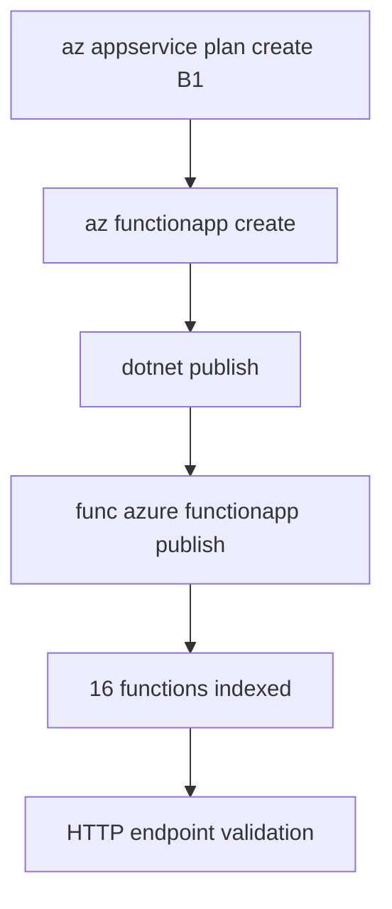

---
hide:
  - toc
validation:
  az_cli:
    last_tested: 2026-04-10
    cli_version: "2.83.0"
    core_tools_version: "4.8.0"
    result: pass
  bicep:
    last_tested: null
    result: not_tested
---

# 02 - First Deploy (Dedicated)

Deploy your .NET 8 isolated worker app to a Dedicated (App Service Plan) B1 with long-form Azure CLI commands and validate your first production endpoint.

## Prerequisites

| Tool | Version | Purpose |
|------|---------|---------|
| .NET SDK | 8.0 (LTS) | Build and run isolated worker functions |
| Azure Functions Core Tools | v4 | Start local host and publish artifacts |
| Azure CLI | 2.61+ | Provision Azure resources and inspect app state |

!!! info "Dedicated plan basics"
    Dedicated (App Service Plan) runs on pre-provisioned compute with predictable cost. Always On keeps the host loaded for non-HTTP triggers. Supports VNet integration and deployment slots on eligible SKUs. No execution timeout limit.

## What You'll Build

A Linux Dedicated Function App running the .NET 8 isolated worker on a B1 App Service Plan, deployed from your local project with Core Tools, then validated through all HTTP endpoints.



## Steps

### Step 1 - Set deployment variables

```bash
export RG="rg-func-dotnet-ded-demo"
export LOCATION="koreacentral"
export STORAGE_NAME="stdnetded0410"
export PLAN_NAME="plan-dnetded-04100301"
export APP_NAME="func-dnetded-04100301"
```

### Step 2 - Create resource group and storage account

```bash
az group create \
  --name "$RG" \
  --location "$LOCATION"

az storage account create \
  --name "$STORAGE_NAME" \
  --resource-group "$RG" \
  --location "$LOCATION" \
  --sku Standard_LRS
```

### Step 3 - Create the Dedicated App Service Plan

```bash
az appservice plan create \
  --name "$PLAN_NAME" \
  --resource-group "$RG" \
  --location "$LOCATION" \
  --sku B1 \
  --is-linux
```

!!! note "Dedicated plan uses `az appservice plan create`"
    Unlike Premium which uses `az functionapp plan create`, Dedicated plans use `az appservice plan create`. This creates a standard App Service Plan that can host both Function Apps and Web Apps.

### Step 4 - Create the function app on the Dedicated plan

```bash
az functionapp create \
  --name "$APP_NAME" \
  --resource-group "$RG" \
  --storage-account "$STORAGE_NAME" \
  --plan "$PLAN_NAME" \
  --runtime dotnet-isolated \
  --runtime-version 8 \
  --functions-version 4 \
  --os-type Linux
```

### Step 5 - Create trigger resources

```bash
az storage queue create \
  --name "incoming-orders" \
  --account-name "$STORAGE_NAME"

az storage container create \
  --name "uploads" \
  --account-name "$STORAGE_NAME"
```

### Step 6 - Configure app settings

```bash
STORAGE_CONN=$(az storage account show-connection-string \
  --name "$STORAGE_NAME" \
  --resource-group "$RG" \
  --query connectionString \
  --output tsv)

az functionapp config appsettings set \
  --name "$APP_NAME" \
  --resource-group "$RG" \
  --settings \
    "QueueStorage=$STORAGE_CONN" \
    "EventHubConnection=Endpoint=sb://placeholder.servicebus.windows.net/;SharedAccessKeyName=placeholder;SharedAccessKey=cGxhY2Vob2xkZXI=;EntityPath=events"
```

### Step 7 - Build and publish

```bash
cd apps/dotnet
dotnet publish --configuration Release --output ./publish

cd publish
func azure functionapp publish "$APP_NAME" --dotnet-isolated
```

!!! note "Must pass --dotnet-isolated flag"
    When publishing from the compiled output directory, Core Tools cannot detect the project language. Always pass `--dotnet-isolated` to specify the worker runtime explicitly.

### Step 8 - Verify function list

```bash
az functionapp function list \
  --name "$APP_NAME" \
  --resource-group "$RG" \
  --query "[].{name:name, language:language}" \
  --output table
```

Expected output (16 functions):

```text
Name                                          Language
--------------------------------------------  ---------------
func-dnetded-04100301/blobProcessor           dotnet-isolated
func-dnetded-04100301/dnsResolve              dotnet-isolated
func-dnetded-04100301/eventhubLagProcessor    dotnet-isolated
func-dnetded-04100301/externalDependency      dotnet-isolated
func-dnetded-04100301/health                  dotnet-isolated
func-dnetded-04100301/helloHttp               dotnet-isolated
func-dnetded-04100301/identityProbe           dotnet-isolated
func-dnetded-04100301/info                    dotnet-isolated
func-dnetded-04100301/logLevels               dotnet-isolated
func-dnetded-04100301/queueProcessor          dotnet-isolated
func-dnetded-04100301/scheduledCleanup        dotnet-isolated
func-dnetded-04100301/slowResponse            dotnet-isolated
func-dnetded-04100301/storageProbe            dotnet-isolated
func-dnetded-04100301/testError               dotnet-isolated
func-dnetded-04100301/timerLab                dotnet-isolated
func-dnetded-04100301/unhandledError          dotnet-isolated
```

!!! tip "Fast indexing on Dedicated"
    Unlike Premium and Consumption plans, Dedicated plans typically index all functions immediately after publish. You should see all 16 functions in the list without any delay.

### Step 9 - Test HTTP endpoints

```bash
curl --request GET "https://$APP_NAME.azurewebsites.net/api/health"
curl --request GET "https://$APP_NAME.azurewebsites.net/api/hello/Dedicated"
curl --request GET "https://$APP_NAME.azurewebsites.net/api/info"
```

## Verification

```text
Uploading 6.82 MB [-----------------------------------------------------------]
Upload completed successfully.
Deployment completed successfully.
Syncing triggers...
```

App state:

```text
State    DefaultHostName                            Kind
-------  -----------------------------------------  -----------------
Running  func-dnetded-04100301.azurewebsites.net    functionapp,linux
```

Health endpoint response:

```json
{"status":"healthy","timestamp":"2026-04-09T18:42:33.260Z","version":"1.0.0"}
```

Hello endpoint response:

```json
{"message":"Hello, Dedicated"}
```

Info endpoint response:

```json
{"name":"azure-functions-dotnet-guide","version":"1.0.0","dotnet":".NET 8.0.23","os":"Linux","environment":"production","functionApp":"func-dnetded-04100301"}
```

!!! note ".NET upload size"
    The .NET isolated worker publish output is approximately 6.82 MB, larger than Java (~326 KB) because it includes the ASP.NET Core runtime dependencies.

## Next Steps

> **Next:** [03 - Configuration](03-configuration.md)

## See Also

- [Tutorial Overview & Plan Chooser](../index.md)
- [.NET Language Guide](../../index.md)
- [Platform: Hosting Plans](../../../../platform/hosting.md)
- [Operations: Deployment](../../../../operations/deployment.md)
- [Recipes Index](../../recipes/index.md)

## Sources

- [Azure Functions .NET isolated worker guide (Microsoft Learn)](https://learn.microsoft.com/azure/azure-functions/dotnet-isolated-process-guide)
- [Develop Azure Functions locally with Core Tools (Microsoft Learn)](https://learn.microsoft.com/azure/azure-functions/functions-develop-local)
- [Azure Functions hosting options (Microsoft Learn)](https://learn.microsoft.com/azure/azure-functions/functions-scale)
- [Azure App Service plans overview (Microsoft Learn)](https://learn.microsoft.com/azure/app-service/overview-hosting-plans)
