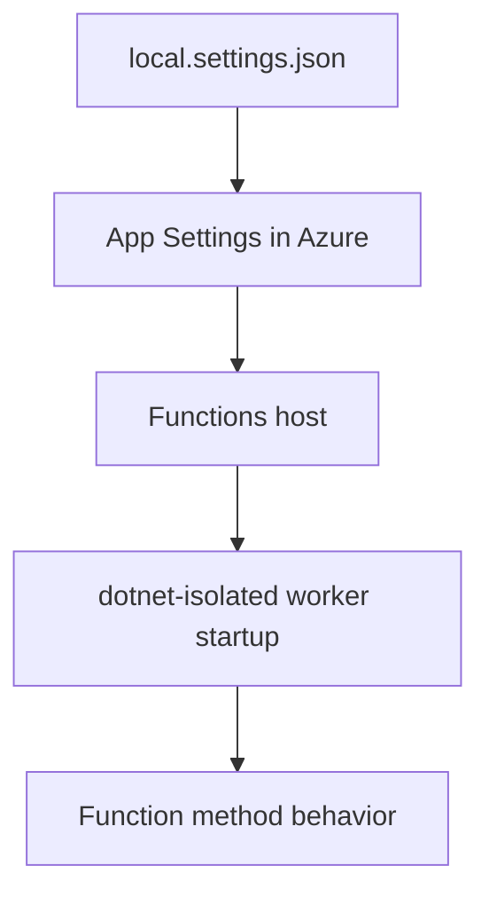

---
validation:
  az_cli:
    last_tested: 2026-04-10
    cli_version: 2.83.0
    core_tools_version: 4.8.0
    result: pass
  bicep:
    last_tested:
    result: not_tested
content_sources:

  - type: mslearn-adapted
    url: https://learn.microsoft.com/en-us/azure/azure-functions/dotnet-isolated-process-guide
  - type: mslearn-adapted
    url: https://learn.microsoft.com/en-us/azure/azure-functions/functions-scale
  - type: mslearn-adapted
    url: https://learn.microsoft.com/en-us/azure/azure-functions/functions-app-settings
  - type: mslearn-adapted
    url: https://learn.microsoft.com/en-us/azure/app-service/overview-hosting-plans
content_validation:
  status: verified
  last_reviewed: '2026-05-23'
  reviewer: agent
  core_claims:
    - claim: This page uses Microsoft Learn as the primary source basis for its Azure-specific guidance.
      source: https://learn.microsoft.com/en-us/azure/azure-functions/dotnet-isolated-process-guide
      verified: true
---
# 03 - Configuration (Dedicated)

Apply environment settings, runtime configuration, and host-level options so the same artifact can run across environments.

## Prerequisites

| Tool | Version | Purpose |
|------|---------|---------|
| .NET SDK | 8.0 (LTS) | Build and run isolated worker functions |
| Azure Functions Core Tools | v4 | Start local host and publish artifacts |
| Azure CLI | 2.61+ | Provision Azure resources and inspect app state |

!!! info "Dedicated plan basics"
    Dedicated (App Service Plan) runs on pre-provisioned compute with predictable cost. Always On keeps the host loaded for non-HTTP triggers. Supports VNet integration and deployment slots on eligible SKUs. No execution timeout limit.

## What You'll Build

You will standardize .NET isolated worker app settings for Dedicated, keep environment-specific values outside the artifact, and verify effective configuration from Azure.

<!-- diagram-id: what-you-ll-build -->


## Steps

### Step 1 - Baseline local settings

The reference app includes a `local.settings.json.example` template:

```json
{
  "IsEncrypted": false,
  "Values": {
    "AzureWebJobsStorage": "UseDevelopmentStorage=true",
    "FUNCTIONS_WORKER_RUNTIME": "dotnet-isolated",
    "QueueStorage": "UseDevelopmentStorage=true",
    "EventHubConnection": "Endpoint=sb://placeholder.servicebus.windows.net/;SharedAccessKeyName=placeholder;SharedAccessKey=cGxhY2Vob2xkZXI=;EntityPath=events"
  }
}
```

!!! note "Local vs Azure settings"
    `local.settings.json` is used only for local development. In Azure, app settings are stored as environment variables in the Function App configuration.

### Step 2 - Configure app settings in Azure

```bash
az functionapp config appsettings set \
  --name "$APP_NAME" \
  --resource-group "$RG" \
  --settings \
    "APP_ENV=production" \
    "AZURE_FUNCTIONS_ENVIRONMENT=Production"
```

| CLI element | Explanation |
|---|---|
| Command(s) | `az functionapp config appsettings set` |
| Key flags | `--name`, `--resource-group`, `--settings` |
| Variables | `$APP_NAME`, `$RG` |
| Expected result | Azure CLI applies the configuration change; confirm the returned JSON or follow-up query shows the expected value. |


### Step 3 - Set runtime guardrails

```bash
az functionapp config appsettings set \
  --name "$APP_NAME" \
  --resource-group "$RG" \
  --settings \
    "FUNCTIONS_EXTENSION_VERSION=~4" \
    "FUNCTIONS_WORKER_RUNTIME=dotnet-isolated"
```

| CLI element | Explanation |
|---|---|
| Command(s) | `az functionapp config appsettings set` |
| Key flags | `--name`, `--resource-group`, `--settings` |
| Variables | `$APP_NAME`, `$RG` |
| Expected result | Azure CLI applies the configuration change; confirm the returned JSON or follow-up query shows the expected value. |


### Step 4 - Enable Always On for non-HTTP triggers

```bash
az functionapp config set \
  --name "$APP_NAME" \
  --resource-group "$RG" \
  --always-on true
```

| CLI element | Explanation |
|---|---|
| Command(s) | `az functionapp config set` |
| Key flags | `--name`, `--resource-group`, `--always-on` |
| Variables | `$APP_NAME`, `$RG` |
| Expected result | Azure CLI applies the configuration change; confirm the returned JSON or follow-up query shows the expected value. |


!!! warning "Always On is critical for Dedicated"
    Without Always On, the app may unload after idle periods, causing timer and queue triggers to stop firing. Always On is available on Basic (B1) and higher SKUs.

### Step 5 - Review Program.cs for isolated hosting

Ensure the host builder uses the ASP.NET Core integration model:

```csharp
using Microsoft.Azure.Functions.Worker;
using Microsoft.Extensions.DependencyInjection;
using Microsoft.Extensions.Hosting;

var host = new HostBuilder()
    .ConfigureFunctionsWebApplication()
    .ConfigureServices(services =>
    {
        services.AddApplicationInsightsTelemetryWorkerService();
        services.ConfigureFunctionsApplicationInsights();
    })
    .Build();

host.Run();
```

!!! note "Isolated worker model"
    The .NET isolated worker uses `ConfigureFunctionsWebApplication()` with ASP.NET Core integration. HTTP functions use `HttpRequest` and `IActionResult` from ASP.NET Core, and logging is constructor-injected with `ILogger<T>`.

### Step 6 - Verify effective settings

```bash
az functionapp config appsettings list \
  --name "$APP_NAME" \
  --resource-group "$RG" \
  --output table
```

| CLI element | Explanation |
|---|---|
| Command(s) | `az functionapp config appsettings list` |
| Key flags | `--name`, `--resource-group`, `--output` |
| Variables | `$APP_NAME`, `$RG` |
| Expected result | Azure CLI applies the configuration change; confirm the returned JSON or follow-up query shows the expected value. |


### Step 7 - Verify runtime behavior with info endpoint

```bash
curl --request GET "https://$APP_NAME.azurewebsites.net/api/info"
```

The `/api/info` endpoint reads environment variables at runtime, confirming the deployed configuration:

```json
{
  "name": "azure-functions-dotnet-guide",
  "version": "1.0.0",
  "dotnet": ".NET 8.0.23",
  "os": "Linux",
  "environment": "production",
  "functionApp": "func-dnetded-04100301"
}
```

## Verification

App settings output (showing key fields):

```text
Name                                      Value                                                SlotSetting
----------------------------------------  ---------------------------------------------------  -----------
FUNCTIONS_WORKER_RUNTIME                  dotnet-isolated                                      False
FUNCTIONS_EXTENSION_VERSION               ~4                                                   False
APP_ENV                                   production                                           False
AZURE_FUNCTIONS_ENVIRONMENT               Production                                           False
AzureWebJobsStorage                       DefaultEndpointsProtocol=https;AccountName=...       False
APPLICATIONINSIGHTS_CONNECTION_STRING     InstrumentationKey=<instrumentation-key>;...          False
QueueStorage                              DefaultEndpointsProtocol=https;AccountName=...       False
EventHubConnection                        Endpoint=sb://placeholder.servicebus.windows.net/;...False
```

!!! warning "Sensitive values in app settings"
    Connection strings and keys appear in the output. In production, use Azure Key Vault references instead of storing secrets directly in app settings.

## Next Steps

> **Next:** [04 - Logging and Monitoring](04-logging-monitoring.md)

## See Also

- [Tutorial Overview & Plan Chooser](../index.md)
- [.NET Language Guide](../../index.md)
- [Platform: Hosting Plans](../../../../platform/hosting.md)
- [Operations: Deployment](../../../../operations/deployment.md)
- [Recipes Index](../../recipes/index.md)

## Sources

- [Azure Functions .NET isolated worker guide (Microsoft Learn)](https://learn.microsoft.com/en-us/azure/azure-functions/dotnet-isolated-process-guide)
- [Azure Functions hosting options (Microsoft Learn)](https://learn.microsoft.com/en-us/azure/azure-functions/functions-scale)
- [Azure Functions app settings reference (Microsoft Learn)](https://learn.microsoft.com/en-us/azure/azure-functions/functions-app-settings)
- [Azure App Service plans overview (Microsoft Learn)](https://learn.microsoft.com/en-us/azure/app-service/overview-hosting-plans)
