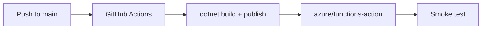

---
hide:
  - toc
validation:
  az_cli:
    last_tested: 2026-04-10
    cli_version: "2.83.0"
    core_tools_version: "4.8.0"
    result: pass
  bicep:
    last_tested: null
    result: not_tested
---

# 06 - CI/CD (Dedicated)

Automate build, test, and deployment using GitHub Actions so every change ships through the same pipeline.

## Prerequisites

| Tool | Version | Purpose |
|------|---------|---------|
| .NET SDK | 8.0 (LTS) | Build and run isolated worker functions |
| Azure Functions Core Tools | v4 | Start local host and publish artifacts |
| Azure CLI | 2.61+ | Provision Azure resources and inspect app state |

!!! info "Dedicated plan basics"
    Dedicated (App Service Plan) runs on pre-provisioned compute with predictable cost. Always On keeps the host loaded for non-HTTP triggers. Supports VNet integration and deployment slots on eligible SKUs. No execution timeout limit.

## What You'll Build

You will configure a GitHub Actions pipeline that builds and deploys a .NET isolated worker Function App to a Dedicated plan, then verify the release with a smoke test and workflow run evidence.



## Steps

### Step 1 - Get the publish profile

Download the publish profile for use in GitHub Actions:

```bash
az functionapp deployment list-publishing-profiles \
  --name "$APP_NAME" \
  --resource-group "$RG" \
  --xml
```

### Step 2 - Store deployment secrets in GitHub

Add repository secrets:

- `AZURE_FUNCTIONAPP_PUBLISH_PROFILE` — paste the XML from Step 1
- `AZURE_FUNCTIONAPP_NAME` — your function app name (e.g., `func-dnetded-04100301`)

### Step 3 - Create workflow file

```yaml
name: deploy-dotnet-function-dedicated

on:
  push:
    branches: [ main ]
    paths:
      - 'apps/dotnet/**'

env:
  DOTNET_VERSION: '8.0.x'
  AZURE_FUNCTIONAPP_NAME: ${{ secrets.AZURE_FUNCTIONAPP_NAME }}
  DOTNET_PROJECT_DIRECTORY: 'apps/dotnet'

jobs:
  build-and-deploy:
    runs-on: ubuntu-latest
    steps:
      - uses: actions/checkout@v4

      - name: Set up .NET
        uses: actions/setup-dotnet@v4
        with:
          dotnet-version: ${{ env.DOTNET_VERSION }}

      - name: Build
        run: dotnet build --configuration Release
        working-directory: ${{ env.DOTNET_PROJECT_DIRECTORY }}

      - name: Publish
        run: dotnet publish --configuration Release --output ./publish
        working-directory: ${{ env.DOTNET_PROJECT_DIRECTORY }}

      - name: Deploy to Azure Functions
        uses: Azure/functions-action@v1
        with:
          app-name: ${{ env.AZURE_FUNCTIONAPP_NAME }}
          package: '${{ env.DOTNET_PROJECT_DIRECTORY }}/publish'
          publish-profile: ${{ secrets.AZURE_FUNCTIONAPP_PUBLISH_PROFILE }}
```

!!! note "Deploy from publish output directory"
    The `package` path must point to the `dotnet publish` output directory (`./publish`). The .NET isolated worker publishes all required DLLs and runtime dependencies into this folder. The `azure/functions-action` handles the `--dotnet-isolated` flag automatically.

### Step 4 - Add post-deployment smoke test

Add a smoke test step after deployment:

```yaml
      - name: Smoke test
        run: |
          sleep 30
          HTTP_STATUS=$(curl --silent --output /dev/null --write-out "%{http_code}" \
            "https://${{ env.AZURE_FUNCTIONAPP_NAME }}.azurewebsites.net/api/health")
          if [ "$HTTP_STATUS" -ne 200 ]; then
            echo "Smoke test failed with status $HTTP_STATUS"
            exit 1
          fi
          echo "Smoke test passed with status $HTTP_STATUS"
```

!!! tip "No cold-start delay on Dedicated"
    Unlike Consumption plans, Dedicated plans with Always On enabled keep the host running. The 30-second sleep is a safety buffer for deployment propagation, not for cold start.

### Step 5 - Validate the release

```bash
# Check function app last modified time
az functionapp show \
  --name "$APP_NAME" \
  --resource-group "$RG" \
  --query "lastModifiedTimeUtc" \
  --output tsv

# Test health endpoint
curl --request GET "https://$APP_NAME.azurewebsites.net/api/health"

# Test hello endpoint
curl --request GET "https://$APP_NAME.azurewebsites.net/api/hello/CICD"
```

Use GitHub Actions run history as the deployment timeline of record (`Actions` tab → workflow runs → latest commit SHA), and compare it with `lastModifiedTimeUtc` to confirm release timing.

## Verification

Build and publish output:

```text
  Determining projects to restore...
  All projects are up-to-date for restore.
  AzureFunctionsGuide -> /apps/dotnet/bin/Release/net8.0/AzureFunctionsGuide.dll
  AzureFunctionsGuide -> /apps/dotnet/publish/
```

Health endpoint response after deployment:

```json
{"status":"healthy","timestamp":"2026-04-09T18:42:33.260Z","version":"1.0.0"}
```

Hello endpoint response:

```json
{"message":"Hello, CICD"}
```

## Next Steps

> **Next:** [07 - Extending with Triggers](07-extending-triggers.md)

## See Also

- [Tutorial Overview & Plan Chooser](../index.md)
- [.NET Language Guide](../../index.md)
- [Platform: Hosting Plans](../../../../platform/hosting.md)
- [Operations: Deployment](../../../../operations/deployment.md)
- [Recipes Index](../../recipes/index.md)

## Sources

- [Azure Functions .NET isolated worker guide (Microsoft Learn)](https://learn.microsoft.com/azure/azure-functions/dotnet-isolated-process-guide)
- [Azure Functions hosting options (Microsoft Learn)](https://learn.microsoft.com/azure/azure-functions/functions-scale)
- [Continuous delivery with GitHub Actions (Microsoft Learn)](https://learn.microsoft.com/azure/azure-functions/functions-how-to-github-actions)
- [Azure App Service plans overview (Microsoft Learn)](https://learn.microsoft.com/azure/app-service/overview-hosting-plans)
