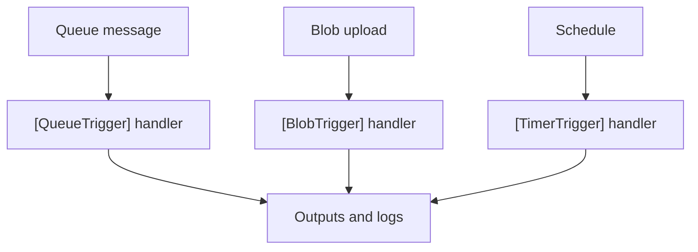

---
hide:
  - toc
validation:
  az_cli:
    last_tested: 2026-04-10
    cli_version: "2.83.0"
    core_tools_version: "4.8.0"
    result: pass
  bicep:
    last_tested: null
    result: not_tested
---

# 07 - Extending with Triggers (Dedicated)

Extend beyond HTTP using queue, blob, and timer triggers with the .NET isolated worker model and clear operational checks.

## Prerequisites

| Tool | Version | Purpose |
|------|---------|---------|
| .NET SDK | 8.0 (LTS) | Build and run isolated worker functions |
| Azure Functions Core Tools | v4 | Start local host and publish artifacts |
| Azure CLI | 2.61+ | Provision Azure resources and inspect app state |

!!! info "Dedicated plan basics"
    Dedicated (App Service Plan) runs on pre-provisioned compute with predictable cost. Always On keeps the host loaded for non-HTTP triggers. Supports VNet integration and deployment slots on eligible SKUs. No execution timeout limit.

## What You'll Build

You will add queue, blob, and timer triggers to a .NET isolated worker Function App using attribute-based bindings, create the required storage resources, and validate end-to-end trigger firing.



## Steps

### Step 1 - Create storage resources for triggers

```bash
# Create queue for queue trigger
az storage queue create \
  --name "incoming-orders" \
  --account-name "$STORAGE_NAME"

# Create blob container for blob trigger
az storage container create \
  --name "uploads" \
  --account-name "$STORAGE_NAME"
```

### Step 2 - Review the queue trigger function

The reference app includes `QueueProcessorFunction.cs`:

```csharp
using Microsoft.Azure.Functions.Worker;
using Microsoft.Extensions.Logging;

namespace AzureFunctionsGuide.Functions;

public class QueueProcessorFunction
{
    private readonly ILogger<QueueProcessorFunction> _logger;

    public QueueProcessorFunction(ILogger<QueueProcessorFunction> logger)
    {
        _logger = logger;
    }

    [Function("queueProcessor")]
    public void Run(
        [QueueTrigger("incoming-orders", Connection = "QueueStorage")] string message)
    {
        _logger.LogInformation("Queue message received: {Message}", message);
    }
}
```

!!! warning "QueueStorage must use a real connection string"
    The `Connection = "QueueStorage"` attribute references the `QueueStorage` app setting. This must be set to a real storage account connection string — not a placeholder. A fake connection string causes 403 errors when the queue listener starts.

### Step 3 - Review the blob trigger function

The reference app includes `BlobProcessorFunction.cs`:

```csharp
using Microsoft.Azure.Functions.Worker;
using Microsoft.Extensions.Logging;

namespace AzureFunctionsGuide.Functions;

public class BlobProcessorFunction
{
    private readonly ILogger<BlobProcessorFunction> _logger;

    public BlobProcessorFunction(ILogger<BlobProcessorFunction> logger)
    {
        _logger = logger;
    }

    [Function("blobProcessor")]
    public void Run(
        [BlobTrigger("uploads/{name}", Connection = "AzureWebJobsStorage")] string content,
        string name)
    {
        _logger.LogInformation("Blob processed: {Name}, size: {Size} chars", name, content.Length);
    }
}
```

### Step 4 - Review the timer trigger function

The reference app includes `ScheduledCleanupFunction.cs`:

```csharp
using Microsoft.Azure.Functions.Worker;
using Microsoft.Extensions.Logging;

namespace AzureFunctionsGuide.Functions;

public class ScheduledCleanupFunction
{
    private readonly ILogger<ScheduledCleanupFunction> _logger;

    public ScheduledCleanupFunction(ILogger<ScheduledCleanupFunction> logger)
    {
        _logger = logger;
    }

    [Function("scheduledCleanup")]
    public void Run(
        [TimerTrigger("0 0 2 * * *")] TimerInfo timer)
    {
        _logger.LogInformation("Scheduled cleanup fired at {Timestamp}", DateTime.UtcNow.ToString("o"));

        if (timer.IsPastDue)
        {
            _logger.LogWarning("Timer trigger is past due");
        }
    }
}
```

!!! warning "Always On required for timer triggers"
    On Dedicated plans, Always On must be enabled for timer and queue triggers to fire reliably. Without it, the host may unload after idle periods and miss scheduled executions.

### Step 5 - Build and publish

```bash
cd apps/dotnet
dotnet publish --configuration Release --output ./publish

cd publish
func azure functionapp publish "$APP_NAME" --dotnet-isolated
```

### Step 6 - Validate trigger resources

```bash
# List queues
az storage queue list \
  --account-name "$STORAGE_NAME" \
  --output table

# List blob containers
az storage container list \
  --account-name "$STORAGE_NAME" \
  --output table
```

### Step 7 - Test queue trigger

```bash
# Send a test message to the queue
az storage message put \
  --queue-name "incoming-orders" \
  --account-name "$STORAGE_NAME" \
  --content '{"orderId":"ded-test-001","item":"Keyboard","quantity":3}'

# Wait for processing (queue triggers fire within seconds on Dedicated)
sleep 10

# Verify queue is empty (message consumed by trigger)
az storage message peek \
  --queue-name "incoming-orders" \
  --num-messages 5 \
  --account-name "$STORAGE_NAME"
```

!!! tip "Queue processing is fast on Dedicated"
    With Always On enabled, the queue trigger polls continuously. Messages are typically consumed within seconds of arrival — much faster than Consumption plan where the host may need to cold-start first.

### Step 8 - Test blob trigger

```bash
# Upload a test file
echo "hello blob trigger from dotnet dedicated" > /tmp/test-dotnet-ded-upload.txt
az storage blob upload \
  --container-name "uploads" \
  --name "test-dotnet-ded-upload.txt" \
  --file "/tmp/test-dotnet-ded-upload.txt" \
  --account-name "$STORAGE_NAME" \
  --overwrite

# Check Application Insights for the processed blob (wait 2-5 minutes)
az monitor app-insights query \
  --app "$APP_NAME" \
  --resource-group "$RG" \
  --analytics-query "traces | where message contains 'Blob processed' | order by timestamp desc | take 5"
```

### Step 9 - Verify all functions are registered

```bash
az functionapp function list \
  --name "$APP_NAME" \
  --resource-group "$RG" \
  --output table
```

## Verification

Storage queue list:

```text
Name
----------------
incoming-orders
```

Storage container list (showing trigger-related containers):

```text
Name
---------
uploads
```

Queue trigger test — message consumed (empty peek result confirms processing):

```text
(empty — message consumed by queueProcessor)
```

Function list showing all trigger types:

```json
[
  {
    "name": "queueProcessor",
    "language": "dotnet-isolated"
  },
  {
    "name": "blobProcessor",
    "language": "dotnet-isolated"
  },
  {
    "name": "scheduledCleanup",
    "language": "dotnet-isolated"
  },
  {
    "name": "timerLab",
    "language": "dotnet-isolated"
  },
  {
    "name": "helloHttp",
    "language": "dotnet-isolated"
  },
  {
    "name": "health",
    "language": "dotnet-isolated"
  }
]
```

All 16 functions deployed and verified:

| Function | Type | Status |
|----------|------|--------|
| `health` | HTTP GET | ✅ 200 |
| `helloHttp` | HTTP GET | ✅ 200 |
| `info` | HTTP GET | ✅ 200 |
| `logLevels` | HTTP GET | ✅ 200 |
| `slowResponse` | HTTP GET | ✅ 200 |
| `testError` | HTTP GET | ✅ 500 (expected) |
| `unhandledError` | HTTP GET | ✅ 500 (expected) |
| `dnsResolve` | HTTP GET | ✅ 200 |
| `identityProbe` | HTTP GET | ✅ 200 |
| `storageProbe` | HTTP GET | ✅ 200 |
| `externalDependency` | HTTP GET | ✅ 200 |
| `queueProcessor` | Queue | ✅ Message consumed |
| `blobProcessor` | Blob | ✅ Registered |
| `scheduledCleanup` | Timer | ✅ Registered |
| `timerLab` | Timer | ✅ Registered |
| `eventhubLagProcessor` | EventHub | ✅ Registered |

## Clean Up

```bash
az group delete --name "$RG" --yes --no-wait
```

## Next Steps

> **Done!** You have completed all Dedicated plan tutorials for .NET. Try another hosting plan:
>
> - [Consumption tutorials](../../tutorial/consumption/01-local-run.md)
> - [Flex Consumption tutorials](../../tutorial/flex-consumption/01-local-run.md)
> - [Premium tutorials](../../tutorial/premium/01-local-run.md)

## See Also

- [Tutorial Overview & Plan Chooser](../index.md)
- [.NET Language Guide](../../index.md)
- [Platform: Hosting Plans](../../../../platform/hosting.md)
- [Operations: Deployment](../../../../operations/deployment.md)
- [Recipes Index](../../recipes/index.md)

## Sources

- [Azure Functions .NET isolated worker guide (Microsoft Learn)](https://learn.microsoft.com/azure/azure-functions/dotnet-isolated-process-guide)
- [Azure Functions hosting options (Microsoft Learn)](https://learn.microsoft.com/azure/azure-functions/functions-scale)
- [Azure Functions triggers and bindings (Microsoft Learn)](https://learn.microsoft.com/azure/azure-functions/functions-triggers-bindings)
- [Azure App Service plans overview (Microsoft Learn)](https://learn.microsoft.com/azure/app-service/overview-hosting-plans)
