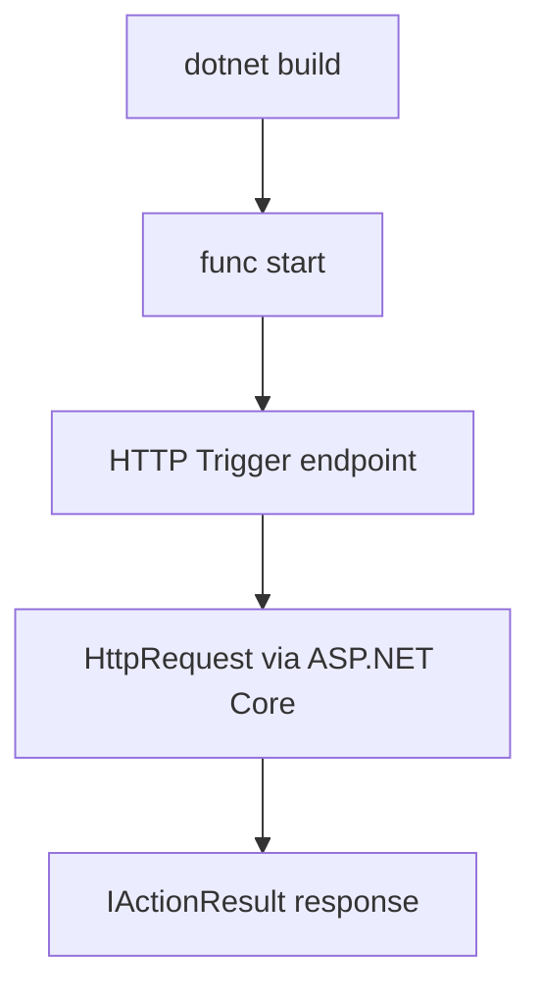

---
validation:
  az_cli:
    last_tested: 2026-04-10
    cli_version: "2.83.0"
    core_tools_version: "4.8.0"
    result: pass
  bicep:
    last_tested: null
    result: not_tested
content_sources:
  - type: mslearn-adapted
    url: https://learn.microsoft.com/azure/azure-functions/dotnet-isolated-process-guide
  - type: mslearn-adapted
    url: https://learn.microsoft.com/azure/azure-functions/functions-develop-local
  - type: mslearn-adapted
    url: https://learn.microsoft.com/azure/azure-functions/flex-consumption-plan
---

# 01 - Run Locally (Flex Consumption)

Build and run a .NET 8 isolated worker Function App locally before deploying to the Flex Consumption (FC1) plan. Local development is identical across all hosting plans — plan-specific differences only appear at deployment time.

## Prerequisites

| Tool | Version | Purpose |
|------|---------|---------|
| .NET SDK | 8.0 (LTS) | Build and run isolated worker functions |
| Azure Functions Core Tools | v4 | Start local host and publish artifacts |
| Azure CLI | 2.61+ | Provision Azure resources and inspect app state |

!!! info "Flex Consumption plan basics"
    Flex Consumption (FC1) keeps serverless economics while adding VNet integration, configurable instance memory (512 MB to 4096 MB), and per-function scaling. Microsoft recommends it for many new apps.

## What You'll Build

A .NET 8 isolated worker Function App with 16 functions that runs locally, returning JSON from `/api/health`, and validates the isolated hosting model before deployment.

<!-- diagram-id: what-you-ll-build -->


## Steps

### Step 1 - Clone and navigate to the reference app

```bash
cd apps/dotnet
```

### Step 2 - Review the project structure

```text
apps/dotnet/
├── Functions/
│   ├── HealthFunction.cs
│   ├── HelloHttpFunction.cs
│   ├── InfoFunction.cs
│   ├── LogLevelsFunction.cs
│   ├── SlowResponseFunction.cs
│   ├── TestErrorFunction.cs
│   ├── UnhandledErrorFunction.cs
│   ├── DnsResolveFunction.cs
│   ├── IdentityProbeFunction.cs
│   ├── StorageProbeFunction.cs
│   ├── ExternalDependencyFunction.cs
│   ├── QueueProcessorFunction.cs
│   ├── BlobProcessorFunction.cs
│   ├── ScheduledCleanupFunction.cs
│   ├── TimerLabFunction.cs
│   └── EventHubLagProcessorFunction.cs
├── Shared/
│   └── AppConfig.cs
├── Program.cs
├── host.json
├── local.settings.json.example
└── AzureFunctionsGuide.csproj
```

### Step 3 - Configure local settings

```bash
cp local.settings.json.example local.settings.json
```

Verify the file contains:

```json
{
  "IsEncrypted": false,
  "Values": {
    "AzureWebJobsStorage": "UseDevelopmentStorage=true",
    "FUNCTIONS_WORKER_RUNTIME": "dotnet-isolated",
    "QueueStorage": "UseDevelopmentStorage=true",
    "EventHubConnection": "Endpoint=sb://placeholder.servicebus.windows.net/;SharedAccessKeyName=placeholder;SharedAccessKey=cGxhY2Vob2xkZXI=;EntityPath=events"
  }
}
```

### Step 4 - Review Program.cs for isolated hosting

```csharp
using Microsoft.Azure.Functions.Worker;
using Microsoft.Extensions.DependencyInjection;
using Microsoft.Extensions.Hosting;

var host = new HostBuilder()
    .ConfigureFunctionsWebApplication()
    .ConfigureServices(services =>
    {
        services.AddApplicationInsightsTelemetryWorkerService();
        services.ConfigureFunctionsApplicationInsights();
    })
    .Build();

host.Run();
```

!!! note "Isolated worker model"
    The .NET isolated worker uses `ConfigureFunctionsWebApplication()` with ASP.NET Core integration. HTTP functions use `HttpRequest` and `IActionResult` from ASP.NET Core, and logging is constructor-injected with `ILogger<T>`.

### Step 5 - Build and start the function host

```bash
dotnet build
func start
```

### Step 6 - Test the health endpoint

In a second terminal:

```bash
curl --request GET "http://localhost:7071/api/health"
```

Expected response:

```json
{"status":"healthy","timestamp":"2026-04-10T03:05:00.000Z","version":"1.0.0"}
```

Test additional endpoints:

```bash
curl --request GET "http://localhost:7071/api/hello/World"
curl --request GET "http://localhost:7071/api/info"
```

## Verification

```text
Azure Functions Core Tools
Core Tools Version:       4.8.0
Function Runtime Version: 4.x.x.x

Functions:

        blobProcessor: blobTrigger

        dnsResolve: [GET] http://localhost:7071/api/dns/{hostname}

        eventhubLagProcessor: eventHubTrigger

        externalDependency: [GET] http://localhost:7071/api/dependency

        health: [GET] http://localhost:7071/api/health

        helloHttp: [GET] http://localhost:7071/api/hello/{name?}

        identityProbe: [GET] http://localhost:7071/api/identity

        info: [GET] http://localhost:7071/api/info

        logLevels: [GET] http://localhost:7071/api/loglevels

        queueProcessor: queueTrigger

        scheduledCleanup: timerTrigger

        slowResponse: [GET] http://localhost:7071/api/slow

        storageProbe: [GET] http://localhost:7071/api/storage/probe

        testError: [GET] http://localhost:7071/api/testerror

        timerLab: timerTrigger

        unhandledError: [GET] http://localhost:7071/api/unhandlederror
```

## Next Steps

> **Next:** [02 - First Deploy](02-first-deploy.md)

## See Also

- [Tutorial Overview & Plan Chooser](../index.md)
- [.NET Language Guide](../../index.md)
- [Platform: Hosting Plans](../../../../platform/hosting.md)
- [Operations: Deployment](../../../../operations/deployment.md)
- [Recipes Index](../../recipes/index.md)

## Sources

- [Azure Functions .NET isolated worker guide (Microsoft Learn)](https://learn.microsoft.com/azure/azure-functions/dotnet-isolated-process-guide)
- [Develop Azure Functions locally with Core Tools (Microsoft Learn)](https://learn.microsoft.com/azure/azure-functions/functions-develop-local)
- [Azure Functions Flex Consumption plan (Microsoft Learn)](https://learn.microsoft.com/azure/azure-functions/flex-consumption-plan)
