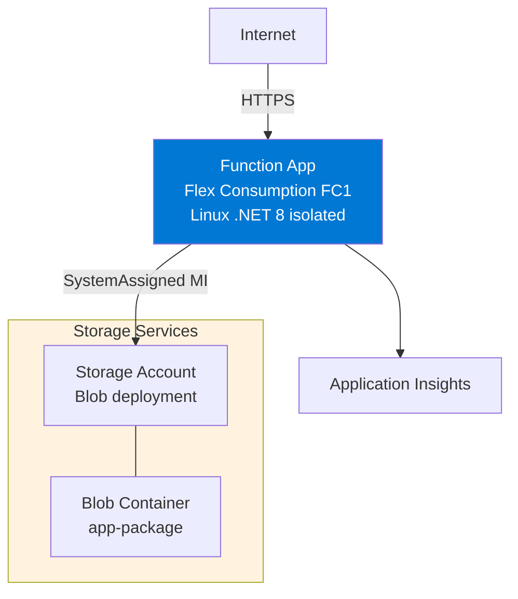
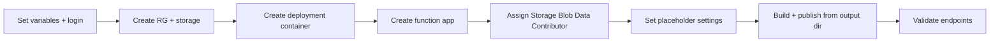

---
validation:
  az_cli:
    last_tested: 2026-04-11
    cli_version: "2.70.0"
    core_tools_version: "4.6.0"
    result: pass
  bicep:
    last_tested: null
    result: not_tested
content_sources:
  - type: mslearn-adapted
    url: https://learn.microsoft.com/azure/azure-functions/dotnet-isolated-process-guide
  - type: mslearn-adapted
    url: https://learn.microsoft.com/azure/azure-functions/functions-scale
  - type: mslearn-adapted
    url: https://learn.microsoft.com/azure/azure-functions/flex-consumption-plan
---

# 02 - First Deploy (Flex Consumption)

Provision Azure resources and deploy the .NET 8 isolated worker reference application to the Flex Consumption (FC1) plan with repeatable CLI commands.

## Prerequisites

| Tool | Version | Purpose |
|------|---------|---------|
| .NET SDK | 8.0 (LTS) | Build and run isolated worker functions |
| Azure Functions Core Tools | v4 | Start local host and publish artifacts |
| Azure CLI | 2.61+ | Provision Azure resources and inspect app state |
| Azure subscription | Active | Target for deployment |

!!! info "Flex Consumption plan basics"
    Flex Consumption (FC1) keeps serverless economics while adding VNet integration, configurable instance memory (512 MB to 4096 MB), and per-function scaling. Microsoft recommends it for many new apps.

## What You'll Build

You will provision a Linux Flex Consumption Function App for .NET 8 isolated worker, deploy with `func azure functionapp publish` from the compiled output directory, and validate HTTP endpoints.

!!! tip "Network Scenario Choices"
    This tutorial deploys with **public networking**. FC1 supports full private networking:

    | Scenario | Description | Guide |
    |----------|-------------|-------|
    | **Public Only** | No VNet (this tutorial) | Current page |
    | **Private Egress** | VNet + Storage PE | [Private Egress](../../../../platform/networking-scenarios/private-egress.md) |
    | **Private Ingress** | + Site Private Endpoint | [Private Ingress](../../../../platform/networking-scenarios/private-ingress.md) |
    | **Fixed Outbound IP** | + NAT Gateway | [Fixed Outbound](../../../../platform/networking-scenarios/fixed-outbound-nat.md) |

!!! info "Infrastructure Context"
    **Plan**: Flex Consumption (FC1) | **Network**: VNet integration supported | **Storage auth**: SystemAssigned MI

    Flex Consumption uses blob-based deployment storage with managed identity authentication, unlike Consumption which uses Azure Files with connection strings.

    <!-- diagram-id: what-you-ll-build -->


<!-- diagram-id: what-you-ll-build-2 -->


## Steps

### Step 1 - Set variables and sign in

```bash
export RG="rg-func-dotnet-flex-demo"
export APP_NAME="func-dnetflex-$(date +%m%d%H%M)"
export STORAGE_NAME="stdnetflex$(date +%m%d)"
export LOCATION="koreacentral"

az login
az account set --subscription "<subscription-id>"
```

| Command/Parameter | Purpose |
|-------------------|---------|
| `RG` | Resource group name |
| `APP_NAME` | Unique name for the function app |
| `STORAGE_NAME` | Storage account for state and deployment |
| `az login` | Authenticates your CLI session |
| `--subscription` | Sets the target subscription context |

### Step 2 - Create resource group and storage account

```bash
az group create --name "$RG" --location "$LOCATION"

az storage account create \
  --name "$STORAGE_NAME" \
  --resource-group "$RG" \
  --location "$LOCATION" \
  --sku Standard_LRS \
  --kind StorageV2
```

| Command/Parameter | Purpose |
|-------------------|---------|
| `az group create` | Creates the resource group container |
| `--kind StorageV2` | Required for Flex Consumption deployment features |

### Step 3 - Create the deployment container

```bash
az storage container create \
  --name app-package \
  --account-name "$STORAGE_NAME" \
  --auth-mode login
```

| Command/Parameter | Purpose |
|-------------------|---------|
| `app-package` | Standard name for the deployment artifact container |
| `--auth-mode login` | Uses your Microsoft Entra identity for creation |

!!! warning "Container must exist before function app creation"
    Flex Consumption requires a pre-existing blob container for deployment packages. If the container does not exist, `az functionapp create` fails with a `ContainerNotFound` error.

### Step 4 - Create function app

```bash
az functionapp create \
  --name "$APP_NAME" \
  --resource-group "$RG" \
  --storage-account "$STORAGE_NAME" \
  --runtime dotnet-isolated \
  --runtime-version 8.0 \
  --flexconsumption-location "$LOCATION" \
  --deployment-storage-name "$STORAGE_NAME" \
  --deployment-storage-container-name app-package \
  --deployment-storage-auth-type SystemAssignedIdentity
```

| Command/Parameter | Purpose |
|-------------------|---------|
| `--runtime dotnet-isolated` | Targets the isolated worker process |
| `--flexconsumption-location` | Identifies this as a Flex Consumption app |
| `--deployment-storage-auth-type` | Uses Managed Identity for secure artifact access |

!!! note "Flex Consumption vs Consumption CLI differences"
    Flex Consumption uses `--flexconsumption-location` instead of `--consumption-plan-location`. It also requires `--deployment-storage-name`, `--deployment-storage-container-name`, and `--deployment-storage-auth-type` parameters.

!!! note "Auto-created Application Insights"
    `az functionapp create` automatically provisions an Application Insights resource and links it to the function app.

### Step 5 - Assign Storage Blob Data Contributor role

The managed identity needs explicit permission to write deployment packages to blob storage:

```bash
PRINCIPAL_ID=$(az functionapp identity show \
  --name "$APP_NAME" \
  --resource-group "$RG" \
  --query principalId \
  --output tsv)

STORAGE_ID=$(az storage account show \
  --name "$STORAGE_NAME" \
  --resource-group "$RG" \
  --query id \
  --output tsv)

az role assignment create \
  --assignee "$PRINCIPAL_ID" \
  --role "Storage Blob Data Contributor" \
  --scope "$STORAGE_ID"
```

| Command/Parameter | Purpose |
|-------------------|---------|
| `az functionapp identity show` | Retrieves the app's Managed Identity ID |
| `az role assignment create` | Grants the app permission to read its own code |

!!! warning "Role propagation delay"
    Azure role assignments can take 1-2 minutes to propagate. If publishing fails with a 403 error immediately after assignment, wait and retry.

### Step 6 - Set placeholder trigger settings

```bash
STORAGE_CONN=$(az storage account show-connection-string \
  --name "$STORAGE_NAME" \
  --resource-group "$RG" \
  --output tsv)

az functionapp config appsettings set \
  --name "$APP_NAME" \
  --resource-group "$RG" \
  --settings \
    "QueueStorage=$STORAGE_CONN" \
    "EventHubConnection=Endpoint=sb://placeholder.servicebus.windows.net/;SharedAccessKeyName=placeholder;SharedAccessKey=cGxhY2Vob2xkZXI=;EntityPath=placeholder"
```

| Command/Parameter | Purpose |
|-------------------|---------|
| `az functionapp config appsettings set` | Configures environment variables |

!!! warning "Placeholder settings prevent host crashes"
    The .NET reference app includes triggers for Queue, EventHub, Blob, and Timer. Use connection string format for EventHubConnection — the `__fullyQualifiedNamespace` format triggers DefaultAzureCredential which may not be configured for all services.

!!! note "`FUNCTIONS_WORKER_RUNTIME` is platform-managed"
    On Flex Consumption, `FUNCTIONS_WORKER_RUNTIME` is set by the platform during `az functionapp create`. You cannot set it manually via app settings.

### Step 7 - Create trigger resources

```bash
az storage queue create \
  --name "incoming-orders" \
  --account-name "$STORAGE_NAME" \
  --auth-mode login

az storage container create \
  --name "uploads" \
  --account-name "$STORAGE_NAME" \
  --auth-mode login
```

| Command/Parameter | Purpose |
|-------------------|---------|
| `az storage queue create` | Creates the queue for order processing |
| `az storage container create` | Creates the blob container for uploads |

### Step 8 - Build and publish

```bash
cd apps/dotnet
dotnet publish --configuration Release --output ./publish

cd publish
func azure functionapp publish "$APP_NAME" --dotnet-isolated
```

| Command/Parameter | Purpose |
|-------------------|---------|
| `dotnet publish` | Compiles the project and dependencies |
| `func azure functionapp publish` | Deploys the artifacts to Azure |

!!! danger "Must publish from output directory with --dotnet-isolated flag"
    When publishing from the compiled output directory, Core Tools cannot detect the project language. Always pass `--dotnet-isolated` to specify the worker runtime explicitly. Without this flag, the publish may succeed but functions will not be indexed correctly.

!!! note "Upload size"
    .NET isolated worker publish output is approximately 6.82 MB, larger than Java (~326 KB) because it includes ASP.NET Core runtime dependencies.

### Step 9 - Validate deployment

```bash
# Wait for function indexing (may take 30-60 seconds)
sleep 30

# List deployed functions
az functionapp function list \
  --name "$APP_NAME" \
  --resource-group "$RG" \
  --query "[].{name:name, language:language}" \
  --output table

# Test the health endpoint
curl --request GET "https://$APP_NAME.azurewebsites.net/api/health"

# Test the hello endpoint
curl --request GET "https://$APP_NAME.azurewebsites.net/api/hello/FlexTest"

# Test the info endpoint
curl --request GET "https://$APP_NAME.azurewebsites.net/api/info"
```

| Command/Parameter | Purpose |
|-------------------|---------|
| `az functionapp function list` | Lists all indexed functions in the app |
| `curl --request GET` | Sends validation requests to the app |
| `/api/health` | Probes service health state |
| `/api/info` | Inspects app configuration values |

### Step 10 - Review Flex Consumption-specific notes

- Flex Consumption uses `--flexconsumption-location` instead of `--consumption-plan-location`.
- Flex Consumption uses blob-based deployment storage, not Azure Files.
- Managed identity is enabled by default — the `/api/identity` endpoint confirms this.
- `FUNCTIONS_WORKER_RUNTIME` is platform-managed; do not set it manually.
- Cold starts may be shorter than Consumption due to configurable instance memory.

## Verification

Function list output (16 functions):

```text
Name                                           Language
---------------------------------------------  ---------------
func-dnetflex-04100301/blobProcessor           dotnet-isolated
func-dnetflex-04100301/dnsResolve              dotnet-isolated
func-dnetflex-04100301/eventhubLagProcessor    dotnet-isolated
func-dnetflex-04100301/externalDependency      dotnet-isolated
func-dnetflex-04100301/health                  dotnet-isolated
func-dnetflex-04100301/helloHttp               dotnet-isolated
func-dnetflex-04100301/identityProbe           dotnet-isolated
func-dnetflex-04100301/info                    dotnet-isolated
func-dnetflex-04100301/logLevels               dotnet-isolated
func-dnetflex-04100301/queueProcessor          dotnet-isolated
func-dnetflex-04100301/scheduledCleanup        dotnet-isolated
func-dnetflex-04100301/slowResponse            dotnet-isolated
func-dnetflex-04100301/storageProbe            dotnet-isolated
func-dnetflex-04100301/testError               dotnet-isolated
func-dnetflex-04100301/timerLab                dotnet-isolated
func-dnetflex-04100301/unhandledError          dotnet-isolated
```

Health endpoint response:

```json
{"status":"healthy","timestamp":"2026-04-10T03:11:06.477Z","version":"1.0.0"}
```

Hello endpoint response:

```json
{"message":"Hello, FlexTest"}
```

Info endpoint response:

```json
{"name":"azure-functions-dotnet-guide","version":"1.0.0","dotnet":".NET 8.0.23","os":"Linux","environment":"production","functionApp":"func-dnetflex-04100301"}
```

Identity probe (confirms managed identity is active on Flex Consumption):

```json
{"managedIdentity":true,"identityEndpoint":"configured"}
```

## Next Steps

> **Next:** [03 - Configuration](03-configuration.md)

## See Also

- [Tutorial Overview & Plan Chooser](../index.md)
- [.NET Language Guide](../../index.md)
- [Platform: Hosting Plans](../../../../platform/hosting.md)
- [Operations: Deployment](../../../../operations/deployment.md)
- [Recipes Index](../../recipes/index.md)

## Sources

- [Azure Functions .NET isolated worker guide (Microsoft Learn)](https://learn.microsoft.com/azure/azure-functions/dotnet-isolated-process-guide)
- [Azure Functions hosting options (Microsoft Learn)](https://learn.microsoft.com/azure/azure-functions/functions-scale)
- [Azure Functions Flex Consumption plan (Microsoft Learn)](https://learn.microsoft.com/azure/azure-functions/flex-consumption-plan)
