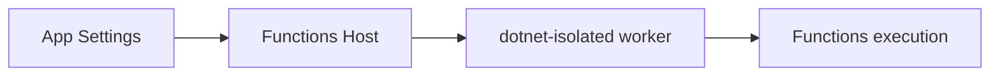

# 03 - Configuration (Flex Consumption)

Configure runtime and app settings for Flex Consumption using explicit app settings, host-level options, and safe environment separation.

## Prerequisites

| Tool | Version | Purpose |
|------|---------|---------|
| .NET SDK | 8.0 (LTS) | Build and run isolated worker functions |
| Azure Functions Core Tools | v4 | Local host and deployment commands |
| Azure CLI | 2.61+ | Provision and configure Azure resources |

!!! info "Plan basics"
    Flex Consumption (FC1) scales to zero with per-function scaling, VNet support, and configurable memory. It is the recommended default for new serverless workloads.
    Supports VNet integration and private endpoints.
    No Kudu/SCM endpoints and no custom container support on this plan.
    All traffic routes through the integrated VNet.

## What You'll Build

- Runtime app settings for .NET isolated worker on Flex Consumption
- Identity-based host storage configuration for `AzureWebJobsStorage`
- Host-level settings validation with Azure CLI

## Steps
### Step 1 - Set baseline runtime settings
```bash
az functionapp config appsettings set \
  --name "$APP_NAME" \
  --resource-group "$RG" \
  --settings \
    "FUNCTIONS_WORKER_RUNTIME=dotnet-isolated" \
    "FUNCTIONS_EXTENSION_VERSION=~4" \
    "DOTNET_ENVIRONMENT=Production" \
    "APP_ENV=production"
```

### Step 2 - Configure worker and feature settings
```bash
az functionapp config appsettings set \
  --name "$APP_NAME" \
  --resource-group "$RG" \
  --settings \
    "AzureWebJobsStorage__accountName=$STORAGE_NAME" \
    "AzureWebJobsStorage__credential=managedidentity"
```

Grant the function app managed identity `Storage Blob Data Contributor` and `Storage Queue Data Contributor` on `$STORAGE_NAME` so host storage operations succeed without a connection string.

### Step 3 - Update host.json for routing and timeout
```json
{
  "version": "2.0",
  "functionTimeout": "00:10:00",
  "extensions": {
    "http": {
      "routePrefix": "api"
    }
  }
}
```

### Step 4 - Confirm effective settings
```bash
az functionapp config appsettings list \
  --name "$APP_NAME" \
  --resource-group "$RG" \
  --output table
```


### Step X - Validate isolated worker conventions
```bash
grep "FUNCTIONS_WORKER_RUNTIME" "local.settings.json"
grep "ConfigureFunctionsWebApplication" "Program.cs"
```

Confirm that HTTP functions use `HttpRequestData` and `HttpResponseData`, and that logging is constructor-injected with `ILogger<T>`.

## Verification
```text
Name                              SlotSetting
--------------------------------  -----------
FUNCTIONS_WORKER_RUNTIME          False
FUNCTIONS_EXTENSION_VERSION       False
DOTNET_ENVIRONMENT                False
APP_ENV                           False
AzureWebJobsStorage__accountName  False
AzureWebJobsStorage__credential   False
```

## See Also
- [Tutorial Overview & Plan Chooser](../index.md)
- [.NET Language Guide](../../index.md)
- [Platform: Hosting Plans](../../../../platform/hosting.md)
- [Operations: Deployment](../../../../operations/deployment.md)
- [Recipes Index](../../recipes/index.md)

## Sources
- [Azure Functions .NET isolated worker guide](https://learn.microsoft.com/azure/azure-functions/dotnet-isolated-process-guide)
- [Develop Azure Functions locally with Core Tools](https://learn.microsoft.com/azure/azure-functions/functions-develop-local)
- [Azure Functions hosting options](https://learn.microsoft.com/azure/azure-functions/functions-scale)
