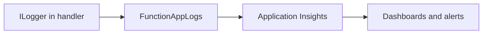

---
hide:
  - toc
validation:
  az_cli:
    last_tested: 2026-04-10
    cli_version: "2.83.0"
    core_tools_version: "4.8.0"
    result: pass
  bicep:
    last_tested: null
    result: not_tested
---

# 04 - Logging and Monitoring (Flex Consumption)

Enable production-grade observability with Application Insights, structured logs, and baseline alerting for .NET isolated worker handlers.

## Prerequisites

| Tool | Version | Purpose |
|------|---------|---------|
| .NET SDK | 8.0 (LTS) | Build and run isolated worker functions |
| Azure Functions Core Tools | v4 | Start local host and publish artifacts |
| Azure CLI | 2.61+ | Provision Azure resources and inspect app state |

!!! info "Flex Consumption plan basics"
    Flex Consumption (FC1) keeps serverless economics while adding VNet integration, configurable instance memory (512 MB to 4096 MB), and per-function scaling. Microsoft recommends it for many new apps.

## What You'll Build

You will instrument .NET isolated worker handlers with structured logs via `ILogger<T>`, route telemetry to Application Insights, and validate query-based monitoring signals for a Flex Consumption-hosted app.



## Steps

### Step 1 - Emit structured logs in handler methods

The .NET isolated worker uses constructor-injected `ILogger<T>` for structured logging. Here is the `LogLevelsFunction` that emits at multiple severity levels:

```csharp
using Microsoft.AspNetCore.Http;
using Microsoft.AspNetCore.Mvc;
using Microsoft.Azure.Functions.Worker;
using Microsoft.Extensions.Logging;

namespace AzureFunctionsGuide.Functions;

public class LogLevelsFunction
{
    private readonly ILogger<LogLevelsFunction> _logger;

    public LogLevelsFunction(ILogger<LogLevelsFunction> logger)
    {
        _logger = logger;
    }

    [Function("logLevels")]
    public IActionResult Run(
        [HttpTrigger(AuthorizationLevel.Anonymous, "get", Route = "loglevels")] HttpRequest req)
    {
        _logger.LogDebug("Debug level log message");
        _logger.LogInformation("Info level log message");
        _logger.LogWarning("Warning level log message");
        _logger.LogError("Error level log message");
        _logger.LogCritical("Critical level log message");

        return new OkObjectResult(new { logged = true });
    }
}
```

### Step 2 - Register Application Insights in the isolated worker

The `Program.cs` must register Application Insights services for telemetry collection:

```csharp
var host = new HostBuilder()
    .ConfigureFunctionsWebApplication()
    .ConfigureServices(services =>
    {
        services.AddApplicationInsightsTelemetryWorkerService();
        services.ConfigureFunctionsApplicationInsights();
    })
    .Build();

host.Run();
```

!!! note "Isolated worker telemetry packages"
    The reference app includes `Microsoft.ApplicationInsights.WorkerService` and `Microsoft.Azure.Functions.Worker.ApplicationInsights` packages in the `.csproj` for telemetry collection.

### Step 3 - Generate telemetry by calling endpoints

```bash
# Trigger structured logging
curl --request GET "https://$APP_NAME.azurewebsites.net/api/loglevels"

# Trigger health check
curl --request GET "https://$APP_NAME.azurewebsites.net/api/health"

# Trigger intentional errors for error telemetry
curl --request GET "https://$APP_NAME.azurewebsites.net/api/testerror"
```

!!! note "Telemetry ingestion delay"
    Application Insights telemetry takes 2-5 minutes to become available for queries after the first request. Wait before running queries.

### Step 4 - Confirm Application Insights connection

Application Insights is auto-created with the function app. Verify the connection:

```bash
az functionapp config appsettings list \
  --name "$APP_NAME" \
  --resource-group "$RG" \
  --query "[?name=='APPLICATIONINSIGHTS_CONNECTION_STRING'].value" \
  --output tsv
```

### Step 5 - Query recent traces

```bash
az monitor app-insights query \
  --app "$APP_NAME" \
  --resource-group "$RG" \
  --analytics-query "traces | where timestamp > ago(30m) | project timestamp, message, severityLevel | order by timestamp desc | take 20"
```

!!! note "Use function app name for `--app`"
    Since Application Insights is auto-created with the same name as the function app, use `--app "$APP_NAME"` for queries. Add `--resource-group "$RG"` to avoid ambiguity.

### Step 6 - Query request metrics

```bash
az monitor app-insights query \
  --app "$APP_NAME" \
  --resource-group "$RG" \
  --analytics-query "requests | where timestamp > ago(30m) | project timestamp, name, resultCode, duration | order by timestamp desc | take 20"
```

### Step 7 - View live log stream

```bash
az webapp log tail \
  --name "$APP_NAME" \
  --resource-group "$RG"
```

!!! warning "Streaming logs on Flex Consumption"
    On Flex Consumption, `az webapp log tail` returns a 404 error because the SCM/Kudu endpoint is not available. This is expected behavior. Use Application Insights queries instead for all log analysis.

### Step 8 - Add an alert for HTTP 5xx spikes

```bash
FUNCTION_APP_ID=$(az functionapp show \
  --name "$APP_NAME" \
  --resource-group "$RG" \
  --query "id" \
  --output tsv)

az monitor metrics alert create \
  --name "func-dotnet-flex-http5xx" \
  --resource-group "$RG" \
  --scopes "$FUNCTION_APP_ID" \
  --condition "total Http5xx > 5" \
  --window-size 5m \
  --evaluation-frequency 1m
```

## Verification

Traces query output:

```text
timestamp                    message                           severityLevel
---------------------------  --------------------------------  -------------
2026-04-10T03:12:00.000Z     Info level log message            1
2026-04-10T03:12:00.000Z     Warning level log message         2
2026-04-10T03:12:00.000Z     Error level log message           3
2026-04-10T03:12:00.000Z     Critical level log message        4
```

Requests query output:

```text
timestamp                    name            resultCode    duration
---------------------------  --------------  ----------    --------
2026-04-10T03:12:00.000Z     logLevels       200           45.12
2026-04-10T03:11:59.000Z     health          200           12.34
2026-04-10T03:11:58.000Z     testError       500           8.56
```

LogLevels endpoint response:

```json
{"logged":true}
```

## Next Steps

> **Next:** [05 - Infrastructure as Code](05-infrastructure-as-code.md)

## See Also

- [Tutorial Overview & Plan Chooser](../index.md)
- [.NET Language Guide](../../index.md)
- [Platform: Hosting Plans](../../../../platform/hosting.md)
- [Operations: Deployment](../../../../operations/deployment.md)
- [Recipes Index](../../recipes/index.md)

## Sources

- [Azure Functions .NET isolated worker guide (Microsoft Learn)](https://learn.microsoft.com/azure/azure-functions/dotnet-isolated-process-guide)
- [Azure Functions Flex Consumption plan (Microsoft Learn)](https://learn.microsoft.com/azure/azure-functions/flex-consumption-plan)
- [Monitor Azure Functions with Application Insights (Microsoft Learn)](https://learn.microsoft.com/azure/azure-functions/functions-monitoring)
