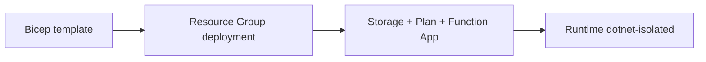

# 05 - Infrastructure as Code (Flex Consumption)

Define the Flex Consumption environment in Bicep and deploy the same architecture repeatedly across environments.

## Prerequisites

| Tool | Version | Purpose |
|------|---------|---------|
| .NET SDK | 8.0 (LTS) | Build and run isolated worker functions |
| Azure Functions Core Tools | v4 | Local host and deployment commands |
| Azure CLI | 2.61+ | Provision and configure Azure resources |

!!! info "Plan basics"
    Flex Consumption (FC1) scales to zero with per-function scaling, VNet support, and configurable memory. It is the recommended default for new serverless workloads.
    Supports VNet integration and private endpoints.

## Steps
### Step 1 - Create a Bicep template for Flex Consumption
```bicep
param location string = resourceGroup().location
param appName string
param storageName string
param planName string

resource storage 'Microsoft.Storage/storageAccounts@2023-01-01' = {
  name: storageName
  location: location
  sku: {
    name: 'Standard_LRS'
  }
  kind: 'StorageV2'
}

resource appPlan 'Microsoft.Web/serverfarms@2023-12-01' = {
  name: planName
  location: location
  sku: {
    name: 'FC1'
  }
  kind: 'functionapp'
}

resource app 'Microsoft.Web/sites@2023-12-01' = {
  name: appName
  location: location
  kind: 'functionapp,linux'
  properties: {
    serverFarmId: appPlan.id
    siteConfig: {
      linuxFxVersion: 'DOTNET-ISOLATED|8.0'
      appSettings: [
        { name: 'FUNCTIONS_WORKER_RUNTIME'; value: 'dotnet-isolated' }
        { name: 'FUNCTIONS_EXTENSION_VERSION'; value: '~4' }
      ]
    }
  }
}
```

### Step 2 - Deploy the template
```bash
az deployment group create \
  --resource-group "$RG" \
  --template-file "infra/flex-consumption/main.bicep" \
  --parameters appName="$APP_NAME" storageName="$STORAGE_NAME" planName="$PLAN_NAME"
```

### Step 3 - Validate created resources
```bash
az functionapp show \
  --name "$APP_NAME" \
  --resource-group "$RG" \
  --query "{kind:kind,state:state,defaultHostName:defaultHostName}" \
  --output json
```


### Step X - Validate isolated worker conventions
```bash
grep "FUNCTIONS_WORKER_RUNTIME" "local.settings.json"
grep "ConfigureFunctionsWebApplication" "Program.cs"
```

Confirm that HTTP functions use `HttpRequestData` and `HttpResponseData`, and that logging is constructor-injected with `ILogger<T>`.

## Expected Output
```json
{
  "provisioningState": "Succeeded",
  "defaultHostName": "func-dotnet-<plan>-demo.azurewebsites.net"
}
```
## Next Steps

> **Next:** [06 - CI/CD](06-ci-cd.md)

## See Also
- [Tutorial Overview & Plan Chooser](../index.md)
- [.NET Language Guide](../../index.md)
- [Platform: Hosting Plans](../../../../platform/hosting.md)
- [Operations: Deployment](../../../../operations/deployment.md)
- [Recipes Index](../../recipes/index.md)

## Sources
- [Azure Functions .NET isolated worker guide](https://learn.microsoft.com/azure/azure-functions/dotnet-isolated-process-guide)
- [Develop Azure Functions locally with Core Tools](https://learn.microsoft.com/azure/azure-functions/functions-develop-local)
- [Azure Functions hosting options](https://learn.microsoft.com/azure/azure-functions/functions-scale)
