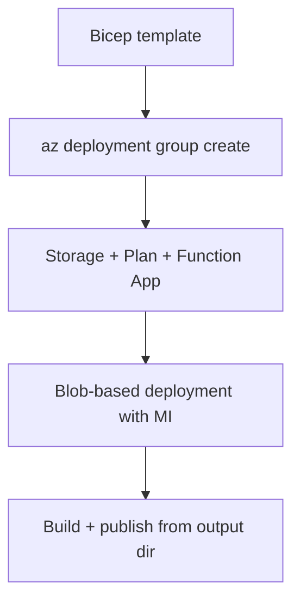

---
hide:
  - toc
validation:
  az_cli:
    last_tested: 2026-04-10
    cli_version: "2.83.0"
    core_tools_version: "4.8.0"
    result: pass
  bicep:
    last_tested: null
    result: not_tested
content_sources:
  - type: mslearn-adapted
    url: https://learn.microsoft.com/azure/azure-functions/dotnet-isolated-process-guide
  - type: mslearn-adapted
    url: https://learn.microsoft.com/azure/azure-functions/flex-consumption-plan
  - type: mslearn-adapted
    url: https://learn.microsoft.com/azure/azure-resource-manager/bicep/overview
---

# 05 - Infrastructure as Code (Flex Consumption)

Describe your .NET Function App platform using Bicep so provisioning is deterministic and easy to review. Flex Consumption uses `functionAppConfig` instead of traditional `siteConfig` for runtime and scaling settings.

## Prerequisites

| Tool | Version | Purpose |
|------|---------|---------|
| .NET SDK | 8.0 (LTS) | Build and run isolated worker functions |
| Azure Functions Core Tools | v4 | Start local host and publish artifacts |
| Azure CLI | 2.61+ | Provision Azure resources and inspect app state |

!!! info "Flex Consumption plan basics"
    Flex Consumption (FC1) keeps serverless economics while adding VNet integration, configurable instance memory (512 MB to 4096 MB), and per-function scaling. Microsoft recommends it for many new apps.

## What You'll Build

You will define a complete Flex Consumption environment in Bicep (storage account, FC1 plan, blob deployment container, and Linux Function App for .NET 8 isolated worker with managed identity), and deploy from your own template.

<!-- diagram-id: what-you-ll-build -->


## Steps

### Step 1 - Create a Bicep template for Flex Consumption

```bicep
param location string = resourceGroup().location
param baseName string

var storageName = toLower(replace('${baseName}storage', '-', ''))
var planName = '${baseName}-plan'
var appName = '${baseName}-func'
var deploymentContainerName = 'app-package'
```

### Step 2 - Define storage and deployment container

```bicep
resource storage 'Microsoft.Storage/storageAccounts@2023-05-01' = {
  name: storageName
  location: location
  sku: { name: 'Standard_LRS' }
  kind: 'StorageV2'
}

resource blobService 'Microsoft.Storage/storageAccounts/blobServices@2023-05-01' = {
  parent: storage
  name: 'default'
}

resource deploymentContainer 'Microsoft.Storage/storageAccounts/blobServices/containers@2023-05-01' = {
  parent: blobService
  name: deploymentContainerName
  properties: {
    publicAccess: 'None'
  }
}
```

!!! warning "Deployment container must exist before function app creation"
    Flex Consumption requires a pre-existing blob container for deployment packages. The Bicep template creates it as a dependency of the function app resource.

### Step 3 - Define Flex Consumption plan and function app

```bicep
resource plan 'Microsoft.Web/serverfarms@2024-04-01' = {
  name: planName
  location: location
  sku: {
    name: 'FC1'
    tier: 'FlexConsumption'
  }
  properties: {
    reserved: true
  }
}

resource functionApp 'Microsoft.Web/sites@2024-04-01' = {
  name: appName
  location: location
  kind: 'functionapp,linux'
  identity: {
    type: 'SystemAssigned'
  }
  properties: {
    serverFarmId: plan.id
    httpsOnly: true
    functionAppConfig: {
      runtime: {
        name: 'dotnet-isolated'
        version: '8.0'
      }
      scaleAndConcurrency: {
        maximumInstanceCount: 100
        instanceMemoryMB: 2048
      }
      deployment: {
        storage: {
          type: 'blobContainer'
          value: 'https://${storage.name}.blob.${environment().suffixes.storage}/${deploymentContainerName}'
          authentication: {
            type: 'SystemAssignedIdentity'
          }
        }
      }
    }
  }
}
```

!!! note "Flex Consumption vs Consumption Bicep differences"
    - Flex Consumption uses `functionAppConfig` instead of `siteConfig.appSettings` for runtime configuration.
    - SKU is `FC1` / `FlexConsumption` instead of `Y1` / `Dynamic`.
    - Deployment uses blob storage with managed identity instead of Azure Files with connection strings.
    - `WEBSITE_CONTENTAZUREFILECONNECTIONSTRING` and `WEBSITE_CONTENTSHARE` are NOT used.

### Step 4 - Deploy infrastructure

```bash
az deployment group create \
  --resource-group "$RG" \
  --template-file main.bicep \
  --parameters baseName="$BASE_NAME"
```

### Step 5 - Deploy application artifact

After infrastructure is provisioned, build and publish from the output directory:

```bash
cd apps/dotnet
dotnet publish --configuration Release --output ./publish

cd publish
func azure functionapp publish "$APP_NAME" --dotnet-isolated
```

!!! danger "Must pass --dotnet-isolated flag"
    When publishing from the compiled output directory, Core Tools cannot detect the project language. Always pass `--dotnet-isolated` to specify the worker runtime explicitly. Without this flag, the publish may succeed but functions will not be indexed correctly.

### Step 6 - Validate infrastructure deployment

```bash
az deployment group show \
  --resource-group "$RG" \
  --name main \
  --query "properties.provisioningState" \
  --output tsv

az functionapp show \
  --name "$APP_NAME" \
  --resource-group "$RG" \
  --output table
```

## Verification

Infrastructure deployment output:

```text
ProvisioningState    Timestamp
-----------------    --------------------------
Succeeded            2026-04-10T03:10:00.000Z
```

Function app status:

```text
Name                       State    ResourceGroup              DefaultHostName
-------------------------  -------  -------------------------  -----------------------------------------------
func-dnetflex-04100301     Running  rg-func-dotnet-flex-demo   func-dnetflex-04100301.azurewebsites.net
```

## Next Steps

> **Next:** [06 - CI/CD](06-ci-cd.md)

## See Also

- [Tutorial Overview & Plan Chooser](../index.md)
- [.NET Language Guide](../../index.md)
- [Platform: Hosting Plans](../../../../platform/hosting.md)
- [Operations: Deployment](../../../../operations/deployment.md)
- [Recipes Index](../../recipes/index.md)

## Sources

- [Azure Functions .NET isolated worker guide (Microsoft Learn)](https://learn.microsoft.com/azure/azure-functions/dotnet-isolated-process-guide)
- [Azure Functions Flex Consumption plan (Microsoft Learn)](https://learn.microsoft.com/azure/azure-functions/flex-consumption-plan)
- [Automate resource deployment with Bicep (Microsoft Learn)](https://learn.microsoft.com/azure/azure-resource-manager/bicep/overview)
