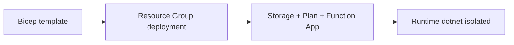

# 05 - Infrastructure as Code (Flex Consumption)

Define the Flex Consumption environment in Bicep and deploy the same architecture repeatedly across environments.

## Prerequisites

| Tool | Version | Purpose |
|------|---------|---------|
| .NET SDK | 8.0 (LTS) | Build and run isolated worker functions |
| Azure Functions Core Tools | v4 | Local host and deployment commands |
| Azure CLI | 2.61+ | Provision and configure Azure resources |

!!! info "Plan basics"
    Flex Consumption (FC1) scales to zero with per-function scaling, VNet support, and configurable memory. It is the recommended default for new serverless workloads.
    Supports VNet integration and private endpoints.
    No Kudu/SCM endpoints and no custom container support on this plan.
    All traffic routes through the integrated VNet.

## What You'll Build

- A Flex Consumption Bicep template based on `functionAppConfig`
- Storage resources used by the deployment package container
- Repeatable group deployment for Flex-specific Function App infrastructure

## Steps
### Step 1 - Create a Bicep template for Flex Consumption
Below is a simplified Flex Consumption template showing key resources.

```bicep
param location string = resourceGroup().location
param baseName string

var functionAppName = '${baseName}-func'
var storageAccountName = toLower(replace('${baseName}storage', '-', ''))
var appServicePlanName = '${baseName}-plan'
var managedIdentityName = '${baseName}-identity'
var deploymentContainerName = 'deployment-packages'

resource storage 'Microsoft.Storage/storageAccounts@2023-05-01' = {
  name: storageAccountName
  location: location
  sku: { name: 'Standard_LRS' }
  kind: 'StorageV2'
  properties: {
    allowSharedKeyAccess: false
  }
}

resource managedIdentity 'Microsoft.ManagedIdentity/userAssignedIdentities@2023-01-31' = {
  name: managedIdentityName
  location: location
}

resource blobService 'Microsoft.Storage/storageAccounts/blobServices@2023-05-01' = {
  parent: storage
  name: 'default'
}

resource deploymentContainer 'Microsoft.Storage/storageAccounts/blobServices/containers@2023-05-01' = {
  parent: blobService
  name: deploymentContainerName
  properties: {
    publicAccess: 'None'
  }
}

resource plan 'Microsoft.Web/serverfarms@2024-04-01' = {
  name: appServicePlanName
  location: location
  sku: {
    name: 'FC1'
    tier: 'FlexConsumption'
  }
  properties: {
    reserved: true
  }
}

resource app 'Microsoft.Web/sites@2024-04-01' = {
  name: functionAppName
  location: location
  kind: 'functionapp,linux'
  identity: {
    type: 'UserAssigned'
    userAssignedIdentities: {
      '${managedIdentity.id}': {}
    }
  }
  properties: {
    serverFarmId: plan.id
    httpsOnly: true
    functionAppConfig: {
      runtime: {
        name: 'dotnet-isolated'
        version: '8.0'
      }
      scaleAndConcurrency: {
        maximumInstanceCount: 100
        instanceMemoryMB: 2048
      }
      deployment: {
        storage: {
          type: 'blobContainer'
          value: 'https://${storage.name}.blob.${environment().suffixes.storage}/${deploymentContainerName}'
          authentication: {
            type: 'UserAssignedIdentity'
            userAssignedIdentityResourceId: managedIdentity.id
          }
        }
      }
    }
  }
}

resource appSettings 'Microsoft.Web/sites/config@2024-04-01' = {
  parent: app
  name: 'appsettings'
  properties: {
    AzureWebJobsStorage__accountName: storage.name
    AzureWebJobsStorage__credential: 'managedidentity'
    AzureWebJobsStorage__clientId: managedIdentity.properties.clientId
    FUNCTIONS_EXTENSION_VERSION: '~4'
  }
}
```

The repository template (`infra/flex-consumption/main.bicep`) extends this with full VNet integration, private endpoints, private DNS zones, and RBAC role assignments.

### Step 2 - Deploy the template
```bash
az deployment group create \
  --resource-group "$RG" \
  --template-file "infra/flex-consumption/main.bicep" \
  --parameters baseName="$BASE_NAME"
```

### Step 3 - Validate created resources
```bash
az functionapp show \
  --name "$APP_NAME" \
  --resource-group "$RG" \
  --query "{kind:kind,state:state,defaultHostName:defaultHostName}" \
  --output json
```


### Step 4 - Validate isolated worker conventions
```bash
grep "FUNCTIONS_WORKER_RUNTIME" "local.settings.json"
grep "ConfigureFunctionsWebApplication" "Program.cs"
```

Confirm that HTTP functions use `HttpRequestData` and `HttpResponseData`, and that logging is constructor-injected with `ILogger<T>`.

## Verification
```json
{
  "kind": "functionapp,linux",
  "state": "Running",
  "defaultHostName": "func-dotnet-flex-consumption-demo.azurewebsites.net"
}
```

## See Also
- [Tutorial Overview & Plan Chooser](../index.md)
- [.NET Language Guide](../../index.md)
- [Platform: Hosting Plans](../../../../platform/hosting.md)
- [Operations: Deployment](../../../../operations/deployment.md)
- [Recipes Index](../../recipes/index.md)

## Sources
- [Azure Functions .NET isolated worker guide](https://learn.microsoft.com/azure/azure-functions/dotnet-isolated-process-guide)
- [Develop Azure Functions locally with Core Tools](https://learn.microsoft.com/azure/azure-functions/functions-develop-local)
- [Azure Functions hosting options](https://learn.microsoft.com/azure/azure-functions/functions-scale)
