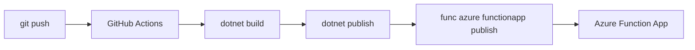

# 06 - CI/CD (Flex Consumption)

Automate build and deployment for Flex Consumption with GitHub Actions, deterministic .NET builds, and Entra ID-based deployment.

## Prerequisites

| Tool | Version | Purpose |
|------|---------|---------|
| .NET SDK | 8.0 (LTS) | Build and run isolated worker functions |
| Azure Functions Core Tools | v4 | Local host and deployment commands |
| Azure CLI | 2.61+ | Provision and configure Azure resources |

!!! info "Plan basics"
    Flex Consumption (FC1) scales to zero with per-function scaling, VNet support, and configurable memory. It is the recommended default for new serverless workloads.
    Supports VNet integration and private endpoints.
    No Kudu/SCM endpoints and no custom container support on this plan.
    All traffic routes through the integrated VNet.

## What You'll Build

- A GitHub Actions workflow that deploys Flex Consumption without publish profiles
- Federated identity authentication to Azure in CI
- Post-deployment endpoint validation with a function key

## Steps
### Step 1 - Configure GitHub secrets for federated deployment
```bash
az ad app federated-credential create \
  --id "<app-registration-object-id>" \
  --parameters "<federated-credential-json>"
```

Add these GitHub secrets:

- `AZURE_CLIENT_ID`
- `AZURE_TENANT_ID`
- `AZURE_SUBSCRIPTION_ID`
- `AZURE_FUNCTIONAPP_NAME`

### Step 2 - Create GitHub Actions workflow
```yaml
name: Deploy .NET Function App (Flex Consumption)

on:
  push:
    branches:
      - main

jobs:
  build-and-deploy:
    runs-on: ubuntu-latest
    steps:
      - name: Checkout
        uses: actions/checkout@v4

      - name: Set up .NET
        uses: actions/setup-dotnet@v4
        with:
          dotnet-version: '8.0.x'

      - name: Build
        run: dotnet build --configuration Release

      - name: Publish
        run: dotnet publish --configuration Release --output ./publish

      - name: Install Azure Functions Core Tools
        run: npm install --global azure-functions-core-tools@4 --unsafe-perm true

      - name: Azure login
        uses: azure/login@v2
        with:
          client-id: ${{ secrets.AZURE_CLIENT_ID }}
          tenant-id: ${{ secrets.AZURE_TENANT_ID }}
          subscription-id: ${{ secrets.AZURE_SUBSCRIPTION_ID }}

      - name: Deploy
        run: func azure functionapp publish "${{ secrets.AZURE_FUNCTIONAPP_NAME }}"
```

### Step 3 - Validate release
```bash
export FUNCTION_KEY=$(az functionapp function keys list \
  --name "$APP_NAME" \
  --resource-group "$RG" \
  --function-name "Health" \
  --query "default" \
  --output tsv)
curl --request GET "https://$APP_NAME.azurewebsites.net/api/health?code=$FUNCTION_KEY"
```


### Step X - Validate isolated worker conventions
```bash
grep "FUNCTIONS_WORKER_RUNTIME" "local.settings.json"
grep "ConfigureFunctionsWebApplication" "Program.cs"
```

Confirm that HTTP functions use `HttpRequestData` and `HttpResponseData`, and that logging is constructor-injected with `ILogger<T>`.

## Verification
```text
{"status":"healthy"}
```

## See Also
- [Tutorial Overview & Plan Chooser](../index.md)
- [.NET Language Guide](../../index.md)
- [Platform: Hosting Plans](../../../../platform/hosting.md)
- [Operations: Deployment](../../../../operations/deployment.md)
- [Recipes Index](../../recipes/index.md)

## Sources
- [Azure Functions .NET isolated worker guide](https://learn.microsoft.com/azure/azure-functions/dotnet-isolated-process-guide)
- [Develop Azure Functions locally with Core Tools](https://learn.microsoft.com/azure/azure-functions/functions-develop-local)
- [Azure Functions hosting options](https://learn.microsoft.com/azure/azure-functions/functions-scale)
