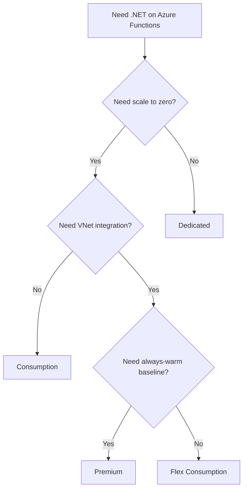

# Tutorial — Choose Your Hosting Plan

This section provides four complete .NET tracks that follow the same seven-step progression from local development to production-ready operation.

## Which Plan Should I Start With?

## Plan Comparison at a Glance

| Feature | Consumption (Y1) | Flex Consumption (FC1) | Premium (EP) | Dedicated (ASP) |
|---------|:----------------:|:----------------------:|:------------:|:---------------:|
| Scale to zero | Yes | Yes | No | No |
| VNet integration | No | Yes | Yes | Yes |
| Private endpoints | No | Yes | Yes | Yes |
| Deployment slots | Limited | No | Yes | Yes |
| Timeout max | 10 min | Unlimited | Unlimited | Unlimited |
| Cost model | Per execution | Per execution | Pre-allocated | Pre-allocated |

## Tutorial Tracks

### [Consumption](consumption/01-local-run.md)
- 01 [Run Locally](consumption/01-local-run.md)
- 02 [First Deploy](consumption/02-first-deploy.md)
- 03 [Configuration](consumption/03-configuration.md)
- 04 [Logging and Monitoring](consumption/04-logging-monitoring.md)
- 05 [Infrastructure as Code](consumption/05-infrastructure-as-code.md)
- 06 [CI/CD](consumption/06-ci-cd.md)
- 07 [Extending Triggers](consumption/07-extending-triggers.md)

### [Flex Consumption](flex-consumption/01-local-run.md)
- 01 [Run Locally](flex-consumption/01-local-run.md)
- 02 [First Deploy](flex-consumption/02-first-deploy.md)
- 03 [Configuration](flex-consumption/03-configuration.md)
- 04 [Logging and Monitoring](flex-consumption/04-logging-monitoring.md)
- 05 [Infrastructure as Code](flex-consumption/05-infrastructure-as-code.md)
- 06 [CI/CD](flex-consumption/06-ci-cd.md)
- 07 [Extending Triggers](flex-consumption/07-extending-triggers.md)

### [Premium](premium/01-local-run.md)
- 01 [Run Locally](premium/01-local-run.md)
- 02 [First Deploy](premium/02-first-deploy.md)
- 03 [Configuration](premium/03-configuration.md)
- 04 [Logging and Monitoring](premium/04-logging-monitoring.md)
- 05 [Infrastructure as Code](premium/05-infrastructure-as-code.md)
- 06 [CI/CD](premium/06-ci-cd.md)
- 07 [Extending Triggers](premium/07-extending-triggers.md)

### [Dedicated](dedicated/01-local-run.md)
- 01 [Run Locally](dedicated/01-local-run.md)
- 02 [First Deploy](dedicated/02-first-deploy.md)
- 03 [Configuration](dedicated/03-configuration.md)
- 04 [Logging and Monitoring](dedicated/04-logging-monitoring.md)
- 05 [Infrastructure as Code](dedicated/05-infrastructure-as-code.md)
- 06 [CI/CD](dedicated/06-ci-cd.md)
- 07 [Extending Triggers](dedicated/07-extending-triggers.md)

## See Also
- [.NET Language Guide](../index.md)
- [.NET Isolated Worker Model](../isolated-worker-model.md)
- [Platform: Hosting Plans](../../../platform/hosting.md)
- [Operations: Deployment](../../../operations/deployment.md)

## Sources
- [Azure Functions hosting options](https://learn.microsoft.com/azure/azure-functions/functions-scale)
- [Guide for running C# Azure Functions in the isolated worker model](https://learn.microsoft.com/azure/azure-functions/dotnet-isolated-process-guide)
