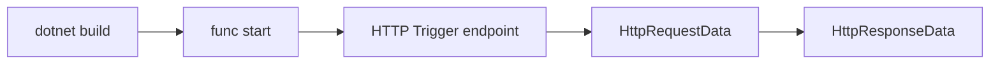

# 01 - Run Locally (Premium)

Build and run a .NET isolated worker Function App locally before touching Azure resources. This creates predictable deployment behavior later in the track.

## Prerequisites

| Tool | Version | Purpose |
|------|---------|---------|
| .NET SDK | 8.0 (LTS) | Build and run isolated worker functions |
| Azure Functions Core Tools | v4 | Local host and deployment commands |
| Azure CLI | 2.61+ | Provision and configure Azure resources |

!!! info "Plan basics"
    Premium (EP) keeps warm instances, supports deployment slots, and is suitable for low-latency and long-running functions.
    Supports VNet integration, private endpoints, and deployment slots.

## Steps
### Step 1 - Initialize a .NET isolated project
```bash
func init MyProject --dotnet-isolated
cd MyProject
func new --template "HTTP trigger" --name HttpFunction
```

### Step 2 - Use a production-aligned project structure
```text
project-root/
├── Functions/
│   ├── HttpFunctions.cs
│   ├── TimerFunctions.cs
│   └── QueueFunctions.cs
├── Program.cs
├── host.json
├── local.settings.json
└── MyProject.csproj
```

### Step 3 - Configure Program.cs for isolated hosting
```csharp
using Microsoft.Extensions.Hosting;

var host = new HostBuilder()
    .ConfigureFunctionsWebApplication()
    .Build();

host.Run();
```

### Step 4 - Implement an HTTP function with DI logger
```csharp
using Microsoft.Azure.Functions.Worker;
using Microsoft.Azure.Functions.Worker.Http;
using Microsoft.Extensions.Logging;
using System.Net;

namespace MyProject.Functions;

public class HttpFunctions
{
    private readonly ILogger<HttpFunctions> _logger;

    public HttpFunctions(ILogger<HttpFunctions> logger)
    {
        _logger = logger;
    }

    [Function("Health")]
    public HttpResponseData Health(
        [HttpTrigger(AuthorizationLevel.Function, "get", "post", Route = "health")] HttpRequestData req)
    {
        _logger.LogInformation("Health check executed.");
        var response = req.CreateResponse(HttpStatusCode.OK);
        response.WriteString("{\"status\":\"healthy\"}");
        return response;
    }
}
```

### Step 5 - Set local settings and run the host
```json
{
  "IsEncrypted": false,
  "Values": {
    "AzureWebJobsStorage": "UseDevelopmentStorage=true",
    "FUNCTIONS_WORKER_RUNTIME": "dotnet-isolated"
  }
}
```

```bash
dotnet build
func start
```


### Step X - Validate isolated worker conventions
```bash
grep "FUNCTIONS_WORKER_RUNTIME" "local.settings.json"
grep "ConfigureFunctionsWebApplication" "Program.cs"
```

Confirm that HTTP functions use `HttpRequestData` and `HttpResponseData`, and that logging is constructor-injected with `ILogger<T>`.

## Expected Output
```text
Azure Functions Core Tools
Core Tools Version:       4.x.x
Function Runtime Version: 4.x.x.x

Functions:
    Health: [GET,POST] http://localhost:7071/api/health
```
## Next Steps

> **Next:** [02 - First Deploy](02-first-deploy.md)

## See Also
- [Tutorial Overview & Plan Chooser](../index.md)
- [.NET Language Guide](../../index.md)
- [Platform: Hosting Plans](../../../../platform/hosting.md)
- [Operations: Deployment](../../../../operations/deployment.md)
- [Recipes Index](../../recipes/index.md)

## Sources
- [Azure Functions .NET isolated worker guide](https://learn.microsoft.com/azure/azure-functions/dotnet-isolated-process-guide)
- [Develop Azure Functions locally with Core Tools](https://learn.microsoft.com/azure/azure-functions/functions-develop-local)
- [Azure Functions hosting options](https://learn.microsoft.com/azure/azure-functions/functions-scale)
