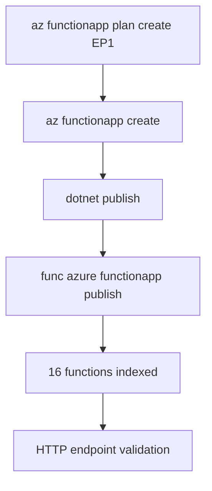

---
hide:
  - toc
validation:
  az_cli:
    last_tested: 2026-04-10
    cli_version: "2.83.0"
    core_tools_version: "4.8.0"
    result: pass
  bicep:
    last_tested: null
    result: not_tested
content_sources:
  - type: mslearn-adapted
    url: https://learn.microsoft.com/azure/azure-functions/dotnet-isolated-process-guide
  - type: mslearn-adapted
    url: https://learn.microsoft.com/azure/azure-functions/functions-develop-local
  - type: mslearn-adapted
    url: https://learn.microsoft.com/azure/azure-functions/functions-scale
  - type: mslearn-adapted
    url: https://learn.microsoft.com/azure/azure-functions/functions-premium-plan
---

# 02 - First Deploy (Premium)

Deploy your .NET 8 isolated worker app to the Premium (EP1) plan with long-form Azure CLI commands and validate your first production endpoint.

## Prerequisites

| Tool | Version | Purpose |
|------|---------|---------|
| .NET SDK | 8.0 (LTS) | Build and run isolated worker functions |
| Azure Functions Core Tools | v4 | Start local host and publish artifacts |
| Azure CLI | 2.61+ | Provision Azure resources and inspect app state |

!!! info "Premium plan basics"
    Premium (EP1) keeps at least one warm instance, supports VNet integration, private endpoints, and deployment slots. No cold-start penalty, with up to 100 instances and no execution timeout.

## What You'll Build

A Linux Premium Function App running the .NET 8 isolated worker on an EP1 plan, deployed from your local project with Core Tools, then validated through all HTTP endpoints.

<!-- diagram-id: what-you-ll-build -->


## Steps

### Step 1 - Set deployment variables

```bash
export RG="rg-func-dotnet-prem-demo"
export LOCATION="koreacentral"
export STORAGE_NAME="stdnetprem0410"
export PLAN_NAME="plan-dnetprem-04100301"
export APP_NAME="func-dnetprem-04100301"
```

### Step 2 - Create resource group and storage account

```bash
az group create \
  --name "$RG" \
  --location "$LOCATION"

az storage account create \
  --name "$STORAGE_NAME" \
  --resource-group "$RG" \
  --location "$LOCATION" \
  --sku Standard_LRS
```

### Step 3 - Create the Premium plan

```bash
az functionapp plan create \
  --name "$PLAN_NAME" \
  --resource-group "$RG" \
  --location "$LOCATION" \
  --sku EP1 \
  --is-linux true
```

!!! note "Premium plan vs Consumption"
    Unlike Consumption, Premium requires a dedicated plan resource. The `az functionapp plan create` command creates an Elastic Premium plan with always-warm instances.

### Step 4 - Create the function app on the Premium plan

```bash
az functionapp create \
  --name "$APP_NAME" \
  --resource-group "$RG" \
  --storage-account "$STORAGE_NAME" \
  --plan "$PLAN_NAME" \
  --runtime dotnet-isolated \
  --runtime-version 8 \
  --functions-version 4 \
  --os-type Linux
```

### Step 5 - Create trigger resources

```bash
az storage queue create \
  --name "incoming-orders" \
  --account-name "$STORAGE_NAME"

az storage container create \
  --name "uploads" \
  --account-name "$STORAGE_NAME"
```

### Step 6 - Configure app settings

```bash
STORAGE_CONN=$(az storage account show-connection-string \
  --name "$STORAGE_NAME" \
  --resource-group "$RG" \
  --query connectionString \
  --output tsv)

az functionapp config appsettings set \
  --name "$APP_NAME" \
  --resource-group "$RG" \
  --settings \
    "QueueStorage=$STORAGE_CONN" \
    "EventHubConnection=Endpoint=sb://placeholder.servicebus.windows.net/;SharedAccessKeyName=placeholder;SharedAccessKey=cGxhY2Vob2xkZXI=;EntityPath=events"
```

### Step 7 - Build and publish

```bash
cd apps/dotnet
dotnet publish --configuration Release --output ./publish

cd publish
func azure functionapp publish "$APP_NAME" --dotnet-isolated
```

!!! note "Must pass --dotnet-isolated flag"
    When publishing from the compiled output directory, Core Tools cannot detect the project language. Always pass `--dotnet-isolated` to specify the worker runtime explicitly.

### Step 8 - Verify function list

```bash
az functionapp function list \
  --name "$APP_NAME" \
  --resource-group "$RG" \
  --query "[].{name:name, language:language}" \
  --output table
```

Expected output (16 functions):

```text
Name                                          Language
--------------------------------------------  ---------------
func-dnetprem-04100301/blobProcessor          dotnet-isolated
func-dnetprem-04100301/dnsResolve             dotnet-isolated
func-dnetprem-04100301/eventhubLagProcessor   dotnet-isolated
func-dnetprem-04100301/externalDependency     dotnet-isolated
func-dnetprem-04100301/health                 dotnet-isolated
func-dnetprem-04100301/helloHttp              dotnet-isolated
func-dnetprem-04100301/identityProbe          dotnet-isolated
func-dnetprem-04100301/info                   dotnet-isolated
func-dnetprem-04100301/logLevels              dotnet-isolated
func-dnetprem-04100301/queueProcessor         dotnet-isolated
func-dnetprem-04100301/scheduledCleanup       dotnet-isolated
func-dnetprem-04100301/slowResponse           dotnet-isolated
func-dnetprem-04100301/storageProbe           dotnet-isolated
func-dnetprem-04100301/testError              dotnet-isolated
func-dnetprem-04100301/timerLab               dotnet-isolated
func-dnetprem-04100301/unhandledError         dotnet-isolated
```

!!! warning "Premium function indexing delay"
    On Premium plans, `az functionapp function list` may return 0 functions for several minutes after the first publish. The functions are available via HTTP immediately — the indexing metadata takes longer to propagate. If you see an empty list, wait 2-3 minutes and retry.

### Step 9 - Test HTTP endpoints

```bash
curl --request GET "https://$APP_NAME.azurewebsites.net/api/health"
curl --request GET "https://$APP_NAME.azurewebsites.net/api/hello/Premium"
curl --request GET "https://$APP_NAME.azurewebsites.net/api/info"
```

## Verification

```text
Uploading 6.82 MB [-----------------------------------------------------------]
Upload completed successfully.
Deployment completed successfully.
Syncing triggers...
```

App state:

```text
State    DefaultHostName                             Kind
-------  ------------------------------------------  -----------------
Running  func-dnetprem-04100301.azurewebsites.net    functionapp,linux
```

Health endpoint response:

```json
{"status":"healthy","timestamp":"2026-04-09T18:25:15.779Z","version":"1.0.0"}
```

Hello endpoint response:

```json
{"message":"Hello, Premium"}
```

!!! note ".NET upload size"
    The .NET isolated worker publish output is approximately 6.82 MB, larger than Java (~326 KB) because it includes the ASP.NET Core runtime dependencies.

## Next Steps

> **Next:** [03 - Configuration](03-configuration.md)

## See Also

- [Tutorial Overview & Plan Chooser](../index.md)
- [.NET Language Guide](../../index.md)
- [Platform: Hosting Plans](../../../../platform/hosting.md)
- [Operations: Deployment](../../../../operations/deployment.md)
- [Recipes Index](../../recipes/index.md)

## Sources

- [Azure Functions .NET isolated worker guide (Microsoft Learn)](https://learn.microsoft.com/azure/azure-functions/dotnet-isolated-process-guide)
- [Develop Azure Functions locally with Core Tools (Microsoft Learn)](https://learn.microsoft.com/azure/azure-functions/functions-develop-local)
- [Azure Functions hosting options (Microsoft Learn)](https://learn.microsoft.com/azure/azure-functions/functions-scale)
- [Azure Functions Premium plan (Microsoft Learn)](https://learn.microsoft.com/azure/azure-functions/functions-premium-plan)
