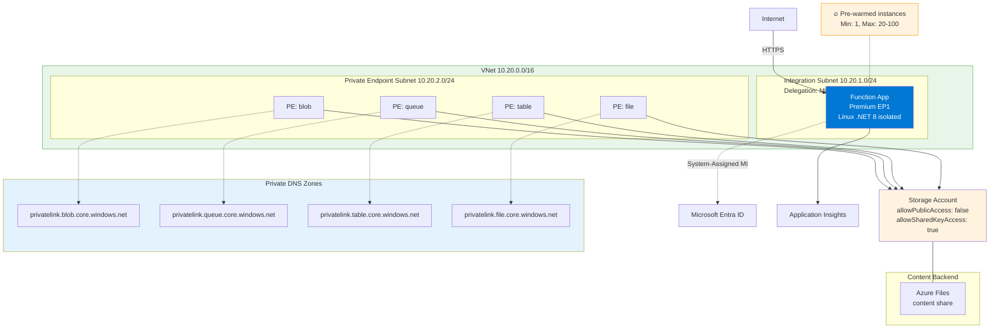
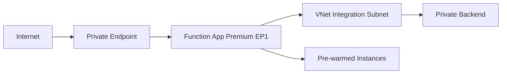

---
hide:
  - toc
validation:
  az_cli:
    last_tested: null
    cli_version: "2.83.0"
    core_tools_version: "4.8.0"
    result: not_tested
  bicep:
    last_tested: null
    result: not_tested
content_sources:
  - type: mslearn-adapted
    url: https://learn.microsoft.com/azure/azure-functions/dotnet-isolated-process-guide
  - type: mslearn-adapted
    url: https://learn.microsoft.com/azure/azure-functions/functions-premium-plan
  - type: mslearn-adapted
    url: https://learn.microsoft.com/azure/app-service/configure-vnet-integration-enable
  - type: mslearn-adapted
    url: https://learn.microsoft.com/azure/app-service/networking/private-endpoint
---

# 02A - First Deploy (Private Egress)

Deploy a .NET 8 isolated worker Function App to an Elastic Premium plan (`EP1`) with VNet integration and private endpoint support, then publish code and verify the app is live.

## Prerequisites

- You completed [01 - Run Locally](01-local-run.md).
- You are signed in to Azure CLI and have Contributor access.
- You already exported: `$RG`, `$APP_NAME`, `$PLAN_NAME`, `$STORAGE_NAME`, `$LOCATION` (use `koreacentral` for this guide).

## What You'll Build

- A Linux .NET 8 isolated worker Function App on Elastic Premium (`EP1`) with runtime settings.
- VNet integration and a site private endpoint for private inbound access.
- A first deployment pipeline (`func azure functionapp publish`) and endpoint verification.

!!! tip "Network Scenario Choices"
    This tutorial deploys with **VNet + Private Endpoints**. For other network configurations:

    | Scenario | Description | Guide |
    |----------|-------------|-------|
    | **Public Only** | No VNet, simplest setup | [Public Only](../../../../platform/networking-scenarios/public-only.md) |
    | **Private Egress** | VNet + Storage PE | [Private Egress](../../../../platform/networking-scenarios/private-egress.md) |
    | **Private Ingress** | + Site Private Endpoint (this tutorial) | Current page |
    | **Fixed Outbound IP** | + NAT Gateway | [Fixed Outbound](../../../../platform/networking-scenarios/fixed-outbound-nat.md) |

!!! info "Infrastructure Context"
    **Plan**: Premium (EP1) | **Network**: VNet + Private Endpoints | **Always warm**: ✅

    Premium deploys with VNet integration (delegated subnet), a private endpoint for inbound access, private DNS zone, and pre-warmed instances. Storage uses connection string or identity-based authentication.

    <!-- diagram-id: what-you-ll-build -->


## Steps

1. Authenticate and set subscription context.

    ```bash
    az login
    az account set --subscription "<subscription-id>"
    ```

    | Command/Parameter | Purpose |
    |-------------------|---------|
    | `az login` | Authenticates your Azure CLI session. |
    | `az account set --subscription "<subscription-id>"` | Sets the active subscription for the current session. |
    | `--subscription "<subscription-id>"` | Specifies the target subscription ID. |

    Expected output (abridged):

    ```json
    [
      {
        "name": "<account-name>",
        "tenantId": "<tenant-id>",
        "id": "<subscription-id>",
        "isDefault": true
      }
    ]
    ```

    ```json
    {
      "id": "<subscription-id>",
      "name": "<subscription-name>",
      "state": "Enabled"
    }
    ```

2. Create resource group and storage account.

    ```bash
    export RG="rg-func-dotnet-prem-demo"
    export STORAGE_NAME="stdnetprem$(openssl rand -hex 4)"
    export APP_NAME="func-dnetprem-$(openssl rand -hex 4)"
    export PLAN_NAME="plan-dnetprem-$(openssl rand -hex 4)"
    export LOCATION="koreacentral"

    az group create \
      --name "$RG" \
      --location "$LOCATION"

    az storage account create \
      --name "$STORAGE_NAME" \
      --resource-group "$RG" \
      --location "$LOCATION" \
      --sku "Standard_LRS" \
      --kind "StorageV2" \
      --allow-blob-public-access false
    ```

    | Command/Parameter | Purpose |
    |-------------------|---------|
    | `az group create` | Provisions a new resource group. |
    | `--name "$RG"` | Sets the resource group name. |
    | `--location "$LOCATION"` | Places the resource group in the target region. |
    | `az storage account create` | Creates a storage account for function app use. |
    | `--sku "Standard_LRS"` | Uses Standard Locally Redundant Storage. |
    | `--kind "StorageV2"` | Selects General Purpose v2 storage account type. |
    | `--allow-blob-public-access false` | Disables public anonymous access to blobs. |

    Expected output (abridged):

    ```json
    {
      "name": "<resource-group-name>",
      "location": "koreacentral",
      "properties": {
        "provisioningState": "Succeeded"
      }
    }
    ```

    ```json
    {
      "name": "<storage-account-name>",
      "location": "koreacentral",
      "kind": "StorageV2",
      "sku": {
        "name": "Standard_LRS"
      },
      "allowBlobPublicAccess": false,
      "provisioningState": "Succeeded"
    }
    ```

3. Create the Premium plan and Function App (Linux example).

    ```bash
    az functionapp plan create \
      --name "$PLAN_NAME" \
      --resource-group "$RG" \
      --location "$LOCATION" \
      --sku "EP1" \
      --is-linux

    az functionapp create \
      --name "$APP_NAME" \
      --resource-group "$RG" \
      --plan "$PLAN_NAME" \
      --storage-account "$STORAGE_NAME" \
      --runtime "dotnet-isolated" \
      --runtime-version "8" \
      --functions-version "4" \
      --os-type "Linux"
    ```

    | Command/Parameter | Purpose |
    |-------------------|---------|
    | `az functionapp plan create` | Provisions an Elastic Premium hosting plan. |
    | `--sku "EP1"` | Selects the initial Premium tier size. |
    | `--is-linux` | Configures the plan for Linux hosting. |
    | `az functionapp create` | Provisions the function app within the Premium plan. |
    | `--plan "$PLAN_NAME"` | Links the app to the newly created plan. |
    | `--runtime "dotnet-isolated"` | Sets the language runtime to .NET 8 isolated worker. |
    | `--runtime-version "8"` | Specifies the .NET version. |
    | `--functions-version "4"` | Selects version 4.x of the runtime. |
    | `--os-type "Linux"` | Deploys the app on a Linux host. |

!!! tip "Globally unique names required"
    Both `$APP_NAME` and `$STORAGE_NAME` must be globally unique across all Azure subscriptions. If you get a naming conflict, append a random suffix (e.g., `func-dnetprem-04091234`).

    Expected output (abridged):

    ```json
    {
      "name": "<plan-name>",
      "location": "koreacentral",
      "sku": {
        "name": "EP1",
        "tier": "ElasticPremium"
      },
      "provisioningState": "Succeeded"
    }
    ```

    ```json
    {
      "name": "<function-app-name>",
      "state": "Running",
      "kind": "functionapp,linux",
      "defaultHostName": "<function-app-name>.azurewebsites.net"
    }
    ```

!!! warning "Enterprise policy: Shared key access"
    Some enterprise subscriptions enforce Azure Policy that sets `allowSharedKeyAccess: false` on all storage accounts. Premium (EP1) requires `WEBSITE_CONTENTAZUREFILECONNECTIONSTRING` with a connection string that uses shared key access to create the content file share during provisioning. If your subscription has this policy, the Function App creation will fail with a 403 error. Solutions:

    - Request a policy exemption from your Azure administrator
    - Use Flex Consumption (FC1) which supports identity-based blob storage without shared keys
    - Use Dedicated (B1) which uses `WEBSITE_RUN_FROM_PACKAGE` without a content file share

4. Configure app settings using classic `siteConfig.appSettings` model values.

    ```bash
    az functionapp config appsettings set \
      --name "$APP_NAME" \
      --resource-group "$RG" \
      --settings \
        "FUNCTIONS_WORKER_RUNTIME=dotnet-isolated" \
        "AzureWebJobsStorage__accountName=$STORAGE_NAME" \
        "AzureWebJobsStorage__credential=managedidentity"
    ```

    | Command/Parameter | Purpose |
    |-------------------|---------|
    | `az functionapp config appsettings set` | Configures environment variables for the function app. |
    | `"FUNCTIONS_WORKER_RUNTIME=dotnet-isolated"` | Sets the runtime worker to .NET isolated. |
    | `"AzureWebJobsStorage__accountName=$STORAGE_NAME"` | Sets the storage account name for host storage. |
    | `"AzureWebJobsStorage__credential=managedidentity"` | Configures the host to use managed identity for storage access. |

    Expected output (abridged):

    ```json
    [
      {
        "name": "FUNCTIONS_WORKER_RUNTIME",
        "value": "dotnet-isolated"
      },
      {
        "name": "AzureWebJobsStorage__accountName",
        "value": "<storage-account-name>"
      },
      {
        "name": "AzureWebJobsStorage__credential",
        "value": "managedidentity"
      }
    ]
    ```

    For Premium, both host-storage models are valid:
    - Connection string: `AzureWebJobsStorage=<connection-string>`
    - Identity-based: `AzureWebJobsStorage__accountName=<storage-account-name>` plus `AzureWebJobsStorage__credential=managedidentity`

5. Enable a system-assigned managed identity for the Function App.

    ```bash
    az functionapp identity assign \
      --name "$APP_NAME" \
      --resource-group "$RG"

    export MI_PRINCIPAL_ID=$(az functionapp identity show \
      --name "$APP_NAME" \
      --resource-group "$RG" \
      --query "principalId" \
      --output tsv)
    ```

    | Command/Parameter | Purpose |
    |-------------------|---------|
    | `az functionapp identity assign` | Enables system-assigned managed identity for the app. |
    | `az functionapp identity show` | Retrieves properties of the app's identity. |
    | `--query "principalId"` | Extracts the principal ID for RBAC role assignments. |
    | `--output tsv` | Formats output for variable capture. |

    Expected output (abridged):

    ```json
    {
      "type": "SystemAssigned",
      "principalId": "<object-id>",
      "tenantId": "<tenant-id>"
    }
    ```

    ```text
    <object-id>
    ```

6. Assign storage RBAC roles to the managed identity.

    ```bash
    export STORAGE_ID=$(az storage account show \
      --name "$STORAGE_NAME" \
      --resource-group "$RG" \
      --query "id" \
      --output tsv)

    az role assignment create \
      --assignee "$MI_PRINCIPAL_ID" \
      --role "Storage Blob Data Owner" \
      --scope "$STORAGE_ID"

    az role assignment create \
      --assignee "$MI_PRINCIPAL_ID" \
      --role "Storage Account Contributor" \
      --scope "$STORAGE_ID"

    az role assignment create \
      --assignee "$MI_PRINCIPAL_ID" \
      --role "Storage Queue Data Contributor" \
      --scope "$STORAGE_ID"

    az role assignment create \
      --assignee "$MI_PRINCIPAL_ID" \
      --role "Storage File Data Privileged Contributor" \
      --scope "$STORAGE_ID"
    ```

    | Command/Parameter | Purpose |
    |-------------------|---------|
    | `az storage account show` | Retrieves the storage account resource ID. |
    | `az role assignment create` | Grants a specific RBAC role to the managed identity. |
    | `--assignee "$MI_PRINCIPAL_ID"` | Targets the function app's system-assigned identity. |
    | `--role "Storage Blob Data Owner"` | Grants full blob access for host data. |
    | `--role "Storage Account Contributor"` | Allows platform-level management of the storage account. |
    | `--role "Storage Queue Data Contributor"` | Grants access to storage queues for runtime operations. |
    | `--role "Storage File Data Privileged Contributor"` | Grants access to file shares for Premium content storage. |

    Expected output (abridged):

    ```text
    /subscriptions/<subscription-id>/resourceGroups/<resource-group-name>/providers/Microsoft.Storage/storageAccounts/<storage-account-name>
    ```

    ```json
    {
      "principalId": "<object-id>",
      "roleDefinitionName": "Storage Blob Data Owner",
      "scope": "/subscriptions/<subscription-id>/resourceGroups/<resource-group-name>/providers/Microsoft.Storage/storageAccounts/<storage-account-name>"
    }
    ```

    ```json
    {
      "principalId": "<object-id>",
      "roleDefinitionName": "Storage Account Contributor",
      "scope": "/subscriptions/<subscription-id>/resourceGroups/<resource-group-name>/providers/Microsoft.Storage/storageAccounts/<storage-account-name>"
    }
    ```

    ```json
    {
      "principalId": "<object-id>",
      "roleDefinitionName": "Storage Queue Data Contributor",
      "scope": "/subscriptions/<subscription-id>/resourceGroups/<resource-group-name>/providers/Microsoft.Storage/storageAccounts/<storage-account-name>"
    }
    ```

    ```json
    {
      "principalId": "<object-id>",
      "roleDefinitionName": "Storage File Data Privileged Contributor",
      "scope": "/subscriptions/<subscription-id>/resourceGroups/<resource-group-name>/providers/Microsoft.Storage/storageAccounts/<storage-account-name>"
    }
    ```

    !!! tip "Why these four roles are required on Premium"
        Premium Function Apps need host storage and Azure Files content share access during provisioning and runtime:

        - `Storage Blob Data Owner` for host blobs, leases, and trigger state.
        - `Storage Account Contributor` for storage account-level management operations used by the platform.
        - `Storage Queue Data Contributor` for queue-backed host coordination and trigger operations.
        - `Storage File Data Privileged Contributor` for the Azure Files content share (`WEBSITE_CONTENTAZUREFILECONNECTIONSTRING`) used by Premium.

7. Create a VNet with separate subnets for integration and private endpoints.

    ```bash
    az network vnet create \
      --name "vnet-premium-demo" \
      --resource-group "$RG" \
      --location "$LOCATION" \
      --address-prefixes "10.20.0.0/16" \
      --subnet-name "snet-integration" \
      --subnet-prefixes "10.20.1.0/24"

    az network vnet subnet create \
      --name "snet-private-endpoints" \
      --resource-group "$RG" \
      --vnet-name "vnet-premium-demo" \
      --address-prefixes "10.20.2.0/24"

    az network vnet subnet update \
      --name "snet-integration" \
      --resource-group "$RG" \
      --vnet-name "vnet-premium-demo" \
      --delegations "Microsoft.Web/serverFarms"

    az functionapp vnet-integration add \
      --name "$APP_NAME" \
      --resource-group "$RG" \
      --vnet "vnet-premium-demo" \
      --subnet "snet-integration"

    for SVC in blob queue table file; do
      az network private-endpoint create \
        --name "pe-st-$SVC" \
        --resource-group "$RG" \
        --location "$LOCATION" \
        --vnet-name "vnet-premium-demo" \
        --subnet "snet-private-endpoints" \
        --private-connection-resource-id "$STORAGE_ID" \
        --group-ids "$SVC" \
        --connection-name "conn-st-$SVC"
    done
    ```

    | Command/Parameter | Purpose |
    |-------------------|---------|
    | `az network vnet create` | Provisions a new Virtual Network. |
    | `--address-prefixes "10.20.0.0/16"` | Defines the CIDR range for the VNet. |
    | `az network vnet subnet create` | Adds a subnet for private endpoints. |
    | `az network vnet subnet update` | Modifies the integration subnet. |
    | `--delegations "Microsoft.Web/serverFarms"` | Delegating the subnet to Premium hosting plans. |
    | `az functionapp vnet-integration add` | Configures outbound traffic to flow through the VNet. |
    | `az network private-endpoint create` | Provisions private endpoints for storage services. |
    | `--group-ids "$SVC"` | Specifies the storage sub-resource (blob, queue, etc). |

    Expected output (abridged):

    ```json
    {
      "newVNetName": "vnet-premium-demo",
      "newSubnetName": "snet-integration",
      "newRouteAllEnabled": false
    }
    ```

    ```text
    {
      "name": "pe-st-blob",
      "provisioningState": "Succeeded"
    }
    {
      "name": "pe-st-queue",
      "provisioningState": "Succeeded"
    }
    {
      "name": "pe-st-table",
      "provisioningState": "Succeeded"
    }
    {
      "name": "pe-st-file",
      "provisioningState": "Succeeded"
    }
    ```

8. Create a private endpoint for inbound private access.

    ```bash
    APP_ID=$(az functionapp show \
      --name "$APP_NAME" \
      --resource-group "$RG" \
      --query "id" \
      --output tsv)

    az network private-endpoint create \
      --name "pe-$APP_NAME" \
      --resource-group "$RG" \
      --location "$LOCATION" \
      --vnet-name "vnet-premium-demo" \
      --subnet "snet-private-endpoints" \
      --private-connection-resource-id "$APP_ID" \
      --group-ids "sites" \
      --connection-name "conn-$APP_NAME"
    ```

    | Command/Parameter | Purpose |
    |-------------------|---------|
    | `az functionapp show` | Retrieves the function app resource ID. |
    | `az network private-endpoint create` | Provisions an inbound private endpoint for the function app. |
    | `--group-ids "sites"` | Targets the primary web app (site) resource. |
    | `--connection-name "conn-$APP_NAME"` | Sets the private link connection name. |

    Expected output (abridged):

    ```text
    /subscriptions/<subscription-id>/resourceGroups/<resource-group-name>/providers/Microsoft.Web/sites/<function-app-name>
    ```

    ```json
    {
      "name": "pe-<function-app-name>",
      "provisioningState": "Succeeded",
      "privateLinkServiceConnections": [
        {
          "groupIds": [
            "sites"
          ]
        }
      ]
    }
    ```

    Private endpoint name resolution requires private DNS configuration. At minimum, create and link `privatelink.azurewebsites.net` to the VNet, then attach the zone to the private endpoint:

    ```bash
    az network private-dns zone create \
      --resource-group "$RG" \
      --name "privatelink.azurewebsites.net"

    az network private-dns link vnet create \
      --resource-group "$RG" \
      --zone-name "privatelink.azurewebsites.net" \
      --name "link-vnet-premium-demo" \
      --virtual-network "vnet-premium-demo" \
      --registration-enabled false

    az network private-endpoint dns-zone-group create \
      --resource-group "$RG" \
      --endpoint-name "pe-$APP_NAME" \
      --name "web-dns-zone-group" \
      --private-dns-zone "privatelink.azurewebsites.net" \
      --zone-name "web-config"

    for SVC in blob queue table file; do
      az network private-dns zone create \
        --resource-group "$RG" \
        --name "privatelink.$SVC.core.windows.net"

      az network private-dns link vnet create \
        --resource-group "$RG" \
        --zone-name "privatelink.$SVC.core.windows.net" \
        --name "link-$SVC" \
        --virtual-network "vnet-premium-demo" \
        --registration-enabled false

      az network private-endpoint dns-zone-group create \
        --resource-group "$RG" \
        --endpoint-name "pe-st-$SVC" \
        --name "$SVC-dns-zone-group" \
        --private-dns-zone "privatelink.$SVC.core.windows.net" \
        --zone-name "$SVC"
    done
    ```

    | Command/Parameter | Purpose |
    |-------------------|---------|
    | `az network private-dns zone create` | Provisions private DNS zones for name resolution. |
    | `az network private-dns link vnet create` | Links the DNS zone to the VNet for resolution. |
    | `az network private-endpoint dns-zone-group create` | Connects the private endpoint to its DNS zone for automatic IP registration. |

    Expected output (abridged):

    ```json
    {
      "name": "privatelink.azurewebsites.net",
      "numberOfRecordSets": 0
    }
    ```

    ```json
    {
      "name": "web-dns-zone-group",
      "provisioningState": "Succeeded"
    }
    ```

    ```text
    {
      "name": "privatelink.blob.core.windows.net",
      "provisioningState": "Succeeded"
    }
    {
      "name": "privatelink.queue.core.windows.net",
      "provisioningState": "Succeeded"
    }
    {
      "name": "privatelink.table.core.windows.net",
      "provisioningState": "Succeeded"
    }
    {
      "name": "privatelink.file.core.windows.net",
      "provisioningState": "Succeeded"
    }
    ```

9. Build and publish function code (Premium supports file share-based deployment and SCM/Kudu).

    ```bash
    cd apps/dotnet
    dotnet publish --configuration Release --output ./publish

    cd publish
    func azure functionapp publish "$APP_NAME" --dotnet-isolated
    ```

    | Command/Parameter | Purpose |
    |-------------------|---------|
    | `cd apps/dotnet` | Navigates to the .NET project directory. |
    | `dotnet publish --configuration Release --output ./publish` | Compiles the project and outputs build artifacts. |
    | `cd publish` | Navigates to the compiled output directory. |
    | `func azure functionapp publish "$APP_NAME" --dotnet-isolated` | Deploys the compiled project to the Azure Function App. |

    !!! danger "Must publish from output directory with --dotnet-isolated flag"
        When publishing from the compiled output directory, Core Tools cannot detect the project language. Always pass `--dotnet-isolated` to specify the worker runtime explicitly. Without this flag, the publish may succeed but functions will not be indexed correctly.

    Expected output (abridged):

    ```text
    Getting site publishing info...
    Creating archive for current directory...
    Uploading 6.82 MB [########################################]
    Upload completed successfully.
    Deployment completed successfully.
    Syncing triggers...
    ```

10. Verify app status and endpoint.

    ```bash
    az functionapp show \
      --name "$APP_NAME" \
      --resource-group "$RG" \
      --output table

    curl --request GET "https://$APP_NAME.azurewebsites.net/api/health"
    ```

    | Command/Parameter | Purpose |
    |-------------------|---------|
    | `az functionapp show` | Displays function app status. |
    | `--output table` | Formats output as a table. |
    | `curl --request GET` | Tests the public HTTP endpoint. |

    Expected output (abridged):

    ```text
    Name               State    DefaultHostName
    -----------------  -------  ----------------------------------------
    <function-app-name> Running  <function-app-name>.azurewebsites.net
    ```

    ```json
    {"status":"healthy","timestamp":"2026-01-01T00:00:00Z","version":"1.0.0"}
    ```

!!! warning "Auto-created Application Insights"
    `az functionapp create` automatically creates an Application Insights resource and links it via `APPINSIGHTS_INSTRUMENTATIONKEY` and `APPLICATIONINSIGHTS_CONNECTION_STRING`. Tutorial 04 creates a second, explicit Application Insights resource. You may see duplicate resources — this is expected.

## Verification

### Expected output when policy allows shared key access

```json
{
  "id": "/subscriptions/<subscription-id>/resourceGroups/rg-func-dotnet-prem-demo/providers/Microsoft.Web/sites/<app-name>",
  "location": "koreacentral",
  "name": "<app-name>",
  "state": "Running",
  "defaultHostName": "<app-name>.azurewebsites.net"
}
```

```text
Getting site publishing info...
Creating archive for current directory...
Uploading 6.82 MB [########################################]
Upload completed successfully.
Deployment completed successfully.
Syncing triggers...
Functions in <app-name>:
    health - [httpTrigger]
    info - [httpTrigger]
    helloHttp - [httpTrigger]
```

```json
{"status":"healthy","timestamp":"2026-01-01T00:00:00Z","version":"1.0.0"}
```

### Deployment Verification Results

!!! warning "Blocked by enterprise policy"
    In our Korea Central deployment, EP1 Premium was blocked during provisioning by the same `allowSharedKeyAccess: false` policy as Consumption. Premium plans also require `WEBSITE_CONTENTAZUREFILECONNECTIONSTRING` with shared key access for the content file share.

    **Observed error:**

    ```text
    ERROR: Creation of storage file share failed with: 'The remote server returned an error: (403) Forbidden.'.
    Please check if the storage account is accessible.
    ```

    **Workarounds:**

    - Request a policy exemption from your Azure administrator
    - Use Flex Consumption (FC1) which supports identity-based blob storage
    - Use Dedicated (B1) which uses `WEBSITE_RUN_FROM_PACKAGE` without a content file share

<!-- diagram-id: deployment-verification-results -->


## Next Steps

> **Next:** [03 - Configuration](03-configuration.md)

## See Also

- [Tutorial Overview & Plan Chooser](../index.md)
- [.NET Language Guide](../../index.md)
- [Platform: Hosting Plans](../../../../platform/hosting.md)
- [Operations: Deployment](../../../../operations/deployment.md)
- [Recipes Index](../../recipes/index.md)

## Sources

- [Azure Functions Premium plan](https://learn.microsoft.com/azure/azure-functions/functions-premium-plan)
- [Integrate your app with an Azure virtual network](https://learn.microsoft.com/azure/app-service/configure-vnet-integration-enable)
- [Use private endpoints for Azure App Service apps](https://learn.microsoft.com/azure/app-service/networking/private-endpoint)
