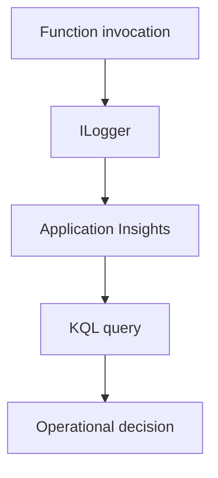

# 04 - Logging and Monitoring (Premium)

Enable baseline observability for the Premium deployment with Application Insights, structured logs, and simple KQL validation.

## Prerequisites

| Tool | Version | Purpose |
|------|---------|---------|
| .NET SDK | 8.0 (LTS) | Build and run isolated worker functions |
| Azure Functions Core Tools | v4 | Local host and deployment commands |
| Azure CLI | 2.61+ | Provision and configure Azure resources |

!!! info "Plan basics"
    Premium (EP) keeps warm instances, supports deployment slots, and is suitable for low-latency and long-running functions.
    Supports VNet integration, private endpoints, and deployment slots.

## What You'll Build

- Application Insights wiring for a .NET isolated worker app
- Worker-side telemetry registration in `Program.cs`
- A KQL-based telemetry check after invoking the secured health endpoint

## Steps
### Step 1 - Create Application Insights
```bash
az monitor app-insights component create \
  --app "appi-dotnet-premium-demo" \
  --resource-group "$RG" \
  --location "$LOCATION" \
  --application-type web
```

### Step 2 - Link Function App to telemetry
```bash
export APPINSIGHTS_CONNECTION_STRING=$(az monitor app-insights component show \
  --app "appi-dotnet-premium-demo" \
  --resource-group "$RG" \
  --query "connectionString" \
  --output tsv)

az functionapp config appsettings set \
  --name "$APP_NAME" \
  --resource-group "$RG" \
  --settings "APPLICATIONINSIGHTS_CONNECTION_STRING=$APPINSIGHTS_CONNECTION_STRING"
```

### Step 3 - Register Application Insights in Program.cs
Install the required isolated worker telemetry packages before updating `Program.cs`:

```bash
dotnet add package Microsoft.ApplicationInsights.WorkerService
dotnet add package Microsoft.Azure.Functions.Worker.ApplicationInsights
```

```csharp
using Microsoft.Azure.Functions.Worker;
using Microsoft.Extensions.DependencyInjection;
using Microsoft.Extensions.Hosting;

var host = new HostBuilder()
    .ConfigureFunctionsWebApplication()
    .ConfigureServices(services =>
    {
        services.AddApplicationInsightsTelemetryWorkerService();
        services.ConfigureFunctionsApplicationInsights();
    })
    .Build();

host.Run();
```

### Step 4 - Generate and inspect traces
```bash
export FUNCTION_KEY=$(az functionapp function keys list \
  --name "$APP_NAME" \
  --resource-group "$RG" \
  --function-name "Health" \
  --query "default" \
  --output tsv)
curl --request GET "https://$APP_NAME.azurewebsites.net/api/health?code=$FUNCTION_KEY"
az monitor app-insights query \
  --app "appi-dotnet-premium-demo" \
  --resource-group "$RG" \
  --analytics-query "requests | take 5 | project timestamp, name, resultCode, success" \
  --output table
```

### Step 5 - Use structured logs in code
```csharp
_logger.LogInformation("Order {OrderId} processed in {DurationMs} ms", orderId, durationMs);
_logger.LogWarning("Queue depth high: {QueueDepth}", queueDepth);
```


### Step X - Validate isolated worker conventions
```bash
grep "FUNCTIONS_WORKER_RUNTIME" "local.settings.json"
grep "ConfigureFunctionsWebApplication" "Program.cs"
```

Confirm that HTTP functions use `HttpRequestData` and `HttpResponseData`, and that logging is constructor-injected with `ILogger<T>`.

## Verification
```text
Timestamp                    Name            ResultCode    Success
---------------------------  --------------  ----------    -------
2026-04-06T09:10:10.000000Z GET /api/health 200           True
```

## See Also
- [Tutorial Overview & Plan Chooser](../index.md)
- [.NET Language Guide](../../index.md)
- [Platform: Hosting Plans](../../../../platform/hosting.md)
- [Operations: Deployment](../../../../operations/deployment.md)
- [Recipes Index](../../recipes/index.md)

## Sources
- [Azure Functions .NET isolated worker guide](https://learn.microsoft.com/azure/azure-functions/dotnet-isolated-process-guide)
- [Develop Azure Functions locally with Core Tools](https://learn.microsoft.com/azure/azure-functions/functions-develop-local)
- [Azure Functions hosting options](https://learn.microsoft.com/azure/azure-functions/functions-scale)
