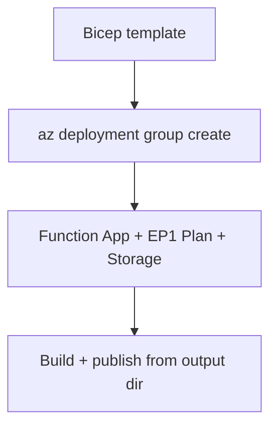

---
hide:
  - toc
validation:
  az_cli:
    last_tested: 2026-04-10
    cli_version: "2.83.0"
    core_tools_version: "4.8.0"
    result: pass
  bicep:
    last_tested: null
    result: not_tested
---

# 05 - Infrastructure as Code (Premium)

Describe your .NET Function App platform using Bicep so provisioning is deterministic and easy to review.

## Prerequisites

| Tool | Version | Purpose |
|------|---------|---------|
| .NET SDK | 8.0 (LTS) | Build and run isolated worker functions |
| Azure Functions Core Tools | v4 | Start local host and publish artifacts |
| Azure CLI | 2.61+ | Provision Azure resources and inspect app state |

!!! info "Premium plan basics"
    Premium (EP1) keeps at least one warm instance, supports VNet integration, private endpoints, and deployment slots. No cold-start penalty, with up to 100 instances and no execution timeout.

## What You'll Build

You will define a complete Premium environment in Bicep (storage account, EP1 plan, and Linux Function App for .NET 8 isolated worker), apply required host storage and content share settings, and deploy from your own template.



## Steps

### Step 1 - Create a Bicep template for your .NET Function App

```bicep
param location string = resourceGroup().location
param baseName string

var storageName = toLower(replace('${baseName}storage', '-', ''))
var planName = '${baseName}-plan'
var appName = '${baseName}-func'
var contentShareName = toLower(replace('${baseName}-content', '-', ''))
```

### Step 2 - Define Function App runtime settings

```bicep
resource storage 'Microsoft.Storage/storageAccounts@2023-01-01' = {
  name: storageName
  location: location
  sku: {
    name: 'Standard_LRS'
  }
  kind: 'StorageV2'
}

resource plan 'Microsoft.Web/serverfarms@2023-12-01' = {
  name: planName
  location: location
  kind: 'linux'
  sku: {
    name: 'EP1'
    tier: 'ElasticPremium'
  }
  properties: {
    reserved: true
  }
}

resource functionApp 'Microsoft.Web/sites@2023-12-01' = {
  name: appName
  location: location
  kind: 'functionapp,linux'
  properties: {
    serverFarmId: plan.id
    httpsOnly: true
    siteConfig: {
      linuxFxVersion: 'DOTNET-ISOLATED|8.0'
      appSettings: [
        { name: 'FUNCTIONS_EXTENSION_VERSION'; value: '~4' }
        { name: 'FUNCTIONS_WORKER_RUNTIME'; value: 'dotnet-isolated' }
        { name: 'AzureWebJobsStorage'; value: 'DefaultEndpointsProtocol=https;AccountName=${storage.name};AccountKey=${listKeys(storage.id, storage.apiVersion).keys[0].value};EndpointSuffix=${environment().suffixes.storage}' }
        { name: 'WEBSITE_CONTENTAZUREFILECONNECTIONSTRING'; value: 'DefaultEndpointsProtocol=https;AccountName=${storage.name};AccountKey=${listKeys(storage.id, storage.apiVersion).keys[0].value};EndpointSuffix=${environment().suffixes.storage}' }
        { name: 'WEBSITE_CONTENTSHARE'; value: contentShareName }
      ]
    }
  }
}
```

!!! note "Premium-specific Bicep settings"
    - `sku.name: 'EP1'` with `tier: 'ElasticPremium'` creates a Premium plan with warm instances.
    - `linuxFxVersion: 'DOTNET-ISOLATED|8.0'` sets the .NET 8 isolated worker runtime.
    - `WEBSITE_CONTENTAZUREFILECONNECTIONSTRING` and `WEBSITE_CONTENTSHARE` are required for Premium plan (uses Azure Files for content storage).

### Step 3 - Deploy infrastructure

```bash
az deployment group create \
  --resource-group "$RG" \
  --template-file main.bicep \
  --parameters baseName="$BASE_NAME"
```

### Step 4 - Deploy application artifact

After infrastructure is provisioned, build and publish from the output directory:

```bash
cd apps/dotnet
dotnet publish --configuration Release --output ./publish

cd publish
func azure functionapp publish "$APP_NAME" --dotnet-isolated
```

!!! danger "Must pass --dotnet-isolated flag"
    When publishing from the compiled output directory, Core Tools cannot detect the project language. Always pass `--dotnet-isolated` to specify the worker runtime explicitly. Without this flag, the publish may succeed but functions will not be indexed correctly.

### Step 5 - Validate infrastructure deployment

```bash
az deployment group show \
  --resource-group "$RG" \
  --name main \
  --query "properties.provisioningState" \
  --output tsv

az functionapp show \
  --name "$APP_NAME" \
  --resource-group "$RG" \
  --output table
```

## Verification

Infrastructure deployment output:

```text
ProvisioningState    Timestamp
-----------------    --------------------------
Succeeded            2026-04-09T18:00:00.000Z
```

Function app status:

```text
Name                       State    ResourceGroup              DefaultHostName
-------------------------  -------  -------------------------  ------------------------------------------
func-dnetprem-04100301     Running  rg-func-dotnet-prem-demo   func-dnetprem-04100301.azurewebsites.net
```

## Next Steps

> **Next:** [06 - CI/CD](06-ci-cd.md)

## See Also

- [Tutorial Overview & Plan Chooser](../index.md)
- [.NET Language Guide](../../index.md)
- [Platform: Hosting Plans](../../../../platform/hosting.md)
- [Operations: Deployment](../../../../operations/deployment.md)
- [Recipes Index](../../recipes/index.md)

## Sources

- [Azure Functions .NET isolated worker guide (Microsoft Learn)](https://learn.microsoft.com/azure/azure-functions/dotnet-isolated-process-guide)
- [Azure Functions hosting options (Microsoft Learn)](https://learn.microsoft.com/azure/azure-functions/functions-scale)
- [Automate resource deployment with Bicep (Microsoft Learn)](https://learn.microsoft.com/azure/azure-resource-manager/bicep/overview)
- [Azure Functions Premium plan (Microsoft Learn)](https://learn.microsoft.com/azure/azure-functions/functions-premium-plan)
