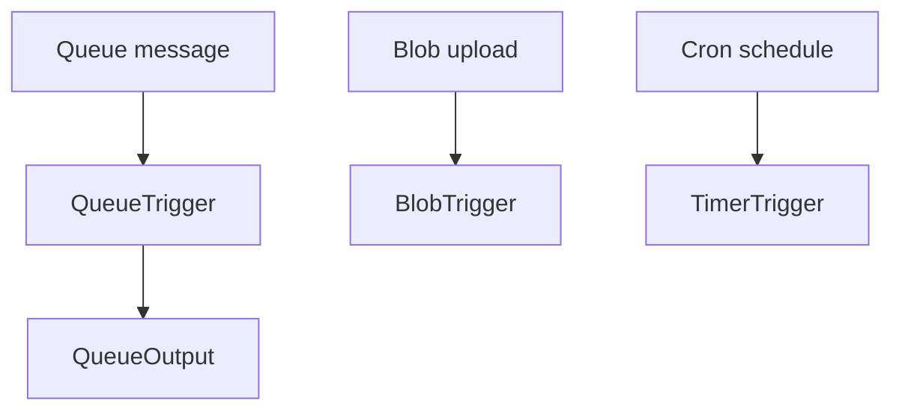

# 07 - Extending Triggers (Premium)

Extend the Premium app beyond HTTP by adding Queue, Blob, and Timer triggers using the .NET isolated worker model.

## Prerequisites

| Tool | Version | Purpose |
|------|---------|---------|
| .NET SDK | 8.0 (LTS) | Build and run isolated worker functions |
| Azure Functions Core Tools | v4 | Local host and deployment commands |
| Azure CLI | 2.61+ | Provision and configure Azure resources |

!!! info "Plan basics"
    Premium (EP) keeps warm instances, supports deployment slots, and is suitable for low-latency and long-running functions.
    Supports VNet integration, private endpoints, and deployment slots.

## Steps
### Step 1 - Add queue trigger and queue output
```csharp
using Microsoft.Azure.Functions.Worker;

namespace MyProject.Functions;

public class QueueFunctions
{
    [Function("QueueProcessor")]
    [QueueOutput("processed-items", Connection = "AzureWebJobsStorage")]
    public string Process(
        [QueueTrigger("work-items", Connection = "AzureWebJobsStorage")] string message)
    {
        return $"processed: {message}";
    }
}
```

### Step 2 - Add blob and timer triggers
```csharp
using Microsoft.Azure.Functions.Worker;
using Microsoft.Extensions.Logging;

namespace MyProject.Functions;

public class TimerFunctions
{
    private readonly ILogger<TimerFunctions> _logger;

    public TimerFunctions(ILogger<TimerFunctions> logger)
    {
        _logger = logger;
    }

    [Function("BlobProcessor")]
    public void BlobProcessor(
        [BlobTrigger("uploads/{name}", Connection = "AzureWebJobsStorage")] byte[] content,
        string name)
    {
        _logger.LogInformation("Blob '{BlobName}' processed with {Length} bytes.", name, content.Length);
    }

    [Function("ScheduledCleanup")]
    public void ScheduledCleanup([TimerTrigger("0 */5 * * * *")] TimerInfo timer)
    {
        _logger.LogInformation("Timer fired at: {Timestamp}", DateTime.UtcNow);
    }
}
```

### Step 3 - Publish and send test events
```bash
dotnet publish --configuration Release --output ./publish
func azure functionapp publish "$APP_NAME" --dotnet-isolated

az storage message put   --queue-name "work-items"   --content '{"id":"1001","action":"reindex"}'   --account-name "$STORAGE_NAME"   --auth-mode login
```

### Step 4 - Review trigger execution
```bash
az functionapp log tail   --name "$APP_NAME"   --resource-group "$RG"
```


### Step X - Validate isolated worker conventions
```bash
grep "FUNCTIONS_WORKER_RUNTIME" "local.settings.json"
grep "ConfigureFunctionsWebApplication" "Program.cs"
```

Confirm that HTTP functions use `HttpRequestData` and `HttpResponseData`, and that logging is constructor-injected with `ILogger<T>`.

## Expected Output
```text
Executing 'Functions.QueueProcessor' (Reason='New queue message detected on work-items.')
Executed 'Functions.QueueProcessor' (Succeeded)
Executing 'Functions.ScheduledCleanup' (Reason='Timer fired at 2026-04-06T10:00:00Z')
Executed 'Functions.ScheduledCleanup' (Succeeded)
```
## Next Steps

> **Next:** [Platform: Architecture](../../../../platform/architecture.md)

## See Also
- [Tutorial Overview & Plan Chooser](../index.md)
- [.NET Language Guide](../../index.md)
- [Platform: Hosting Plans](../../../../platform/hosting.md)
- [Operations: Deployment](../../../../operations/deployment.md)
- [Recipes Index](../../recipes/index.md)

## Sources
- [Azure Functions .NET isolated worker guide](https://learn.microsoft.com/azure/azure-functions/dotnet-isolated-process-guide)
- [Develop Azure Functions locally with Core Tools](https://learn.microsoft.com/azure/azure-functions/functions-develop-local)
- [Azure Functions hosting options](https://learn.microsoft.com/azure/azure-functions/functions-scale)
