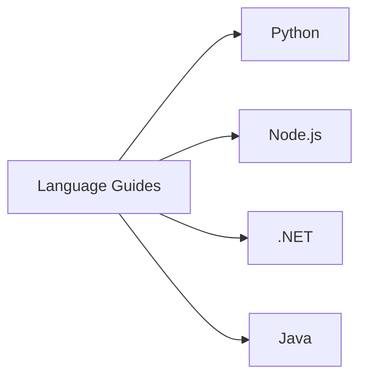

# Language Guides

The Language Guides section maps Azure Functions platform concepts to language-specific implementation models for **Python**, **Node.js**, **.NET**, and **Java**.

Use this section after reading platform fundamentals so you can apply the same architecture and operations decisions in the language stack your team ships.

!!! tip "Platform-first, then language"
    Start with [Platform](../platform/index.md) for architecture, hosting, scaling, networking, and security decisions.
    Then use the language guides to implement those decisions with the correct worker and programming model.

## Supported language tracks

| Language | Guide | Current status | Best starting point |
|----------|-------|----------------|---------------------|
| Python | [Python guide](python/index.md) | **Most complete (reference implementation)** | [Tutorial plan chooser](python/tutorial/index.md) |
| Node.js | [Node.js guide](nodejs/index.md) | Roadmap + starter content | [Node.js quick start](nodejs/index.md#quick-start-http-trigger-nodejs-v4-model) |
| .NET | [.NET guide](dotnet/index.md) | Roadmap + starter content | [.NET isolated quick start](dotnet/index.md#quick-start-http-trigger-net-isolated) |
| Java | [Java guide](java/index.md) | Roadmap + starter content | [Java quick start](java/index.md#quick-start-http-trigger-java) |

## Worker and programming model comparison

This table aligns with Microsoft Learn references for each language runtime.

| Language | Worker model | Primary programming model | Runtime versions (Functions 4.x) | Learn reference |
|----------|--------------|---------------------------|-----------------------------------|-----------------|
| Python | Out-of-process language worker (gRPC) | v2 decorator-based model (`func.FunctionApp`) | Python 3.10, 3.11, 3.12 (plus preview tracks documented in Learn) | Python developer guide |
| Node.js | Out-of-process language worker (gRPC) | v4 code-first model (`app.http()`, `app.timer()`, `app.storageQueue()`) | Node.js 18, 20, 22 | Node.js developer guide |
| .NET | In-process **or** isolated worker (recommended: isolated) | Attribute-based triggers and bindings | .NET 8 (LTS) for isolated worker in this guide baseline | .NET class library guide |
| Java | Out-of-process language worker (JVM) | Annotation-based model (`@FunctionName`, trigger/binding annotations) | Java 8, 11, 17, 21 | Java developer guide |

## How to use this section

1. Confirm plan and architecture in [Platform](../platform/index.md).
2. Open your language index and validate worker/runtime assumptions.
3. Follow quick-start + reference links for local run and deployment.
4. Use operations guidance for deployment, monitoring, and recovery.

## Language guide map

### Python (reference implementation)

- [Python guide index](python/index.md)
- [Tutorial](python/tutorial/index.md) — 4 hosting plan tracks × 7 tutorials each.
- [Recipes](python/recipes/index.md) — practical integration patterns.
- [v2 Programming Model](python/v2-programming-model.md)
- [Python Runtime](python/python-runtime.md)
- [CLI Cheatsheet](python/cli-cheatsheet.md)
- [host.json Reference](python/host-json.md)
- [Environment Variables](python/environment-variables.md)
- [Platform Limits](python/platform-limits.md)
- [Troubleshooting](python/troubleshooting.md)

### Node.js

- [Node.js guide index](nodejs/index.md)
- Includes v4 model overview, differences from Python, and quick start.
- Uses official Learn reference as the source of truth for feature support.

### .NET

- [.NET guide index](dotnet/index.md)
- Focuses on isolated worker as default for new projects.
- Includes migration-oriented framing for teams with in-process apps.

### Java

- [Java guide index](java/index.md)
- Covers annotation-based function model and runtime targeting.
- Includes baseline HTTP trigger example and roadmap.

## Design boundaries

- **Platform docs** explain *why* to choose plan/network/reliability patterns.
- **Language docs** explain *how* to implement those patterns in code.
- **Operations docs** explain *how to run* workloads safely in production.

## See Also

- [Platform](../platform/index.md)
- [Operations](../operations/index.md)
- [Troubleshooting](../troubleshooting/index.md)
- [Start Here](../start-here/index.md)

## Sources

- [Python developer guide](https://learn.microsoft.com/azure/azure-functions/functions-reference-python)
- [Node.js developer guide](https://learn.microsoft.com/azure/azure-functions/functions-reference-node)
- [.NET class library guide](https://learn.microsoft.com/azure/azure-functions/functions-dotnet-class-library)
- [Java developer guide](https://learn.microsoft.com/azure/azure-functions/functions-reference-java)
