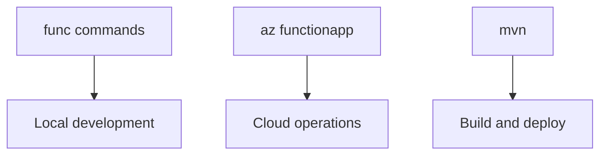

---
content_sources:
  - type: mslearn-adapted
    url: https://learn.microsoft.com/azure/azure-functions/functions-reference-java
  - type: mslearn-adapted
    url: https://learn.microsoft.com/cli/azure/functionapp
---

# CLI Cheatsheet

Quick reference for Java Azure Functions operational workflows.

## Topic/Command Groups

<!-- diagram-id: topic-command-groups -->


### Core Tools

```bash
# Java project scaffolding uses Maven archetype, not func init --java
mvn archetype:generate -DarchetypeGroupId=com.microsoft.azure -DarchetypeArtifactId=azure-functions-archetype
func start
```

### Maven

```bash
mvn clean package
mvn azure-functions:deploy -DfunctionAppName=$APP_NAME
```

### Azure CLI

```bash
az functionapp create --name $APP_NAME --resource-group $RG --storage-account $STORAGE_NAME --plan $PLAN_NAME --runtime java --runtime-version 17 --functions-version 4 --os-type linux
az functionapp config appsettings list --name $APP_NAME --resource-group $RG --output table
az functionapp log tail --name $APP_NAME --resource-group $RG
```

## See Also

- [Java Runtime](java-runtime.md)
- [Annotation Programming Model](annotation-programming-model.md)
- [Operations Overview](../../operations/index.md)

## Sources

- [Azure Functions Java developer guide (Microsoft Learn)](https://learn.microsoft.com/azure/azure-functions/functions-reference-java)
- [Azure Functions CLI reference (Microsoft Learn)](https://learn.microsoft.com/cli/azure/functionapp)
