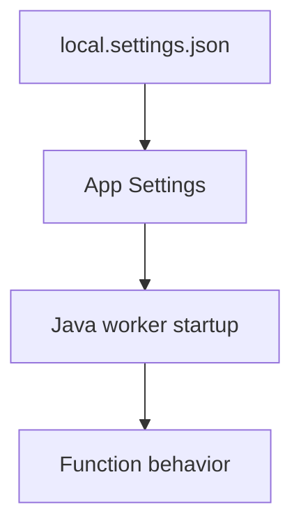

# Environment Variables

Quick reference for Java Azure Functions operational workflows.

## Topic/Command Groups



| Variable | Purpose | Example |
|----------|---------|---------|
| `FUNCTIONS_WORKER_RUNTIME` | Language worker selection | `java` |
| `AzureWebJobsStorage` | Trigger/binding storage | `UseDevelopmentStorage=true` |
| `JAVA_HOME` | Java runtime location | Managed by platform |
| `JAVA_OPTS` | JVM tuning | `-Xmx512m` |

```bash
az functionapp config appsettings set --name $APP_NAME --resource-group $RG --settings "FUNCTIONS_WORKER_RUNTIME=java" "JAVA_OPTS=-Xmx512m"
```

## See Also

- [Java Runtime](java-runtime.md)
- [Annotation Programming Model](annotation-programming-model.md)
- [Operations Overview](../../operations/index.md)

## Sources

- [Azure Functions Java developer guide (Microsoft Learn)](https://learn.microsoft.com/azure/azure-functions/functions-reference-java)
- [Azure Functions CLI reference (Microsoft Learn)](https://learn.microsoft.com/cli/azure/functionapp)
