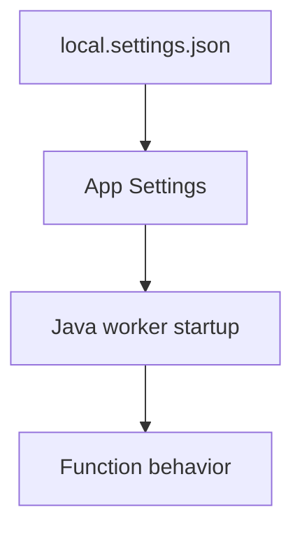

---
content_sources:

  references:
    - type: mslearn-adapted
      url: https://learn.microsoft.com/en-us/azure/azure-functions/functions-reference-java
    - type: mslearn-adapted
      url: https://learn.microsoft.com/en-us/cli/azure/functionapp
  diagrams:
    - id: topic-command-groups
      type: flowchart
      source: self-generated
      justification: Flow view of topic command groups, synthesized from Microsoft Learn documentation cited on this page.
      based_on:
        - https://learn.microsoft.com/en-us/azure/azure-functions/functions-reference-java
        - https://learn.microsoft.com/en-us/cli/azure/functionapp
---
# Environment Variables

Quick reference for Java Azure Functions operational workflows.

## Topic/Command Groups

<!-- diagram-id: topic-command-groups -->


### Core Settings

| Variable | Purpose | Example |
|----------|---------|---------|
| `FUNCTIONS_WORKER_RUNTIME` | Language worker selection | `java` |
| `FUNCTIONS_EXTENSION_VERSION` | Functions runtime version | `~4` |
| `AzureWebJobsStorage` | Trigger/binding storage | `UseDevelopmentStorage=true` |
| `APPLICATIONINSIGHTS_CONNECTION_STRING` | Telemetry destination | `InstrumentationKey=...` |

### Java-Specific Settings

| Variable | Purpose | Example | Notes |
|----------|---------|---------|-------|
| `JAVA_HOME` | Java runtime location | Managed by platform | Do not override on Azure |
| `JAVA_OPTS` | JVM startup options | `-Xmx512m -XX:+UseG1GC` | Heap size, GC, and diagnostic flags |
| `FUNCTIONS_WORKER_JAVA_LOAD_APP_LIBS` | Load app libraries before worker libs | `true` | Useful for dependency conflict resolution |
| `WEBSITE_RUN_FROM_PACKAGE` | Run from immutable package | `1` | Recommended for production deployments |

### JVM Tuning via JAVA_OPTS

Common `JAVA_OPTS` configurations for Azure Functions:

| Configuration | Value | Use case |
|---|---|---|
| Increase heap size | `-Xmx512m` | Memory-intensive processing |
| Use G1 GC | `-XX:+UseG1GC` | Balanced throughput and latency |
| Enable GC logging | `-Xlog:gc*` | Debug memory pressure (Java 11+) |
| Set timezone | `-Duser.timezone=UTC` | Consistent timestamp behavior |

```bash
az functionapp config appsettings set --name $APP_NAME --resource-group $RG --settings "FUNCTIONS_WORKER_RUNTIME=java" "JAVA_OPTS=-Xmx512m"
```

| CLI element | Explanation |
|---|---|
| Command(s) | `az functionapp config appsettings set` |
| Key flags | `--name`, `--resource-group`, `--settings` |
| Variables | `$APP_NAME`, `$RG` |
| Expected result | Azure CLI applies the configuration change; confirm the returned JSON or follow-up query shows the expected value. |


## See Also

- [Java Runtime](java-runtime.md)
- [Annotation Programming Model](annotation-programming-model.md)
- [Operations Overview](../../operations/index.md)

## Sources

- [Azure Functions Java developer guide (Microsoft Learn)](https://learn.microsoft.com/en-us/azure/azure-functions/functions-reference-java)
- [Azure Functions CLI reference (Microsoft Learn)](https://learn.microsoft.com/en-us/cli/azure/functionapp)
