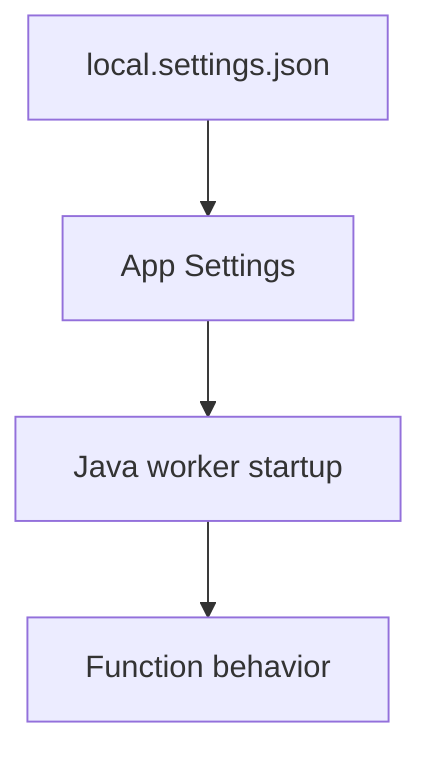

---
content_sources:
- type: mslearn-adapted
  url: https://learn.microsoft.com/azure/azure-functions/functions-reference-java
- type: mslearn-adapted
  url: https://learn.microsoft.com/cli/azure/functionapp
content_validation:
  status: verified
  last_reviewed: '2026-05-23'
  reviewer: agent
  core_claims:
  - claim: This page uses Microsoft Learn as the primary source basis for its Azure-specific
      guidance.
    source: https://learn.microsoft.com/azure/azure-functions/functions-reference-java
    verified: true
---
# Environment Variables

Quick reference for Java Azure Functions operational workflows.

## Topic/Command Groups

<!-- diagram-id: topic-command-groups -->


| Variable | Purpose | Example |
|----------|---------|---------|
| `FUNCTIONS_WORKER_RUNTIME` | Language worker selection | `java` |
| `AzureWebJobsStorage` | Trigger/binding storage | `UseDevelopmentStorage=true` |
| `JAVA_HOME` | Java runtime location | Managed by platform |
| `JAVA_OPTS` | JVM tuning | `-Xmx512m` |

```bash
az functionapp config appsettings set --name $APP_NAME --resource-group $RG --settings "FUNCTIONS_WORKER_RUNTIME=java" "JAVA_OPTS=-Xmx512m"
```

| CLI element | Explanation |
|---|---|
| Command(s) | `az functionapp config appsettings set` |
| Key flags | `--name`, `--resource-group`, `--settings` |
| Variables | `$APP_NAME`, `$RG` |
| Expected result | Azure CLI applies the configuration change; confirm the returned JSON or follow-up query shows the expected value. |


## See Also

- [Java Runtime](java-runtime.md)
- [Annotation Programming Model](annotation-programming-model.md)
- [Operations Overview](../../operations/index.md)

## Sources

- [Azure Functions Java developer guide (Microsoft Learn)](https://learn.microsoft.com/azure/azure-functions/functions-reference-java)
- [Azure Functions CLI reference (Microsoft Learn)](https://learn.microsoft.com/cli/azure/functionapp)
