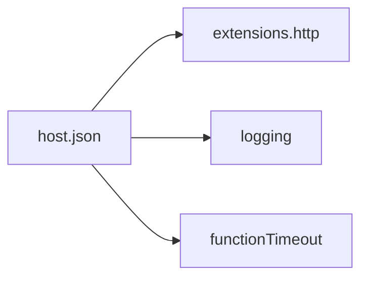

# host.json Reference

Quick reference for Java Azure Functions operational workflows.

## Topic/Command Groups



Example baseline:

```json
{
  "version": "2.0",
  "functionTimeout": "00:05:00",
  "logging": {
    "applicationInsights": {
      "samplingSettings": {
        "isEnabled": true,
        "maxTelemetryItemsPerSecond": 20
      }
    }
  },
  "extensions": {
    "http": {
      "routePrefix": "api"
    }
  }
}
```

## See Also

- [Java Runtime](java-runtime.md)
- [Annotation Programming Model](annotation-programming-model.md)
- [Operations Overview](../../operations/index.md)

## Sources

- [Azure Functions Java developer guide (Microsoft Learn)](https://learn.microsoft.com/azure/azure-functions/functions-reference-java)
- [Azure Functions CLI reference (Microsoft Learn)](https://learn.microsoft.com/cli/azure/functionapp)
