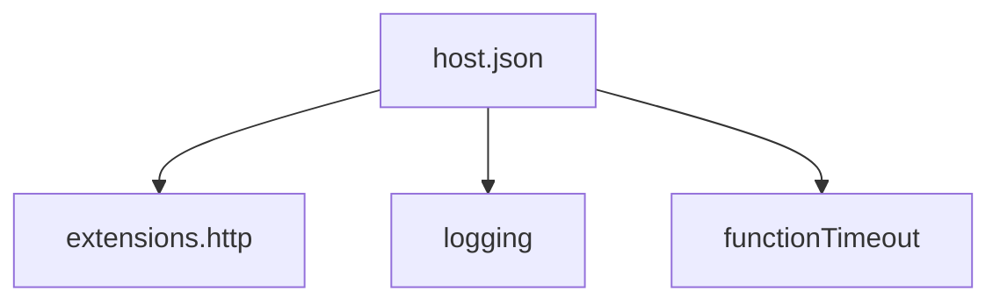

---
content_sources:

  - type: mslearn-adapted
    url: https://learn.microsoft.com/en-us/azure/azure-functions/functions-reference-java
  - type: mslearn-adapted
    url: https://learn.microsoft.com/en-us/cli/azure/functionapp
content_validation:
  status: verified
  last_reviewed: '2026-05-23'
  reviewer: agent
  core_claims:
    - claim: This page uses Microsoft Learn as the primary source basis for its Azure-specific guidance.
      source: https://learn.microsoft.com/en-us/azure/azure-functions/functions-reference-java
      verified: true
---
# host.json Reference

Quick reference for Java Azure Functions operational workflows.

## Topic/Command Groups

<!-- diagram-id: topic-command-groups -->


Example baseline:

```json
{
  "version": "2.0",
  "functionTimeout": "00:05:00",
  "logging": {
    "applicationInsights": {
      "samplingSettings": {
        "isEnabled": true,
        "maxTelemetryItemsPerSecond": 20
      }
    }
  },
  "extensions": {
    "http": {
      "routePrefix": "api"
    }
  }
}
```

## Review Matrix

| Review area | Page-specific check |
|---|---|
| Scope | Confirm the guidance applies to host.json Reference. |
| Source basis | Validate the recommendation against the Microsoft Learn sources in this page. |
| Evidence | Capture command output, portal state, metrics, logs, or screenshots before treating the result as proven. |

## See Also

- [Java Runtime](java-runtime.md)
- [Annotation Programming Model](annotation-programming-model.md)
- [Operations Overview](../../operations/index.md)

## Sources

- [Azure Functions Java developer guide (Microsoft Learn)](https://learn.microsoft.com/en-us/azure/azure-functions/functions-reference-java)
- [Azure Functions CLI reference (Microsoft Learn)](https://learn.microsoft.com/en-us/cli/azure/functionapp)
