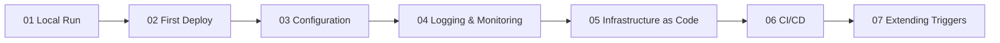

---
content_sources:
  - type: mslearn-adapted
    url: https://learn.microsoft.com/azure/azure-functions/functions-reference-java
  - type: mslearn-adapted
    url: https://learn.microsoft.com/azure/azure-functions/create-first-function-cli-java
---

# Java Language Guide

This guide introduces Azure Functions for Java using the annotation-based programming model.

Java functions are declared with `@FunctionName` and trigger/binding annotations such as `@HttpTrigger`, providing explicit metadata in familiar Java class structure.

!!! warning "Under Development"
    The Java tutorial track and recipes are under active development. This page provides a programming model overview, quick start, and cross-language comparison. For production architecture decisions, pair this page with [Platform](../../platform/index.md) and [Operations](../../operations/index.md).

## Main Content

<!-- diagram-id: main-content -->


The Java guide will follow the same 7-step tutorial structure used by the [Python guide](../python/index.md), covering all four hosting plans.

## Java Model at a Glance

| Topic | Java on Azure Functions |
|-------|--------------------------|
| Registration style | Annotation-based function method declarations |
| Core annotations | `@FunctionName`, `@HttpTrigger`, output/input binding annotations |
| Worker model | Out-of-process Java worker managed by the Functions host |
| Supported runtimes | Java 8, 11, 17, 21 |


- Function entry methods are grouped in Java classes.
- Trigger and binding behavior is declared via annotations.
- Execution context and logging are provided to handler methods.
- Dependency management follows Maven/Gradle Java ecosystem conventions.

## Java vs Python Mental Model

| Concern | Python v2 | Java |
|---------|-----------|------|
| Function declaration | Decorators on Python functions | Java annotations on methods |
| App container | `func.FunctionApp()` object | Class-based methods with annotation metadata |
| Dependency management | `requirements.txt` | `pom.xml` or `build.gradle` |
| Common HTTP pattern | `@app.route(...)` | `@FunctionName` + `@HttpTrigger` |

## Quick Start: HTTP Trigger (Java)

```java
package com.example;

import com.microsoft.azure.functions.*;
import com.microsoft.azure.functions.annotation.*;
import java.util.Optional;

public class HelloFunction {
    @FunctionName("HelloHttp")
    public HttpResponseMessage run(
        @HttpTrigger(
            name = "req",
            methods = {HttpMethod.GET},
            authLevel = AuthorizationLevel.FUNCTION,
            route = "hello/{name?}")
        HttpRequestMessage<Optional<String>> request,
        @BindingName("name") String name,
        final ExecutionContext context) {

        String resolvedName = (name != null && !name.isBlank()) ? name : "world";
        context.getLogger().info("Processed Java request for " + resolvedName);

        return request
            .createResponseBuilder(HttpStatus.OK)
            .body("Hello, " + resolvedName + "! (Azure Functions Java)")
            .build();
    }
}
```

### What this example demonstrates

- Function naming with `@FunctionName`.
- HTTP trigger declaration with `@HttpTrigger`.
- Route parameter extraction with `@BindingName`.
- Logging through `ExecutionContext`.

## Tutorial Roadmap

The following content is planned for the Java track:

- **Tutorial track**: Local run, deployment, configuration, monitoring, IaC, CI/CD across all four hosting plans.
- **Recipes**: Storage, Cosmos DB, Event Grid, Key Vault, Managed Identity.
- **Reference docs**: Runtime/version matrix notes, host settings mapping, troubleshooting patterns.
- **Reference app**: Planned `apps/java/` implementation that mirrors the Python reference app patterns.

## See Also

- [Language Guides Overview](../index.md)
- [Python Guide (reference implementation)](../python/index.md)
- [Node.js Guide](../nodejs/index.md)
- [.NET Guide](../dotnet/index.md)
- [Platform: Architecture](../../platform/architecture.md)
- [Platform: Hosting](../../platform/hosting.md)
- [Operations: Deployment](../../operations/deployment.md)
- [Operations: Monitoring](../../operations/monitoring.md)

## Sources

- [Azure Functions Java developer guide](https://learn.microsoft.com/azure/azure-functions/functions-reference-java)
- [Quickstart: Create a Java function in Azure Functions](https://learn.microsoft.com/azure/azure-functions/create-first-function-cli-java)
