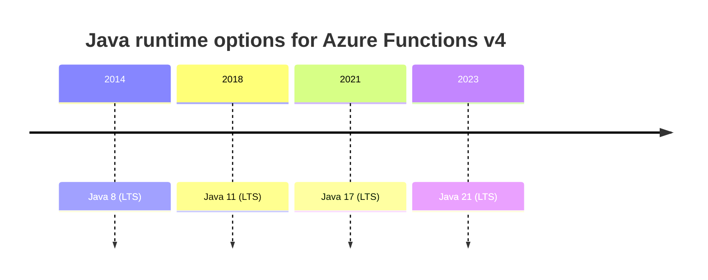
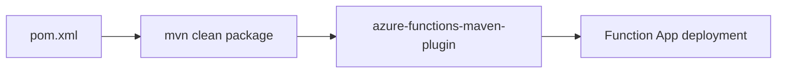

---
content_sources:
  - type: mslearn-adapted
    url: https://learn.microsoft.com/azure/azure-functions/supported-languages
  - type: mslearn-adapted
    url: https://learn.microsoft.com/azure/azure-functions/functions-reference-java
---

# Java Runtime

This reference captures supported Java versions, JVM/runtime settings, Maven dependencies, and practical tuning choices for Azure Functions Java applications.

## Supported Java Versions

<!-- diagram-id: supported-java-versions -->


| Runtime | Status | Typical recommendation |
|---------|--------|------------------------|
| Java 8 | Supported | Legacy workloads only |
| Java 11 | Supported | Existing enterprise baselines |
| Java 17 | Supported (LTS) | Default for new projects |
| Java 21 | Supported (LTS) | Newer language/runtime features |

## Core Runtime Settings

| Setting | Purpose | Example |
|---------|---------|---------|
| `FUNCTIONS_WORKER_RUNTIME` | Select Java worker | `java` |
| `JAVA_HOME` | Java installation path on host | Set automatically |
| `JAVA_OPTS` | JVM arguments | `-Xmx512m` |
| `WEBSITE_RUN_FROM_PACKAGE` | Immutable package deployment | `1` |

```bash
az functionapp config appsettings set   --name $APP_NAME   --resource-group $RG   --settings "FUNCTIONS_WORKER_RUNTIME=java" "JAVA_OPTS=-Xmx512m"
```

## Maven Build and Deployment

<!-- diagram-id: maven-build-and-deployment -->


Required dependency:

```xml
<dependency>
    <groupId>com.microsoft.azure.functions</groupId>
    <artifactId>azure-functions-java-library</artifactId>
    <version>3.1.0</version>
</dependency>
```

Recommended plugin:

```xml
<plugin>
    <groupId>com.microsoft.azure</groupId>
    <artifactId>azure-functions-maven-plugin</artifactId>
</plugin>
```

Common commands:

```bash
mvn clean package
mvn azure-functions:deploy
```

## Project Layout (Maven)

```text
project-root/
├── src/
│   └── main/
│       └── java/
│           └── com/example/
│               ├── Function.java
│               └── ...
├── host.json
├── local.settings.json
└── pom.xml
```

## Runtime Selection in Azure CLI

```bash
az functionapp create   --name $APP_NAME   --resource-group $RG   --storage-account $STORAGE_NAME   --plan $PLAN_NAME   --runtime java   --runtime-version 17   --functions-version 4   --os-type linux
```

## See Also

- [Annotation Programming Model](annotation-programming-model.md)
- [Tutorial Overview & Plan Chooser](tutorial/index.md)
- [Environment Variables](environment-variables.md)
- [Platform Limits](platform-limits.md)

## Sources

- [Supported languages in Azure Functions (Microsoft Learn)](https://learn.microsoft.com/azure/azure-functions/supported-languages)
- [Azure Functions Java developer guide (Microsoft Learn)](https://learn.microsoft.com/azure/azure-functions/functions-reference-java)
