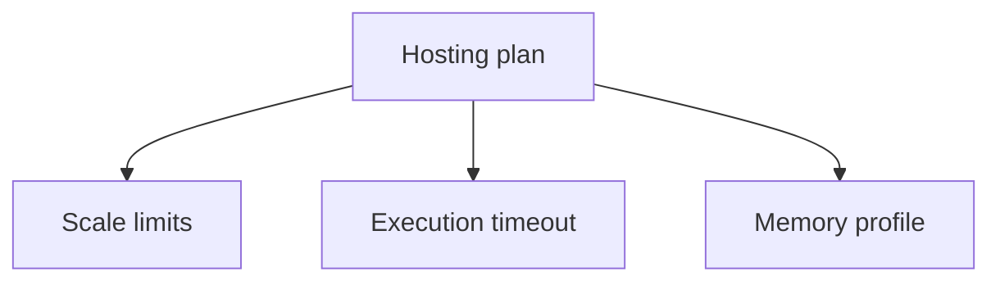

---
content_sources:
- type: mslearn-adapted
  url: https://learn.microsoft.com/azure/azure-functions/functions-reference-java
- type: mslearn-adapted
  url: https://learn.microsoft.com/cli/azure/functionapp
content_validation:
  status: verified
  last_reviewed: '2026-05-23'
  reviewer: agent
  core_claims:
  - claim: This page uses Microsoft Learn as the primary source basis for its Azure-specific
      guidance.
    source: https://learn.microsoft.com/azure/azure-functions/functions-reference-java
    verified: true
---
# Platform Limits

Quick reference for Java Azure Functions operational workflows.

## Topic/Command Groups

<!-- diagram-id: topic-command-groups -->

| Plan | Default timeout | Max timeout | Notes |
|------|-----------------|-------------|-------|
| Consumption | 5 minutes | 10 minutes | Scale-to-zero, fixed memory |
| Flex Consumption | 30 minutes | Unlimited | Configurable memory |
| Premium | 30 minutes | Unlimited | Always-ready instances |
| Dedicated | 30 minutes | Unlimited | Capacity tied to App Service plan |

## See Also

- [Java Runtime](java-runtime.md)
- [Annotation Programming Model](annotation-programming-model.md)
- [Operations Overview](../../operations/index.md)

## Sources

- [Azure Functions Java developer guide (Microsoft Learn)](https://learn.microsoft.com/azure/azure-functions/functions-reference-java)
- [Azure Functions CLI reference (Microsoft Learn)](https://learn.microsoft.com/cli/azure/functionapp)
