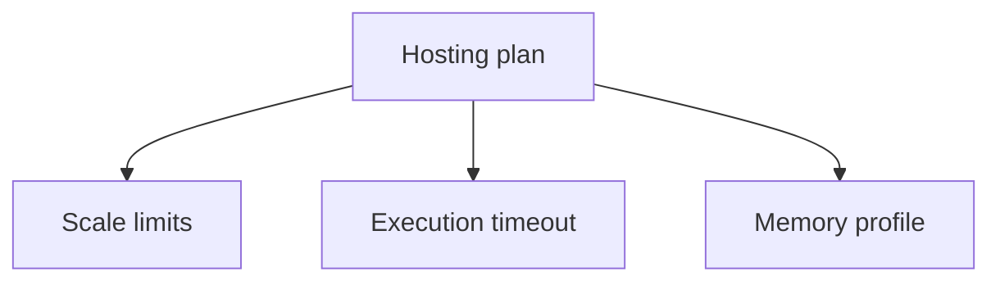

---
content_sources:

  references:
    - type: mslearn-adapted
      url: https://learn.microsoft.com/en-us/azure/azure-functions/functions-reference-java
    - type: mslearn-adapted
      url: https://learn.microsoft.com/en-us/cli/azure/functionapp
  diagrams:
    - id: topic-command-groups
      type: flowchart
      source: self-generated
      justification: Flow view of topic command groups, synthesized from Microsoft Learn documentation cited on this page.
      based_on:
        - https://learn.microsoft.com/en-us/azure/azure-functions/functions-reference-java
        - https://learn.microsoft.com/en-us/cli/azure/functionapp
---
# Platform Limits

Quick reference for Java Azure Functions operational workflows.

## Topic/Command Groups

<!-- diagram-id: topic-command-groups -->

| Plan | Default timeout | Max timeout | Notes |
|------|-----------------|-------------|-------|
| Consumption | 5 minutes | 10 minutes | Scale-to-zero, fixed memory |
| Flex Consumption | 30 minutes | Unlimited | Configurable memory |
| Premium | 30 minutes | Unlimited | Always-ready instances |
| Dedicated | 30 minutes | Unlimited | Capacity tied to App Service plan |

## See Also

- [Java Runtime](java-runtime.md)
- [Annotation Programming Model](annotation-programming-model.md)
- [Operations Overview](../../operations/index.md)

## Sources

- [Azure Functions Java developer guide (Microsoft Learn)](https://learn.microsoft.com/en-us/azure/azure-functions/functions-reference-java)
- [Azure Functions CLI reference (Microsoft Learn)](https://learn.microsoft.com/en-us/cli/azure/functionapp)
