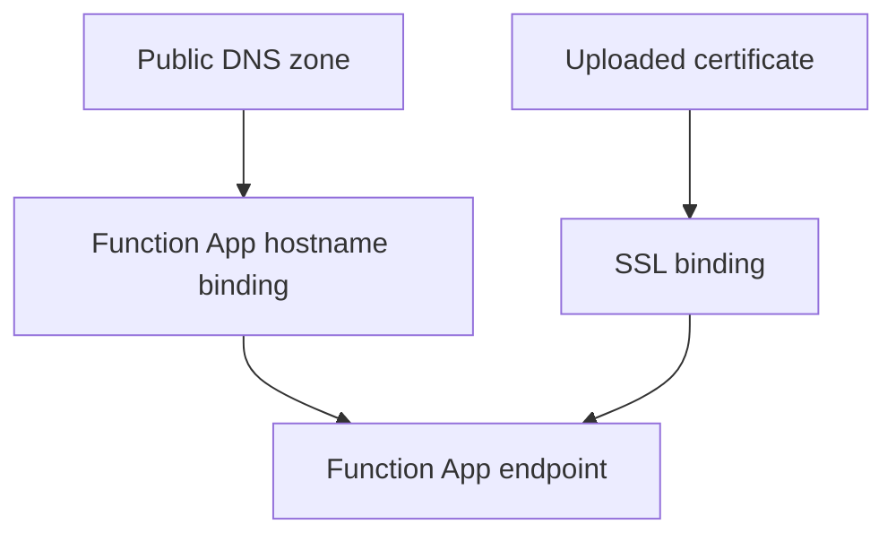

---
content_sources:

  references:
    - type: mslearn-adapted
      url: https://learn.microsoft.com/en-us/azure/app-service/app-service-web-tutorial-custom-domain
    - type: mslearn-adapted
      url: https://learn.microsoft.com/en-us/azure/app-service/configure-ssl-certificate
  diagrams:
    - id: architecture
      type: flowchart
      source: self-generated
      justification: Flow view of architecture, synthesized from Microsoft Learn documentation cited on this page.
      based_on:
        - https://learn.microsoft.com/en-us/azure/app-service/app-service-web-tutorial-custom-domain
        - https://learn.microsoft.com/en-us/azure/app-service/configure-ssl-certificate
---
# Custom Domain and Certificates

This recipe focuses on platform configuration for custom domains and TLS certificates on Azure Functions. It is primarily an operations workflow, not application code.

## Architecture

<!-- diagram-id: architecture -->


## Prerequisites

- Function App on a plan that supports custom domains and TLS.
- Domain ownership and DNS control for TXT/CNAME validation.
- PFX certificate file and password (for uploaded cert flow).

## Domain and certificate workflow

Add custom hostname:

```bash
az functionapp config hostname add \
  --webapp-name $APP_NAME \
  --resource-group $RG \
  --hostname api.contoso.com
```

| CLI element | Explanation |
|---|---|
| Command(s) | `az functionapp config hostname add` |
| Key flags | `--webapp-name`, `--resource-group`, `--hostname` |
| Variables | `$APP_NAME`, `$RG` |
| Expected result | Azure CLI applies the configuration change; confirm the returned JSON or follow-up query shows the expected value. |


Upload certificate:

```bash
az functionapp config ssl upload \
  --resource-group $RG \
  --name $APP_NAME \
  --certificate-file /path/to/certificate.pfx \
  --certificate-password "<pfx-password>"
```

| CLI element | Explanation |
|---|---|
| Command(s) | `az functionapp config ssl upload` |
| Key flags | `--resource-group`, `--name`, `--certificate-file`, `--certificate-password` |
| Variables | `$RG`, `$APP_NAME` |
| Expected result | Azure CLI applies the configuration change; confirm the returned JSON or follow-up query shows the expected value. |


Bind certificate to hostname:

```bash
az functionapp config ssl bind \
  --resource-group $RG \
  --name $APP_NAME \
  --certificate-thumbprint <thumbprint> \
  --ssl-type SNI
```

| CLI element | Explanation |
|---|---|
| Command(s) | `az functionapp config ssl bind` |
| Key flags | `--resource-group`, `--name`, `--certificate-thumbprint`, `--ssl-type` |
| Variables | `$RG`, `$APP_NAME` |
| Expected result | Azure CLI applies the configuration change; confirm the returned JSON or follow-up query shows the expected value. |


## Flex Consumption note

- Flex Consumption does not support managed/platform certificates.
- Use uploaded certificates with supported App Service certificate workflows when applicable.

## Implementation notes

- Validate DNS records before binding to avoid failed hostname operations.
- Track certificate expiration and automate renewal before cut-off.
- Prefer SNI SSL unless dedicated IP SSL is explicitly required.
- Verify endpoint health after every hostname or certificate change.

## See Also

- [HTTP API Patterns](http-api.md)
- [HTTP Authentication](http-auth.md)
- [Managed Identity](managed-identity.md)

## Sources

- [Map an existing custom DNS name to Azure App Service (Microsoft Learn)](https://learn.microsoft.com/en-us/azure/app-service/app-service-web-tutorial-custom-domain)
- [Add and manage TLS/SSL certificates in Azure App Service (Microsoft Learn)](https://learn.microsoft.com/en-us/azure/app-service/configure-ssl-certificate)
