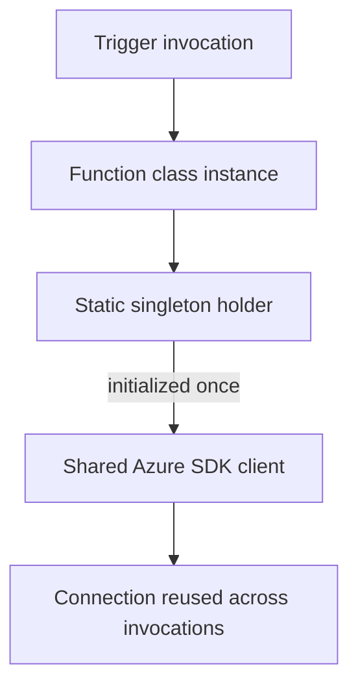

---
content_sources:
  references:
    - type: mslearn-adapted
      url: https://learn.microsoft.com/en-us/azure/azure-functions/functions-reference-java
  diagrams:
    - id: architecture
      type: flowchart
      source: self-generated
      justification: Flow view of architecture, synthesized from Microsoft Learn documentation cited on this page.
      based_on:
        - https://learn.microsoft.com/en-us/azure/azure-functions/functions-reference-java
        - https://learn.microsoft.com/en-us/azure/azure-functions/functions-best-practices
---
# Dependency Injection

The Java worker for Azure Functions does not ship a built-in dependency injection (DI) container. Function classes are instantiated by the runtime, so you cannot rely on constructor injection the way you would in Spring. The idiomatic approach is to share heavyweight clients (Azure SDK clients, HTTP clients) through lazily initialized static singletons and to wire your own dependencies manually. For a full DI container, use the Spring Cloud Function programming model as a separate option.

## Architecture

<!-- diagram-id: architecture -->


## Why Not Constructor Injection

Azure Functions instantiates your function class per invocation and does not resolve constructor parameters from a container. Creating a new Azure SDK client or `HttpClient` inside the function body on every invocation exhausts connections and adds latency. Instead, hold shared clients in a static field initialized once per worker process.

## Shared Client as a Lazy Static Singleton

Use the initialization-on-demand holder idiom so the client is created once, lazily, and in a thread-safe way without explicit locking.

```java
public final class Clients {

    private Clients() {
    }

    private static final class BlobHolder {
        static final BlobServiceClient INSTANCE = new BlobServiceClientBuilder()
            .endpoint(System.getenv("STORAGE__blobServiceUri"))
            .credential(new DefaultAzureCredentialBuilder().build())
            .buildClient();
    }

    public static BlobServiceClient blob() {
        return BlobHolder.INSTANCE;
    }
}
```

The holder class is not loaded until `blob()` is first called, and the JVM guarantees the static initializer runs exactly once.

## Consuming the Shared Client in a Function

```java
public class UploadFunction {

    @FunctionName("upload")
    public HttpResponseMessage run(
        @HttpTrigger(
            name = "req",
            methods = {HttpMethod.POST},
            authLevel = AuthorizationLevel.FUNCTION
        ) HttpRequestMessage<Optional<String>> request,
        final ExecutionContext context
    ) {
        BlobServiceClient client = Clients.blob();
        client.getBlobContainerClient("uploads")
            .getBlobClient(context.getInvocationId())
            .upload(BinaryData.fromString(request.getBody().orElse("")));

        return request.createResponseBuilder(HttpStatus.ACCEPTED).build();
    }
}
```

## Manual Wiring for Your Own Services

For your own service classes, construct the dependency graph once in a factory and expose it through the same holder idiom. This keeps business logic testable — you can instantiate `OrderService` directly in a unit test with a fake repository.

```java
public final class Services {

    private Services() {
    }

    private static final class OrderHolder {
        static final OrderService INSTANCE =
            new OrderService(new TableOrderRepository(Clients.table()));
    }

    public static OrderService orders() {
        return OrderHolder.INSTANCE;
    }
}
```

## Full DI Container: Spring Cloud Function

When you need a real container with `@Autowired`, component scanning, and configuration binding, use the Spring Cloud Function model. Your business logic is expressed as `Function`, `Consumer`, or `Supplier` beans, and the Azure Functions adapter routes triggers to them. This is a distinct programming model — you opt into the full Spring lifecycle instead of the plain annotation model shown above.

!!! tip "Keep singletons stateless"
    Shared singletons run across concurrent invocations on the same worker. Only share thread-safe clients; never store per-request state in a static field.

## See Also

- [Managed Identity](managed-identity.md)
- [Table Storage Integration](table-storage.md)

## Sources

- [Azure Functions Java developer guide (Microsoft Learn)](https://learn.microsoft.com/en-us/azure/azure-functions/functions-reference-java)
- [Azure Functions best practices for reliability (Microsoft Learn)](https://learn.microsoft.com/en-us/azure/azure-functions/functions-best-practices)
