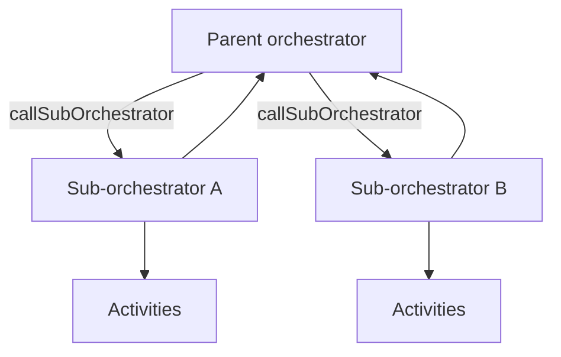

---
content_sources:
  references:
    - type: mslearn-adapted
      url: https://learn.microsoft.com/en-us/azure/azure-functions/durable/durable-functions-sub-orchestrations
    - type: mslearn-adapted
      url: https://learn.microsoft.com/en-us/azure/azure-functions/durable/durable-functions-eternal-orchestrations
    - type: mslearn-adapted
      url: https://learn.microsoft.com/en-us/azure/azure-functions/durable/durable-functions-versioning
  diagrams:
    - id: architecture
      type: flowchart
      source: self-generated
      justification: Flow view of sub-orchestration composition, synthesized from Microsoft Learn documentation cited on this page.
      based_on:
        - https://learn.microsoft.com/en-us/azure/azure-functions/durable/durable-functions-sub-orchestrations
        - https://learn.microsoft.com/en-us/azure/azure-functions/durable/durable-functions-eternal-orchestrations
---
# Durable Functions: Advanced Patterns

This recipe covers advanced Durable Functions patterns for Java beyond the basic chaining and fan-out/fan-in flows: sub-orchestrations, eternal orchestrations, activity retries, and safe versioning. For the fundamentals, see [Durable Orchestration](durable-orchestration.md).

## Architecture

<!-- diagram-id: architecture -->


## Sub-Orchestrations

Break a large workflow into reusable orchestrators. A parent calls a sub-orchestrator with `ctx.callSubOrchestrator`, and can fan out over several the same way it fans out over activities.

```java
@FunctionName("ParentOrchestrator")
public String parentOrchestrator(
        @DurableOrchestrationTrigger(name = "ctx") TaskOrchestrationContext ctx) {
    List<String> regions = ctx.getInput(List.class);

    // Fan out over sub-orchestrations, one per region.
    List<Task<String>> tasks = new ArrayList<>();
    for (String region : regions) {
        tasks.add(ctx.callSubOrchestrator("ProcessRegion", region, String.class));
    }
    List<String> results = ctx.allOf(tasks).await();
    return "Processed " + results.size() + " regions";
}

@FunctionName("ProcessRegion")
public String processRegion(
        @DurableOrchestrationTrigger(name = "ctx") TaskOrchestrationContext ctx) {
    String region = ctx.getInput(String.class);
    String validated = ctx.callActivity("ValidateRegion", region, String.class).await();
    return ctx.callActivity("LoadRegion", validated, String.class).await();
}
```

## Eternal Orchestrations

For a workflow that runs indefinitely (aggregators, periodic jobs), do **not** use an unbounded loop — the history would grow forever. Call `ctx.continueAsNew` to restart the orchestration with fresh state and a clean history.

```java
@FunctionName("PeriodicCleanup")
public void periodicCleanup(
        @DurableOrchestrationTrigger(name = "ctx") TaskOrchestrationContext ctx) {
    CleanupState state = ctx.getInput(CleanupState.class);
    if (state == null) {
        state = new CleanupState();
    }

    ctx.callActivity("RunCleanup", state).await();
    state.runs += 1;

    // Durable sleep, then restart with new state and empty history.
    ctx.createTimer(Duration.ofHours(1)).await();
    ctx.continueAsNew(state);
}
```

## Activity Retries

Wrap flaky activities with a retry policy instead of hand-coding retry loops. The orchestration replays cleanly because retries are recorded in history.

```java
@FunctionName("ResilientOrchestrator")
public String resilientOrchestrator(
        @DurableOrchestrationTrigger(name = "ctx") TaskOrchestrationContext ctx) {
    Order order = ctx.getInput(Order.class);

    RetryPolicy policy = new RetryPolicy(3, Duration.ofSeconds(5));
    TaskOptions options = new TaskOptions(policy);

    return ctx.callActivity("ChargeCustomer", order, options, String.class).await();
}
```

| Element | Explanation |
|---|---|
| `callSubOrchestrator` | Invokes another orchestrator as a child; compose and fan out like activities. |
| `continueAsNew` | Restarts the orchestration with new input and a trimmed history for eternal loops. |
| `RetryPolicy` / `TaskOptions` | Declarative retry policy passed to `callActivity`. |

## Versioning

Orchestrations replay from history, so changing an orchestrator's code while instances are in flight can break replay (non-determinism). Safe strategies:

- **Deploy side by side**: give the changed orchestrator a new name and route new instances to it, letting existing instances drain on the old version.
- **Do not reorder or remove** existing activity calls in a deployed orchestrator.
- **Terminate and restart** in-flight instances if a breaking change is unavoidable.

!!! warning "Determinism still applies"
    Advanced patterns do not relax the determinism rule. Never call `Instant.now()`, generate random values, or do direct I/O inside an orchestrator — use activities and `ctx.getCurrentInstant()`.

## See Also

- [Durable Orchestration](durable-orchestration.md)
- [Durable Entities](durable-entities.md)
- [Platform: Durable Functions](../../../platform/durable-functions.md)

## Sources

- [Sub-orchestrations (Microsoft Learn)](https://learn.microsoft.com/en-us/azure/azure-functions/durable/durable-functions-sub-orchestrations)
- [Eternal orchestrations (Microsoft Learn)](https://learn.microsoft.com/en-us/azure/azure-functions/durable/durable-functions-eternal-orchestrations)
- [Versioning (Microsoft Learn)](https://learn.microsoft.com/en-us/azure/azure-functions/durable/durable-functions-versioning)
</content>
