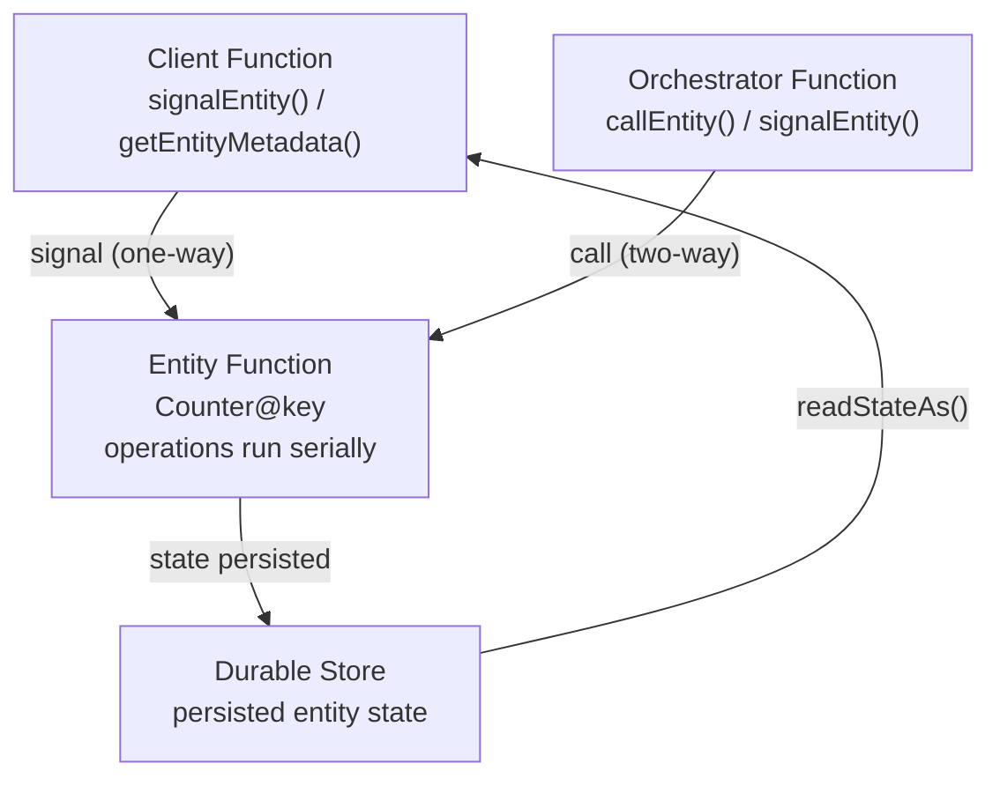

---
content_sources:
  references:
    - type: mslearn-adapted
      url: https://learn.microsoft.com/en-us/azure/azure-functions/durable/durable-functions-entities
  diagrams:
    - id: entity-lifecycle
      type: flowchart
      source: self-generated
      justification: Flow view of the durable entity lifecycle, synthesized from Microsoft Learn documentation cited on this page.
      based_on:
        - https://learn.microsoft.com/en-us/azure/azure-functions/durable/durable-functions-entities
        - https://learn.microsoft.com/en-us/azure/azure-functions/durable/durable-functions-overview
---
# Durable Entities

This recipe covers Durable Entities (the stateful entity model) with Azure Functions Java. Durable Functions for Java supports entities using a class-based syntax from version 1.9.0 or later.

## Overview

Durable Entities manage small pieces of explicit state — tiny, addressable, single-threaded objects that live in durable storage. Unlike orchestrator functions, which represent state implicitly through control flow, an entity reads and writes its state explicitly through operations.

Entities are ideal for aggregation (counters, running totals), fan-in of high-volume signals without lock contention, and actor-style per-key state.

| Concept | Description |
|---------|-------------|
| **Entity class** | Extends `AbstractTaskEntity<TState>`; each public method is an operation. |
| **Entity ID** | An `EntityInstanceId` pair: the **entity name** (e.g. `Counter`) plus the **entity key** (the unique instance). |
| **Operation** | A named method invoked by name (for example `add`, `reset`, `get`), with optional input. |
| **Serialized access** | A single entity processes its operations one at a time, so you never need locks. |

<!-- diagram-id: entity-lifecycle -->


## Prerequisites

Ensure your project references Durable Functions for Java 1.9.0 or later. Entities persist state in Azure Storage (`AzureWebJobsStorage`), like orchestrations.

## Define an Entity Class

Extend `AbstractTaskEntity<TState>`. Each public method is an operation; `initializeState` supplies the default state.

```java
package com.contoso.functions;

import com.microsoft.durabletask.AbstractTaskEntity;
import com.microsoft.durabletask.TaskEntityOperation;

public class CounterEntity extends AbstractTaskEntity<Integer> {

    public void add(int value) {
        this.state += value;
    }

    public void subtract(int value) {
        this.state -= value;
    }

    public int get() {
        return this.state;
    }

    public void reset() {
        this.state = 0;
    }

    @Override
    protected Integer initializeState(TaskEntityOperation operation) {
        return 0;
    }

    @Override
    protected Class<Integer> getStateType() {
        return Integer.class;
    }
}
```

Bind the entity class to an entity trigger function:

```java
import com.microsoft.azure.functions.annotation.*;
import com.microsoft.durabletask.azurefunctions.DurableEntityTrigger;
import com.microsoft.durabletask.EntityRunner;

public class EntityFunctions {

    @FunctionName("Counter")
    public String counterEntity(
        @DurableEntityTrigger(name = "req") String req) {
        return EntityRunner.loadAndRun(req, CounterEntity::new);
    }
}
```

## Signal an Entity from a Client Function

Signaling is one-way (fire-and-forget). Use the `DurableClientContext`.

```java
@FunctionName("SignalCounter")
public HttpResponseMessage signalCounter(
    @HttpTrigger(name = "req", methods = {HttpMethod.POST},
        authLevel = AuthorizationLevel.FUNCTION) HttpRequestMessage<Void> request,
    @DurableClientInput(name = "durableContext") DurableClientContext durableContext) {

    String key = request.getQueryParameters().getOrDefault("key", "myCounter");
    int value = Integer.parseInt(request.getQueryParameters().getOrDefault("value", "1"));

    EntityInstanceId entityId = new EntityInstanceId("Counter", key);
    durableContext.signalEntity(entityId, "add", value);

    return request.createResponseBuilder(HttpStatus.ACCEPTED)
        .body("Signaled add on entity '" + key + "'")
        .build();
}
```

## Read Entity State from a Client Function

Reading returns the entity's most recently persisted (committed) state.

```java
@FunctionName("GetCounter")
public HttpResponseMessage getCounter(
    @HttpTrigger(name = "req", methods = {HttpMethod.GET},
        authLevel = AuthorizationLevel.FUNCTION) HttpRequestMessage<Void> request,
    @DurableClientInput(name = "durableContext") DurableClientContext durableContext) {

    String key = request.getQueryParameters().getOrDefault("key", "myCounter");
    EntityInstanceId entityId = new EntityInstanceId("Counter", key);

    EntityMetadata metadata = durableContext.getEntityMetadata(entityId, true);
    if (metadata == null) {
        return request.createResponseBuilder(HttpStatus.NOT_FOUND)
            .body("Entity '" + key + "' not found").build();
    }

    Integer state = metadata.readStateAs(Integer.class);
    return request.createResponseBuilder(HttpStatus.OK)
        .header("Content-Type", "application/json")
        .body("{\"key\": \"" + key + "\", \"value\": " + state + "}")
        .build();
}
```

## Call and Signal an Entity from an Orchestrator

Orchestrators can both signal (one-way) and call (two-way) entities.

```java
@FunctionName("CounterOrchestration")
public String counterOrchestration(
    @DurableOrchestrationTrigger(name = "ctx") TaskOrchestrationContext ctx) {

    String key = ctx.getInput(String.class);
    EntityInstanceId entityId = new EntityInstanceId("Counter", key);

    // Fire-and-forget signals.
    ctx.signalEntity(entityId, "add", 10);
    ctx.signalEntity(entityId, "subtract", 3);

    // Two-way call: wait for the result.
    int value = ctx.callEntity(entityId, "get", Integer.class).await();

    return "Counter '" + key + "' final value: " + value;
}
```

## Access Rules Summary

| Caller | Signal (one-way) | Call (two-way) | Read state |
|--------|:---:|:---:|:---:|
| **Client function** | Yes | No | Yes |
| **Orchestrator function** | Yes | Yes | No (call `get` instead) |
| **Entity function** | Yes | No | — |

## See Also

- [Durable Orchestration](durable-orchestration.md)
- [Platform: Durable Functions](../../../platform/durable-functions.md)
- [HTTP API Patterns](http-api.md)

## Sources

- [Durable entities (Microsoft Learn)](https://learn.microsoft.com/en-us/azure/azure-functions/durable/durable-functions-entities)
- [Durable Functions overview (Microsoft Learn)](https://learn.microsoft.com/en-us/azure/azure-functions/durable/durable-functions-overview)
