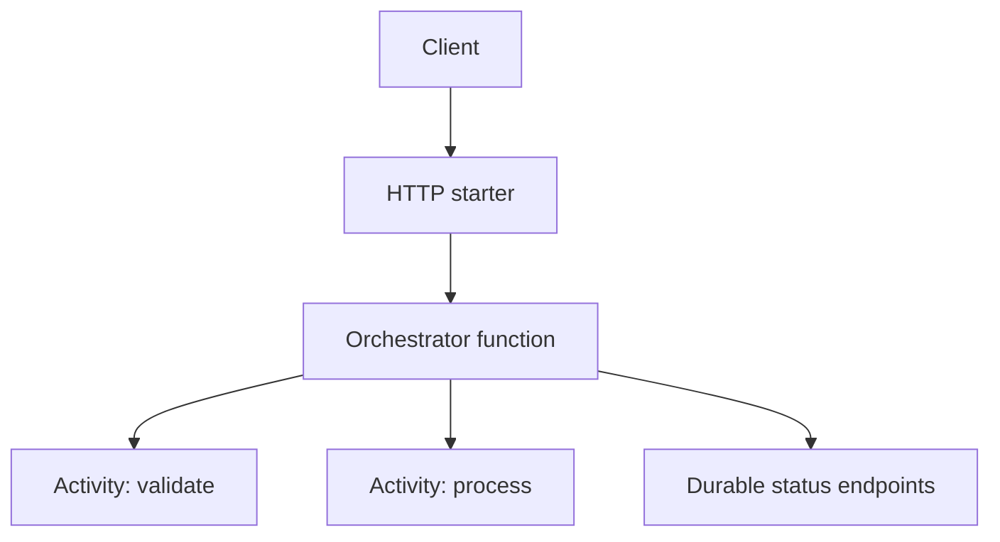

---
content_sources:
  - type: mslearn-adapted
    url: https://learn.microsoft.com/azure/azure-functions/durable/durable-functions-overview
  - type: mslearn-adapted
    url: https://learn.microsoft.com/azure/azure-functions/durable/durable-functions-bindings
---

# Durable Orchestration

This recipe shows Java Durable Functions with an HTTP starter, orchestrator, and activity function using the Durable Task Java SDK.

## Architecture

<!-- diagram-id: architecture -->


## Prerequisites

Durable extension in `host.json`:

```json
{
  "version": "2.0",
  "extensions": {
    "durableTask": {
      "hubName": "JavaDurableHub"
    }
  }
}
```

Maven dependencies:

```xml
<dependencies>
    <dependency>
        <groupId>com.microsoft.azure.functions</groupId>
        <artifactId>azure-functions-java-library</artifactId>
        <version>3.1.0</version>
    </dependency>
    <dependency>
        <groupId>com.microsoft.azure</groupId>
        <artifactId>azure-functions-java-library-durabletask</artifactId>
        <version>1.0.0</version>
    </dependency>
</dependencies>
```

## Java implementation

```java
package com.contoso.functions;

import com.microsoft.azure.functions.*;
import com.microsoft.azure.functions.annotation.*;
import com.microsoft.durabletask.*;
import com.microsoft.durabletask.azurefunctions.*;

import java.util.Optional;

public class DurableFunctions {

    @FunctionName("orchestrationStarter")
    public HttpResponseMessage orchestrationStarter(
        @HttpTrigger(
            name = "request",
            methods = {HttpMethod.POST},
            authLevel = AuthorizationLevel.FUNCTION,
            route = "orchestrators/order"
        ) HttpRequestMessage<Optional<String>> request,
        @DurableClientInput(name = "durableContext") DurableClientContext durableContext
    ) {
        DurableTaskClient client = durableContext.getClient();
        String instanceId = client.scheduleNewOrchestrationInstance("orderOrchestrator", request.getBody().orElse("{}"));
        return durableContext.createCheckStatusResponse(request, instanceId);
    }

    @FunctionName("orderOrchestrator")
    public String orderOrchestrator(
        @DurableOrchestrationTrigger(name = "context") TaskOrchestrationContext context
    ) {
        String payload = context.getInput(String.class);
        String validated = context.callActivity("validateOrder", payload, String.class).await();
        return context.callActivity("processOrder", validated, String.class).await();
    }

    @FunctionName("validateOrder")
    public String validateOrder(
        @DurableActivityTrigger(name = "payload") String payload
    ) {
        return "validated:" + payload;
    }

    @FunctionName("processOrder")
    public String processOrder(
        @DurableActivityTrigger(name = "validatedPayload") String validatedPayload
    ) {
        return "processed:" + validatedPayload;
    }
}
```

## Implementation notes

- Keep orchestrator code deterministic and move I/O to activity functions.
- Use `createCheckStatusResponse` to return status query URLs to callers.
- Design activities to be retry-safe because orchestration replays can occur.
- Keep payloads small and store large documents in Blob Storage.

## See Also

- [Timer Trigger](timer.md)
- [Queue Storage Integration](queue.md)
- [Blob Storage Integration](blob-storage.md)

## Sources

- [Durable Functions overview (Microsoft Learn)](https://learn.microsoft.com/azure/azure-functions/durable/durable-functions-overview)
- [Durable Functions bindings (Microsoft Learn)](https://learn.microsoft.com/azure/azure-functions/durable/durable-functions-bindings)
