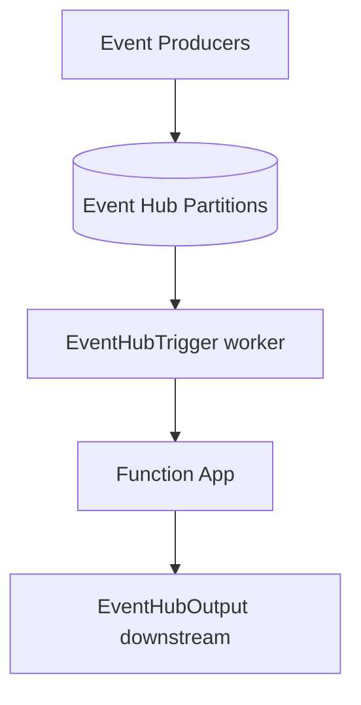

---
content_sources:
  references:
    - type: mslearn-adapted
      url: https://learn.microsoft.com/en-us/azure/azure-functions/functions-bindings-event-hubs
  diagrams:
    - id: architecture
      type: flowchart
      source: self-generated
      justification: Flow view of architecture, synthesized from Microsoft Learn documentation cited on this page.
      based_on:
        - https://learn.microsoft.com/en-us/azure/azure-functions/functions-bindings-event-hubs
        - https://learn.microsoft.com/en-us/azure/azure-functions/functions-bindings-event-hubs-trigger
---
# Event Hubs Integration

This recipe demonstrates Java Event Hubs trigger and output bindings — consuming a high-throughput event stream (single and batch delivery), reading event metadata, and publishing events downstream.

## Architecture

<!-- diagram-id: architecture -->


## Prerequisites

Provide the connection in app settings. A connection-string setting or an identity-based connection is supported. Identity-based connections use a setting prefix with `__fullyQualifiedNamespace`:

```bash
az functionapp config appsettings set \
  --name $APP_NAME \
  --resource-group $RG \
  --settings "EventHubConnection__fullyQualifiedNamespace=$NAMESPACE.servicebus.windows.net"
```

| CLI element | Explanation |
|---|---|
| Command(s) | `az functionapp config appsettings set` |
| Key flags | `--name`, `--resource-group`, `--settings` |
| Variables | `$APP_NAME`, `$RG`, `$NAMESPACE` |
| Expected result | Azure CLI returns the updated app settings as JSON; confirm the setting is present before continuing. |

When using an identity-based connection, grant the function app's managed identity the **Azure Event Hubs Data Receiver** (and **Data Sender** for output) role on the namespace.

## Java Implementation

Setting `cardinality = Cardinality.MANY` delivers a batch of events per invocation, which dramatically improves throughput. Keep the handler idempotent because delivery is at-least-once.

```java
package com.contoso.functions;

import com.microsoft.azure.functions.*;
import com.microsoft.azure.functions.annotation.*;

public class EventHubFunctions {

    @FunctionName("processTelemetry")
    public void processTelemetry(
        @EventHubTrigger(
            name = "events",
            eventHubName = "telemetry",
            connection = "EventHubConnection",
            consumerGroup = "$Default",
            cardinality = Cardinality.MANY
        ) String[] events,
        @EventHubOutput(
            name = "downstream",
            eventHubName = "downstream",
            connection = "EventHubConnection"
        ) OutputBinding<String[]> output,
        final ExecutionContext context
    ) {
        context.getLogger().info("Batch size: " + events.length);

        String[] forwarded = new String[events.length];
        for (int i = 0; i < events.length; i++) {
            // Keep processing idempotent.
            context.getLogger().info("Processing event: " + events[i]);
            forwarded[i] = events[i];
        }

        output.setValue(forwarded);
    }
}
```

## Reading Event Metadata

Use the `@BindingName` annotation to bind partition context and system properties such as sequence numbers and enqueued timestamps:

```java
@FunctionName("processWithMetadata")
public void processWithMetadata(
    @EventHubTrigger(
        name = "event",
        eventHubName = "telemetry",
        connection = "EventHubConnection"
    ) String event,
    @BindingName("SequenceNumber") long sequenceNumber,
    @BindingName("EnqueuedTimeUtc") String enqueuedTimeUtc,
    final ExecutionContext context
) {
    context.getLogger().info("Sequence: " + sequenceNumber);
    context.getLogger().info("Enqueued: " + enqueuedTimeUtc);
}
```

## Host Configuration and Checkpointing

Tune batch size and checkpoint frequency in `host.json`:

```json
{
  "version": "2.0",
  "extensions": {
    "eventHubs": {
      "maxEventBatchSize": 100,
      "batchCheckpointFrequency": 1,
      "prefetchCount": 300
    }
  }
}
```

| Setting | Default | Description |
|---------|---------|-------------|
| `maxEventBatchSize` | 100 | Maximum number of events delivered per batch invocation |
| `batchCheckpointFrequency` | 1 | Number of batches processed before a checkpoint is written |
| `prefetchCount` | 300 | Number of events the underlying client prefetches |

!!! note "Checkpointing"
    The Event Hubs extension checkpoints progress to the storage account referenced by `AzureWebJobsStorage`. A higher `batchCheckpointFrequency` reduces storage writes but increases the volume of events reprocessed after a restart.

## See Also

- [Queue Storage Integration](queue.md)
- [Managed Identity](managed-identity.md)

## Sources

- [Azure Event Hubs bindings for Azure Functions (Microsoft Learn)](https://learn.microsoft.com/en-us/azure/azure-functions/functions-bindings-event-hubs)
- [Azure Event Hubs trigger for Azure Functions (Microsoft Learn)](https://learn.microsoft.com/en-us/azure/azure-functions/functions-bindings-event-hubs-trigger)
- [Azure Event Hubs output binding for Azure Functions (Microsoft Learn)](https://learn.microsoft.com/en-us/azure/azure-functions/functions-bindings-event-hubs-output)
